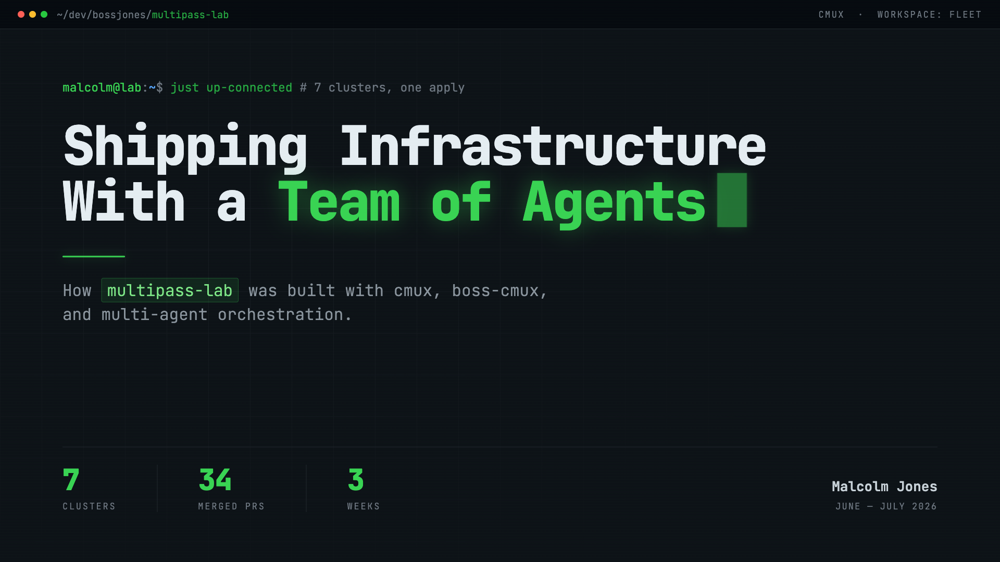

# multipass-lab

> Local lab environments for [**Multipass**](https://multipass.run/) to prototype and test
> infrastructure with [**OpenTofu**](https://opentofu.org/) and **Ansible** before promoting it
> to a real target like **Proxmox**.

[](.github/workflows/ci.yml)
[](https://opentofu.org/)
[](https://multipass.run/)
[](LICENSE)

Multipass acts as a cheap, local stand-in for the eventual VM host. New infrastructure is
structured so the **same modules can target Multipass locally and Proxmox later** —
parameterize the provider/connection, not the resources.

---

### 🎞️ How this repo was built

[](docs/slides/index.html)

<p align="center">
  <b><a href="docs/slides/index.html">Open the deck →</a></b><br>
  <sub>26 slides on cmux, agent fleets, and the coordination protocol — including what broke.
  Zero-dependency single file: <code>open docs/slides/index.html</code>.</sub>
</p>

---

## Contents

- [Why this exists](#why-this-exists)
- [Labs](#labs)
- [Quickstart](#quickstart)
- [How it works](#how-it-works)
- [Repository layout](#repository-layout)
- [Toolchain](#toolchain)
- [Further reading](#further-reading)

---

## Why this exists

Spinning up VMs on a real hypervisor to test a single cloud-init change is slow and expensive.
Multipass gives you throwaway Ubuntu VMs in seconds on your laptop, so you can iterate on
OpenTofu modules, cloud-init templates, and Ansible playbooks locally — then ship the *same*
modules to Proxmox once they're proven.

Each lab ("cluster") is **vendored to its own folder** under [`clusters/`](clusters/) with its
own OpenTofu root module, cloud-init templates, and tests. A single root
[`Justfile`](Justfile) orchestrates every cluster **by folder name** — that name is the only
argument the recipes take.

## Labs

Each lab is self-contained. Click through to its README for the full design, VM topology, and
lab-specific notes.

| Lab | What it demonstrates | VMs | Docs |
|-----|----------------------|-----|------|
| **centralized_logging** | syslog-ng log shipping across three VMs into one collector (`/var/log/remote/<host>/<prog>.log`), with runtime DHCP-IP injection between peers, plus a flag-gated Prometheus exporter layer | 3 | 📘 [USAGE](clusters/centralized_logging/USAGE.md) · 📖 [README](clusters/centralized_logging/README.md) · 🧭 [tutorial](clusters/centralized_logging/TUTORIAL.md) · 📐 [spec](specs/centralized_logging.md) · 📊 [metrics spec](specs/centralized_logging_metrics.md) |
| **centralized_monitoring** | Pull-based Prometheus/Grafana/OpenObserve observability stack across two VMs, with feature-flagged, tiered (MVP/Reach/Nice-to-have) exporters and an inverted runtime-IP injection edge | 2 | 📘 [USAGE](clusters/centralized_monitoring/USAGE.md) · 📖 [README](clusters/centralized_monitoring/README.md) · 📚 [docs/](clusters/centralized_monitoring/docs/) · 📐 [spec](specs/centralized_monitoring.md) · 🧪 [e2e spec](specs/e2e-centralized-monitoring.md) |
| **centralized_k0s** | A `just`-orchestrated, multi-node k0s Kubernetes cluster formed via k0sctl (etcd-backed control plane, kubelet workers via `--enable-worker`), leveling up the single-node k0s embedded in `centralized_monitoring`/`centralized_logging` into its own tunable-topology lab, with an opt-in 3-controller etcd-quorum HA mode behind an HAProxy L4 edge | 3 | 🚩 [feature flags](clusters/centralized_k0s/docs/feature-flags.md) · 📐 [spec](specs/centralized_k0s.md) |
| **centralized_pki** | The lab's internal CA (step-ca) plus a Traefik fleet-edge reverse proxy fronting Authelia (SSO forward-auth) and Vaultwarden, doubling as the reverse-proxy edge for clusters without their own hostname+TLS story and as the root of the fleet's internal-CA trust chain | 2 | 📘 [USAGE](clusters/centralized_pki/USAGE.md) · 📖 [README](clusters/centralized_pki/README.md) · 🔑 [default passwords](clusters/centralized_pki/DEFAULT_PASSWORDS.md) · 📐 [spec](specs/centralized_pki.md) · 🔀 [fleet-edge Traefik spec](specs/dynamic-traefik.md) · 🤝 [PKI + DNS spec](specs/pki-and-dns.md) |
| **centralized_unifi** | A version-exact simulation of a UniFi homelab's log plane — an rsyslog 5.8.11 USG (Debian wheezy, emulated amd64) forwarding syslog to a syslog-ng 3.28.1 UCK Gen2 controller (Debian bullseye, native arm64) with a Prometheus exporter on the collector; log-pipeline only, no human dashboards | 2 | 📖 [README](clusters/centralized_unifi/README.md) · 📐 [spec](specs/centralized_unifi.md) |
| **centralized_netbox** | A NetBox DCIM/IPAM server plus a client VM that self-registers into it via the REST API on first boot (seeded with a base org/device/IPAM data model), with an opt-in Diode/orb-agent discovery service that scans the Multipass subnet and ingests results automatically | 2 | 📐 [spec](specs/centralized_netbox.md) · 🛠️ [CLI spec](specs/cli-netbox.md) · 🌱 [data-seed spec](specs/netbox-data.md) · 🔍 [discovery spec](specs/netbox-discovery.md) |
| **centralized_dns** | A single VM running AdGuard Home (`:53`) over a recursive Unbound resolver (`127.0.0.1:5335`), both host-level under systemd — the network-wide ad-blocking DNS resolver AND the cross-cluster hub that comes up FIRST in `just up-connected` so every other VM can point its resolver at it from first boot | 1 | 📘 [USAGE](clusters/centralized_dns/USAGE.md) · 📖 [README](clusters/centralized_dns/README.md) · 🔑 [default passwords](clusters/centralized_dns/DEFAULT_PASSWORDS.md) · 📐 [spec](specs/centralized_dns.md) · 🧷 [cross-cluster hub spec](specs/cross-cluster.md) · 🤝 [PKI + DNS spec](specs/pki-and-dns.md) · 📊 [dashboards spec (planned)](specs/dns-dashboards.md) |

> _New labs land as new `clusters/<name>/` folders. CI auto-discovers them — see
> [How it works](#how-it-works)._

## Quickstart

All recipes take the **cluster folder name** as their only argument. Run from the repo root:

```sh
just check  centralized_logging   # hermetic: tofu fmt + validate + test (no VMs)
just up     centralized_logging   # tofu apply -> launches all VMs in one apply
just verify centralized_logging   # live: pytest + testinfra over SSH against running VMs
just logs   centralized_logging   # list collected log files on the central VM
just destroy centralized_logging  # tofu destroy (one cluster, gone)

just status                       # multipass list
just down                         # graceful `multipass stop --all` (all VMs, preserved)
just ssh    centralized_logging central   # shell onto the <name>-<role> VM
just help                         # curated workflow overview + full recipe list
```

Run a single **hermetic** test from the cluster dir:

```sh
tofu -chdir=clusters/<name> test -test-directory=tests/tofu
```

Run a single **live** test:

```sh
cd clusters/<name>/tests/testinfra && uv run pytest -v -k <name>
```

See all recipes with `just --list`.

## How it works

A few conventions are shared by every lab — mirror them when adding a new one.

### Two-layer test split

| Layer | Location | Cost | What it asserts |
|-------|----------|------|-----------------|
| **Hermetic** | [`tests/tofu/*.tftest.hcl`](clusters/centralized_logging/tests/tofu/) | free, no VMs | sizing + rendered cloud-init via `mock_provider "multipass" {}` and `command = plan` (`just check`) |
| **Live** | [`tests/testinfra/`](clusters/centralized_logging/tests/testinfra/) | needs running VMs | end-to-end behavior over SSH with pytest + testinfra (`just verify`) |

Cheap structural assertions go hermetic; behavioral end-to-end checks go in testinfra.

### Runtime IP injection

Multipass hands out DHCP IPs, so peer IPs can't be hardcoded. OpenTofu creates the "server" VM
first, reads its computed `ipv4`, and renders each client's cloud-init (`templatefile` →
`.rendered/`, written via `local_file`) from that value — the reference creates the dependency
edge. The `hosts` output (`{role: {name, ipv4}}`) is the contract
[`tests/testinfra/conftest.py`](clusters/centralized_logging/tests/testinfra/conftest.py)
consumes to build SSH targets.

### VM naming

Cluster folders may use underscores; Multipass instance names use hyphens. Resources are named
`${var.name_prefix}-<role>` (e.g. `centralized-logging-central`); the Justfile maps
folder → VM name via `replace(CLUSTER, "_", "-")`.

### SSH access

Via a keypair injected through cloud-init (default `~/.ssh/id_ed25519`, override with
`-var ssh_pubkey_path=...` or the `CLUSTER_SSH_KEY` env var). testinfra disables host-key
checking since VMs are recreated on every `just up`.

### Continuous integration

[`.github/workflows/ci.yml`](.github/workflows/ci.yml) runs **hermetic validation only** —
it mirrors `just check` (`tofu fmt -check` + `validate` + `tofu test` with a mocked provider).
A `discover` job enumerates `clusters/<name>/` folders, so **every new lab gets CI for free**.
The live `just verify` suite needs Multipass/KVM VMs and is intentionally out of scope on
GitHub-hosted runners.

## Repository layout

```
multipass-lab/
├── Justfile                       # orchestrates all clusters by folder name
├── CLAUDE.md                      # guidance for Claude Code in this repo
├── clusters/
│   └── centralized_logging/       # ← a lab (OpenTofu root module + tests)
│       ├── main.tf  outputs.tf  providers.tf  variables.tf  versions.tf
│       ├── cloud-init/            # *.yaml.tftpl templates (re-rendered each apply)
│       ├── tests/tofu/            # hermetic .tftest.hcl
│       ├── tests/testinfra/       # live pytest + testinfra over SSH
│       └── README.md
├── specs/
│   └── centralized_logging.md     # full design doc for the lab
└── .github/workflows/ci.yml       # hermetic CI, auto-discovers clusters
```

Generated/transient paths are gitignored: a cluster's `.terraform/`, `.rendered/`, `tofu`
state, and `logs/`. Don't hand-edit `.rendered/` — it is re-rendered from the `.tftpl`
templates on every apply.

## Toolchain

| Tool | Used for |
|------|----------|
| [`multipass`](https://multipass.run/) | local Ubuntu VM host (Proxmox stand-in) |
| [`tofu`](https://opentofu.org/) (OpenTofu ≥ 1.7) | provision VMs + render cloud-init |
| [`just`](https://github.com/casey/just) | task runner orchestrating clusters by name |
| [`uv`](https://docs.astral.sh/uv/) | Python env for the testinfra verify loop + the host-run CLIs (`*_cli.py`, `locust_cli.py`) |
| [`locust`](https://locust.io/) | host-run load generators (`just locust*`) driving live traffic into a cluster |
| `ansible` | configuration management (where applicable) |

**Providers:** [`larstobi/multipass ~> 1.4`](https://registry.terraform.io/providers/larstobi/multipass)
(public registry) + [`hashicorp/local ~> 2.4`](https://registry.terraform.io/providers/hashicorp/local).
`required_version >= 1.7`. Note `cloudinit_file` takes a **file path**, not inline content.

## Further reading

- 📚 [`docs/README.md`](docs/README.md) — documentation hub (start here to navigate the docs)
- 🧭 [`docs/TUTORIAL.md`](docs/TUTORIAL.md) — **cross-cluster getting-started**: bring up either cluster and interact with every service, with host/docker/k0s mermaid diagrams
- 📘 [`clusters/centralized_logging/USAGE.md`](clusters/centralized_logging/USAGE.md) — detailed how-to-use guide for the first lab
- 🧭 [`clusters/centralized_logging/TUTORIAL.md`](clusters/centralized_logging/TUTORIAL.md) — hands-on metrics-layer walkthrough
- 📖 [`clusters/centralized_logging/README.md`](clusters/centralized_logging/README.md) — the first lab
- 📐 [`specs/centralized_logging.md`](specs/centralized_logging.md) — full design of the centralized-logging cluster
- 📊 [`specs/centralized_logging_metrics.md`](specs/centralized_logging_metrics.md) — Prometheus exporter-layer design
- 📘 [`clusters/centralized_monitoring/USAGE.md`](clusters/centralized_monitoring/USAGE.md) — detailed how-to-use guide for the second lab
- 📚 [`clusters/centralized_monitoring/docs/`](clusters/centralized_monitoring/docs/) — deep reference suite (architecture, endpoints, feature flags, dependencies, operations)
- 📖 [`clusters/centralized_monitoring/README.md`](clusters/centralized_monitoring/README.md) — the second lab
- 📐 [`specs/centralized_monitoring.md`](specs/centralized_monitoring.md) — full design of the centralized-monitoring cluster
- 🧪 [`specs/e2e-centralized-monitoring.md`](specs/e2e-centralized-monitoring.md) — end-to-end monitoring design
- 📥 [`specs/openobserve.md`](specs/openobserve.md) — OpenObserve ingestion design (Prometheus `remote_write` + OTel filelog + k0s log shipping)
- 🐝 [`specs/locustio.md`](specs/locustio.md) — host-run Locust load generators (`just locust*`)
- 🚩 [`clusters/centralized_k0s/docs/feature-flags.md`](clusters/centralized_k0s/docs/feature-flags.md) — k0s feature-flag reference (CNI choice, HA opt-in, Coroot/ingress toggles)
- 📐 [`specs/centralized_k0s.md`](specs/centralized_k0s.md) — full design of the k0sctl-formed, multi-node k0s cluster (default vs. HA topology, HAProxy edge)
- 📘 [`clusters/centralized_pki/USAGE.md`](clusters/centralized_pki/USAGE.md) — detailed how-to-use guide for the internal-CA + fleet-edge cluster
- 📖 [`clusters/centralized_pki/README.md`](clusters/centralized_pki/README.md) — the PKI/Traefik lab
- 🔑 [`clusters/centralized_pki/DEFAULT_PASSWORDS.md`](clusters/centralized_pki/DEFAULT_PASSWORDS.md) — dev-default secrets for step-ca, Authelia, and Vaultwarden
- 📐 [`specs/centralized_pki.md`](specs/centralized_pki.md) — full design of the step-ca + Traefik cluster
- 🔀 [`specs/dynamic-traefik.md`](specs/dynamic-traefik.md) — fleet-edge Traefik reverse-proxy design (pki hosts the edge for netbox/dns/logging)
- 🤝 [`specs/pki-and-dns.md`](specs/pki-and-dns.md) — combined internal-CA trust + Phase-2 TLS + DNS auto-registration design spanning pki, monitoring, and dns
- 📖 [`clusters/centralized_unifi/README.md`](clusters/centralized_unifi/README.md) — the UniFi homelab log-plane simulation lab
- 📐 [`specs/centralized_unifi.md`](specs/centralized_unifi.md) — full design of the version-exact USG→UCK syslog pipeline
- 📐 [`specs/centralized_netbox.md`](specs/centralized_netbox.md) — full design of the NetBox DCIM/IPAM cluster (self-registration, seed data model)
- 🛠️ [`specs/cli-netbox.md`](specs/cli-netbox.md) — the `netbox_cli.py` verification CLI design
- 🌱 [`specs/netbox-data.md`](specs/netbox-data.md) — base data-model seed design (org hierarchy, DCIM device library, IPAM, tenancy)
- 🔍 [`specs/netbox-discovery.md`](specs/netbox-discovery.md) — opt-in Diode/orb-agent subnet-discovery design
- 📘 [`clusters/centralized_dns/USAGE.md`](clusters/centralized_dns/USAGE.md) — detailed how-to-use guide for the AdGuard/Unbound DNS hub
- 📖 [`clusters/centralized_dns/README.md`](clusters/centralized_dns/README.md) — the DNS resolver/cross-cluster hub lab
- 🔑 [`clusters/centralized_dns/DEFAULT_PASSWORDS.md`](clusters/centralized_dns/DEFAULT_PASSWORDS.md) — dev-default AdGuard admin credentials
- 📐 [`specs/centralized_dns.md`](specs/centralized_dns.md) — full design of the AdGuard Home + Unbound cluster
- 🧷 [`specs/cross-cluster.md`](specs/cross-cluster.md) — cross-cluster hub-ordering design (why DNS comes up first in `just up-connected`)
- 📊 [`specs/dns-dashboards.md`](specs/dns-dashboards.md) — Grafana/OpenObserve dashboards for the AdGuard + Unbound exporters (status: planned, not yet built)
- 🤖 [`CLAUDE.md`](CLAUDE.md) — repo conventions and `.claude/` automation guidance
- ⚙️ [`Justfile`](Justfile) — every orchestration recipe
- ✅ [`.github/workflows/ci.yml`](.github/workflows/ci.yml) — hermetic CI pipeline
