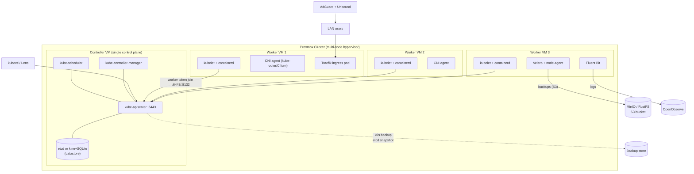
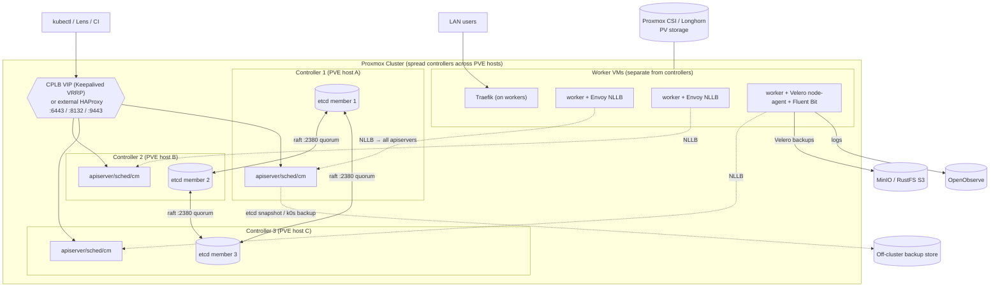

# k0s Homelab: Standard → Production-Grade Upgrade Plan & Technical Documentation

## TL;DR
- For a large homelab on Proxmox, run **3 co-located k0s controllers (stacked etcd quorum) fronted by k0s's built-in Control Plane Load Balancing (CPLB/Keepalived) VIP, plus Node-Local Load Balancing (NLLB) for internal traffic** — this is Option 2 and is the recommended target; single control-plane (Option 1) is genuinely fine only if you can tolerate control-plane outages during node maintenance.
- The real k0s-specific change between the two options is **`spec.storage.type: etcd` + identical cluster-level config on every controller + `spec.api.externalAddress`/CPLB VIP + controller join tokens**; single-node defaults to kine+SQLite which cannot form a quorum.
- Back up at **two layers**: `k0s backup`/etcd snapshots for cluster state, and **Velero + velero-plugin-for-aws against MinIO** (recommended) using CSI Snapshot Data Movement (Kopia) for PV data; RustFS works as an S3 target but is alpha/not production-ready — keep MinIO as primary.

## Key Findings

1. **k0s single→HA is a storage-backend and config-consistency change, not a kubeadm-style topology.** Default single-node k0s uses kine+SQLite; HA requires `spec.storage.type: etcd`. All cluster-level config (`network`, `storage`) must be byte-identical across controllers, while node-specific fields (`spec.api.address`, `spec.storage.etcd.peerAddress`, SANs) differ per node.
2. **3 controllers is the right quorum for a homelab; 5 is overkill.** 3 tolerates 1 failure; 5 tolerates 2 but doubles etcd write amplification. Single control-plane is fine for a lab that can accept downtime.
3. **k0s has two native LB mechanisms** — CPLB (Keepalived VRRP VIP for external/kubectl traffic) and NLLB (per-worker Envoy for internal traffic) — so you often need no external HAProxy at all.
4. **k0s has first-class backup** (`k0s backup`/`k0s restore`, k0sctl remote backup) that snapshots etcd + PKI + config but explicitly NOT PersistentVolumes — that gap is what Velero fills.
5. **Velero + velero-plugin-for-aws works against MinIO/RustFS** with `s3ForcePathStyle=true` and an `s3Url`; CSI Snapshot Data Movement moves PV data to the bucket via Kopia.

## Details

### Current Baseline (what you have)
Multi-node Proxmox → k0s (likely single controller, kine+SQLite, kube-router CNI, kube-proxy) with AdGuard+Unbound DNS, Fluent Bit→OpenObserve logging, step-ca PKI, NetBox IPAM, Traefik ingress. You are evaluating Cilium+Hubble (eBPF, kube-proxy replacement).

### k0s Version Context (2026)
k0s tracks upstream Kubernetes closely; current maintained tracks are 1.33 (etcd 3.5.31), 1.34 (etcd 3.6.12), and 1.35 (Kubernetes 1.35.x). Per k0s official docs (docs.k0sproject.io/stable/releases): "every 4 months there is a new minor release published. After a minor release is published, the upstream community is maintaining it for 14 months" — k0s supports the last three Kubernetes minor releases. Version string form `v1.34.x+k0s.0`. Note the etcd 3.5→3.6 jump between 1.33 and 1.34: per the official etcd.io blog "Avoiding Zombie Cluster Members When Upgrading to etcd v3.6" (Dec 2025, cross-posted on kubernetes.io 2025-12-21): "Always upgrade to v3.5.26 or later before moving to v3.6. This ensures your cluster is automatically repaired and avoids zombie members."

---

### OPTION 1 — Single Control-Plane, Fan-Out Workers

**Description.** One k0s controller runs kube-apiserver, kube-scheduler, kube-controller-manager, and the datastore. In default single-node mode that datastore is **kine+SQLite**; you can (and for a "large homelab" should) switch it to embedded **etcd** even with one controller so a later HA migration doesn't require a datastore rebuild. Workers join via worker tokens. CNI (kube-router default, or Cilium) handles pod networking; Traefik runs as a Deployment/DaemonSet on workers behind a MetalLB or node IP. Backup/monitoring (Velero, Fluent Bit, OpenObserve) live as workloads on workers; `k0s backup` runs on the controller.

**When Option 1 is genuinely fine.** If you can tolerate the control-plane being down during controller maintenance/reboots (existing pods keep running; you just lose scheduling/API), a single controller is legitimately adequate even at dozens of nodes and hundreds of pods. The scaling limit is availability, not capacity.

**Mermaid diagram:**


**Minimal Option-1 k0s.yaml (single controller, etcd-ready):**
```yaml
apiVersion: k0s.k0sproject.io/v1beta1
kind: ClusterConfig
metadata:
  name: k0s
spec:
  api:
    address: 192.168.10.10          # this controller's IP
    sans:
      - 192.168.10.10
  storage:
    type: etcd                       # NOT kine, so HA later is drop-in
    etcd:
      peerAddress: 192.168.10.10
  network:
    provider: kuberouter             # or "custom" for Cilium
    podCIDR: 10.244.0.0/16
    serviceCIDR: 10.96.0.0/12
```

---

### OPTION 2 — True HA Control Plane (etcd quorum) — RECOMMENDED

**Description.** Three controller-only VMs, each running the full control plane with **co-located (stacked) etcd** forming a 3-member quorum. k0s manages etcd membership automatically: joining a controller with a controller token makes k0s add the new etcd member. In front of the API sits either k0s's **built-in CPLB** (Keepalived VRRP floating VIP + load balancing) or an external TCP LB (HAProxy/nginx) or your router; workers additionally use **NLLB** (per-node Envoy) for internal API resilience. Workers are separate from controllers. Traefik ingress runs on workers. Velero + Fluent Bit run as workloads; etcd snapshots + `k0s backup` protect control-plane state.

**etcd quorum math.** Quorum = (n/2)+1. n=3 → quorum 2 → tolerates 1 failure. n=5 → quorum 3 → tolerates 2 failures but every write must be acknowledged by more members (higher latency, more disk I/O). For a homelab, **3 is the sweet spot**; choose 5 only if you routinely have 2 controllers down simultaneously (rare). Note: a 2-controller control plane is "HA" for the API but NOT for etcd (no quorum with 1 down) — avoid it.

**Load balancer options in front of k0s HA (homelab):**

| Option | How | Pros | Cons |
|---|---|---|---|
| **k0s CPLB (Keepalived)** | `spec.network.controlPlaneLoadBalancing.type: Keepalived` with VRRP virtualIPs | No external box; k0s-managed VIP floats between controllers; works with controller+worker; since k0s 1.32 a userspace reverse-proxy LB option replaces IPVS | Needs multicast + GARP on the LAN; VIP must be a free IP in-subnet; can't also set `spec.api.externalAddress` when using VirtualServers |
| **k0s NLLB (Envoy)** | `spec.network.nodeLocalLoadBalancing.type: EnvoyProxy` | Internal HA with zero external infra; auto-reconfigures as controllers change | Internal only (not for kubectl/Lens from your laptop); not on ARMv7; existing workers must restart to pick it up |
| **External HAProxy/nginx** | TCP frontends on 6443/8132/9443 → all controllers | Simple, well-understood, single stable address; good for external clients | Another box to run/patch; itself a SPOF unless paired (keepalived) |
| **Router/OPNsense/pfSense HAProxy** | Router-hosted TCP LB / VIP | Uses hardware you already have; central | Ties cluster availability to router; config lives outside cluster |

Recommended homelab combo: **CPLB (Keepalived) for the external VIP + NLLB for internal traffic**. Use external HAProxy only if your LAN blocks multicast/GARP.

**Ports the LB must pass:** 6443 (Kubernetes API), 8132 (Konnectivity), 9443 (controller join API).

**Mermaid diagram:**


**Full k0sctl.yaml for Option 2 (3 controllers + workers, CPLB enabled):**
```yaml
apiVersion: k0sctl.k0sproject.io/v1beta1
kind: Cluster
metadata:
  name: k0s-homelab
spec:
  hosts:
    - role: controller
      ssh: { address: 192.168.10.11, user: root, keyPath: ~/.ssh/id_rsa }
    - role: controller
      ssh: { address: 192.168.10.12, user: root, keyPath: ~/.ssh/id_rsa }
    - role: controller
      ssh: { address: 192.168.10.13, user: root, keyPath: ~/.ssh/id_rsa }
    - role: worker
      ssh: { address: 192.168.10.21, user: root, keyPath: ~/.ssh/id_rsa }
    - role: worker
      ssh: { address: 192.168.10.22, user: root, keyPath: ~/.ssh/id_rsa }
  k0s:
    version: v1.34.9+k0s.0
    config:
      spec:
        storage:
          type: etcd
        network:
          provider: kuberouter        # or custom for Cilium
          controlPlaneLoadBalancing:
            enabled: true
            type: Keepalived
            keepalived:
              vrrpInstances:
                - virtualIPs: ["192.168.10.100/24"]
                  authPass: "changeme"
              virtualServers:
                - ipAddress: "192.168.10.100"
          nodeLocalLoadBalancing:
            enabled: true
            type: EnvoyProxy
```
When using CPLB VirtualServers, do **not** set a non-empty `spec.api.externalAddress`. If instead you use an external HAProxy, drop the CPLB block and set `spec.api.externalAddress: <LB IP>` + add the LB IP to `spec.api.sans` on every controller.

**Controller join tokens (manual path).** On an existing controller:
```bash
k0s token create --role=controller --expiry=1h > controller.token
# on new controller (etcd/kine required; SQLite single-node cannot join):
k0s install controller --token-file /path/controller.token -c /etc/k0s/k0s.yaml
```
Every controller needs its own `k0s.yaml` with matching cluster-level config but its own `spec.api.address` and `spec.storage.etcd.peerAddress`. All controllers must share the same CA/SA keypairs (`/var/lib/k0s/pki/{ca,sa,etcd/ca}.*`) — k0sctl distributes these automatically; manual installs require copying them.

---

### Pod-Churn / Production Tuning (k0s-specific surface)

k0s exposes upstream component flags as **maps** under `extraArgs` (flag names without `--`, all values quoted strings). k0s explicitly states behavior of `extraArgs`/`rawArgs` is "outside k0s support," and publishes no tuned defaults — the values below are illustrative starting points from upstream Kubernetes, to be load-tested.

```yaml
spec:
  api:
    extraArgs:
      max-requests-inflight: "800"
      max-mutating-requests-inflight: "400"
  controllerManager:
    extraArgs:
      kube-api-qps: "100"
      kube-api-burst: "150"
      concurrent-deployment-syncs: "20"
      node-monitor-period: "3s"
  scheduler:
    extraArgs:
      kube-api-qps: "100"
      kube-api-burst: "150"
  storage:
    type: etcd
    etcd:
      peerAddress: 192.168.10.11
      extraArgs:
        quota-backend-bytes: "8589934592"   # 8 GiB
        snapshot-count: "10000"
        heartbeat-interval: "250"
        election-timeout: "2500"
```

**Kubelet eviction / image GC / reserved via worker profiles** (`spec.workerProfiles`; selected at join with `--profile`). Overridable fields are KubeletConfiguration keys; `clusterDNS`, `clusterDomain`, `apiVersion`, `kind`, `staticPodURL` cannot be overridden:
```yaml
spec:
  workerProfiles:
    - name: churn-optimized
      values:
        imageGCHighThresholdPercent: 85
        imageGCLowThresholdPercent: 80
        kubeReserved: { cpu: "500m", memory: "1Gi", ephemeral-storage: "2Gi" }
        systemReserved: { cpu: "500m", memory: "1Gi" }
        evictionHard:
          memory.available: "500Mi"
          nodefs.available: "10%"
          imagefs.available: "15%"
        maxPods: 250
        registryPullQPS: 10
        registryBurst: 20
```
Join with: `k0s worker --token-file k0s.token --profile churn-optimized`. **Gotcha:** with k0sctl the profile ConfigMap is generated but NOT applied unless you add `--profile=<name>` to the host's `installFlags` (k0s issue #2714).

**containerd image GC** is driven by the **kubelet** thresholds above, not containerd config. For runtime/registry customization use the drop-in mechanism: partial `*.toml` files in `/etc/k0s/containerd.d/` (since k0s 1.27.1), merged into k0s's managed `/etc/k0s/containerd.toml` (magic line `# k0s_managed=true`); verify merged CRI config at `/run/k0s/containerd-cri.toml`.

**CoreDNS autoscaling.** k0s scales CoreDNS replicas by node count internally, but the current schema exposes CoreDNS tuning only via the (experimental) **patches** escape hatch — not a dedicated nodeCount/clusterProportional block:
```yaml
spec:
  network:
    coreDNS:
      patches:
        - target: { kind: Deployment, name: coredns, namespace: kube-system }
          patch:
            type: StrategicMergePatch
            content: |
              spec:
                replicas: 3
                template:
                  spec:
                    containers:
                      - name: coredns
                        resources:
                          limits:
                            memory: 256Mi
```

**ResourceQuotas/LimitRanges, PriorityClasses, PodDisruptionBudgets, HPA/VPA stabilization windows, conntrack tuning** are standard Kubernetes objects/flags applied as manifests (drop into `/var/lib/k0s/manifests/<dir>/` for k0s to auto-apply) — not k0s-specific config. For Cilium (kube-proxy replacement) conntrack is managed by Cilium's eBPF datapath; set `spec.network.kubeProxy.disabled: true` and `provider: custom`.

### CNI: Cilium + Hubble (optional)
To run Cilium as kube-proxy replacement on k0s: set `spec.network.provider: custom` and `spec.network.kubeProxy.disabled: true`, then Helm-install Cilium with `kubeProxyReplacement=true`, `k8sServiceHost=<VIP>`, `k8sServicePort=6443`. CNI provider cannot be changed after init without redeploy — decide before migration. Hubble adds eBPF flow observability that complements your Fluent Bit→OpenObserve pipeline.

---

### Etcd Backup & Disaster Recovery (HA)

**Layer 1 — k0s native.** `k0s backup --save-path=<dir>` on a controller captures: PKI, etcd snapshot (or kine/SQLite snapshot), k0s.yaml, `/var/lib/k0s/manifests`, image bundles, helm config. It does NOT capture PersistentVolumes or non-etcd/kine datastores. Restore: `k0s restore <archive>` on a fresh controller, then join the remaining controllers. With k0sctl: `k0sctl backup` and `k0sctl apply --restore-from <file>`; the `externalAddress` must be unchanged between backup and restore. You can pipe through GnuPG/OpenSSL for encryption (use `-` as save path).

**Layer 2 — raw etcd (know it, even though k0s wraps it).** Verify health and snapshot directly:
```bash
k0s etcd member-list
etcdctl --endpoints=https://127.0.0.1:2379 \
  --cacert=/var/lib/k0s/pki/etcd/ca.crt \
  --cert=/var/lib/k0s/pki/etcd/server.crt \
  --key=/var/lib/k0s/pki/etcd/server.key endpoint health
```
CNCF/etcd guidance: run an odd number of members, snapshot regularly (frequency scales with churn), encrypt snapshots, store off-cluster, and keep etcd on fast disks (SSD) since it's disk/network I/O sensitive.

**Controller replacement (no downtime, ≥3 controllers).** Declarative (k0s ≥1.30):
```bash
kubectl patch etcdmember <name> -p '{"spec":{"leave":true}}' --type merge
kubectl wait etcdmember <name> --for condition=Joined=False
```
Or imperative: `k0s etcd leave --peer-address <IP>`. Then reset the old node and join a fresh one. **k0s cannot shrink etcd automatically** — always remove the member before shutting the node down, and always keep quorum during the operation.

---

### Velero Implementation Plan (MinIO primary, RustFS optional)

**Storage backend choice.** **MinIO is the recommended S3 target.** Caveat: MinIO put the community repo in maintenance mode in December 2025 and, after briefly re-opening it, formally archived it read-only on April 25, 2026, per Storm Developments (2026): "On April 25, 2026 the repository was formally archived, and it has been read-only since... no new releases, no reviewed patches, no official community binaries." MinIO's own archived README states: "the MinIO community edition is now distributed as source code only. We will no longer provide pre-compiled binary releases for the community version," directing production users to the proprietary MinIO AIStor. Practical implication: pin a known-good MinIO image (or build from source with `go install github.com/minio/minio@latest`) and plan a longer-term path. **RustFS** is a Rust, Apache-2.0, S3-compatible MinIO alternative and a drop-in target — per It's FOSS (2026), RustFS is "written in Rust and released under the Apache 2.0 license... claims 2.3x faster performance than MinIO for small object payloads, includes a management console out of the box, and supports migration from existing MinIO deployments. The catch here is that it's still in alpha." **Recommendation: MinIO as primary Velero target now; pilot RustFS (or SeaweedFS/Garage) in staging only.** Whichever you pick, Velero config is identical (both are S3 endpoints with path-style addressing).

**CSI driver for k0s-on-Proxmox.** Most realistic options: **Proxmox CSI plugin** (sergelogvinov — provisions PVs as Proxmox LVM/zfs block devices, supports snapshots, requires clustered Proxmox + region/zone node labels; note k0s kubelet dir is `/var/lib/k0s/kubelet`), **Longhorn** (replicated block storage, native snapshots/backups to S3, easiest CSI-snapshot story but wants raw disks not virtio layering), or **local-path-provisioner** (simplest, no snapshots — rely on Velero File System Backup). For CSI Snapshot Data Movement you need a driver supporting v1 VolumeSnapshots (Proxmox CSI or Longhorn); with local-path use FSB instead.

**Install (Helm, k0s).** Use matched versions — as of March 2026 the current pairing is Velero v1.17.2 with velero-plugin-for-aws v1.13.2 (per LINBIT's March 2026 guide: "This article uses version 1.13.2 of the Velero plugin for AWS, for use with Velero version 1.17.2"); the CSI plugin is now merged into Velero core, so no separate CSI plugin is needed:
```bash
helm repo add vmware-tanzu https://vmware-tanzu.github.io/helm-charts
```
```yaml
# velero-values.yaml
configuration:
  backupStorageLocation:
    - name: default
      provider: aws
      bucket: velero
      default: true
      config:
        region: minio
        s3ForcePathStyle: "true"
        s3Url: http://minio.minio.svc:9000     # or RustFS endpoint
  volumeSnapshotLocation:
    - name: default
      provider: aws
      config:
        region: minio
  features: EnableCSI
credentials:
  useSecret: true
  secretContents:
    cloud: |
      [default]
      aws_access_key_id=velero
      aws_secret_access_key=REDACTED
initContainers:
  - name: velero-plugin-for-aws
    image: velero/velero-plugin-for-aws:v1.13.2
    volumeMounts:
      - { mountPath: /target, name: plugins }
deployNodeAgent: true                 # node-agent daemonset for CSI data movement / FSB
```
```bash
helm install velero vmware-tanzu/velero -n velero --create-namespace -f velero-values.yaml
```
CLI alternative:
```bash
velero install --provider aws --plugins velero/velero-plugin-for-aws:v1.13.2 \
  --bucket velero --secret-file ./credentials-minio \
  --backup-location-config region=minio,s3ForcePathStyle="true",s3Url=http://minio.minio.svc:9000 \
  --use-node-agent --features=EnableCSI
```
Note the `s3ForcePathStyle=true` + `s3Url` are the essential S3-compatible knobs; a known bug is that `s3Url` persists across reinstall (edit the BSL directly if you change it).

**Schedules (balance churn vs homelab capacity):**
```yaml
apiVersion: velero.io/v1
kind: Schedule
metadata: { name: nightly-full, namespace: velero }
spec:
  schedule: "0 2 * * *"           # 02:00 daily
  template:
    ttl: 720h0m0s                 # keep 30 days
    snapshotVolumes: true
    snapshotMoveData: true        # CSI Snapshot Data Movement → bucket (Kopia)
    includedNamespaces: ["*"]
---
apiVersion: velero.io/v1
kind: Schedule
metadata: { name: hourly-stateful, namespace: velero }
spec:
  schedule: "0 * * * *"
  template:
    ttl: 72h0m0s                  # keep 3 days
    snapshotVolumes: true
    snapshotMoveData: true
    includedNamespaces: [databases, netbox, openobserve]
```
For CSI data movement per-backup: `velero backup create <name> --snapshot-move-data`. Velero enforces TTL to expire old backups automatically. Use pre/post hooks (e.g. `CHECKPOINT;` for Postgres) for application-consistent DB backups rather than relying on raw snapshots.

### GitOps / ArgoCD — Deferred
ArgoCD/GitOps is **explicitly out of scope** for this plan. Where it would slot in later: manage the k0s addon manifests (Traefik, Velero schedules, Cilium values, ResourceQuotas/PriorityClasses/PDBs) declaratively from Git, replacing the `/var/lib/k0s/manifests/` drop-in approach and manual Helm installs. k0s also ships a Flux example if you prefer Flux. No further GitOps detail here by design.

---

## Recommendations (staged rollout for a LIVE homelab)

**Stage 0 — Safety net (do first, no cluster changes).**
1. `k0s backup` on the current controller; copy the archive off-box (encrypt with gpg).
2. Stand up MinIO (dedicated VM or Proxmox LXC with a data disk), create a `velero` bucket + access key.
3. Install Velero (values above), run `velero backup create bootstrap --include-namespaces '*'`; confirm `velero backup describe bootstrap` shows `Phase: Completed`. **Validation gate:** backup Completed + objects visible in MinIO console.

**Stage 1 — Convert datastore to etcd (if currently kine/SQLite).**
4. This cannot be migrated in place (etcd↔kine is a rebuild). Cleanest path per the k0s community: **build the HA cluster fresh with etcd and migrate workloads via Velero restore**, rather than in-place surgery on a single node (in-place single→HA is documented but error-prone). If you must stay in place, drain workloads to workers first so app downtime is minimized while the controller is rebuilt.

**Stage 2 — Go HA (Option 2).**
5. Provision 3 controller VMs spread across different Proxmox hosts (so one PVE host failure ≠ quorum loss). Keep workers separate.
6. Deploy with the k0sctl.yaml above (etcd + CPLB + NLLB). k0sctl distributes CA/SA keys automatically. **Validation gate:** `k0s etcd member-list` shows 3 members; `etcdctl ... endpoint health` all healthy; `kubectl get nodes` lists all.
7. Point kubectl/Lens and Traefik/external clients at the **CPLB VIP**, not a single controller.

**Stage 3 — Failover drill (prove it works).**
8. `kubectl get --raw='/readyz'` through the VIP, then hard-stop the active controller VM (or `k0s stop`). Confirm the VIP moves, API stays reachable, and workers keep functioning (NLLB). Confirm etcd keeps quorum (2/3). Bring the node back; confirm it rejoins.

**Stage 4 — Tuning & CNI (optional, one change at a time).**
9. Apply control-plane `extraArgs` + worker profile; restart controllers/workers; watch apiserver latency and etcd fsync in your metrics.
10. If adopting Cilium: decide **before** or during the fresh HA build (CNI can't change post-init without redeploy). Set `provider: custom` + `kubeProxy.disabled: true`, Helm-install Cilium with `kubeProxyReplacement=true` pointing at the VIP; add Hubble.

**Stage 5 — Backup hardening.**
11. Add Velero Schedules (nightly full + hourly stateful) with `snapshotMoveData: true` once a CSI-snapshot-capable driver (Proxmox CSI or Longhorn) is in place; keep local-path apps on FSB. **Validation gate:** a scheduled backup Completes and a **test restore into a scratch namespace** succeeds.

**Thresholds that change the plan.**
- Stay Option 1 if you can accept control-plane downtime and want to minimize nodes.
- Move to 5 controllers only if you regularly lose 2 controllers at once.
- Move Velero from FSB to CSI data movement once you outgrow local-path (need snapshots/consistency).
- Reconsider RustFS→primary only once it declares GA/production-ready.

## Caveats
- **k0s `extraArgs`/`rawArgs` and component patches are "outside k0s support" / experimental** — no k0s-published tuned defaults; every numeric value here is an upstream-Kubernetes starting point to load-test, not a k0s recommendation.
- **CNI and storage-backend type are effectively immutable after init** (changing requires cluster redeploy) — decide Cilium-vs-kube-router and etcd-vs-kine before building.
- **kine/SQLite single-node cannot join controllers** — HA strictly requires etcd (or external MySQL/Postgres via kine).
- **CPLB Keepalived needs multicast + GARP**; if your VLAN/router blocks these, use external HAProxy instead. A past k0s bug (#5178) caused a keepalived load-balancing loop — ensure you're on a current release.
- **NLLB is internal-only and was long marked experimental**; existing workers must restart to adopt it; not on ARMv7.
- **`k0s backup` excludes PersistentVolumes** — Velero is mandatory for PV data, not optional.
- **RustFS is alpha (2026)**; MinIO Community is archived/maintenance-mode (repo read-only since April 25, 2026, source-only, no community binaries) — both carry longer-term risk; treat object storage choice as something to revisit.
- **etcd 3.5→3.6 across k0s 1.33→1.34** needs an intermediate ≥3.5.26 hop to avoid quorum loss ("zombie members") — mind this during k0s upgrades.
- Version specifics (k0s 1.34/1.35, plugin v1.13.2 / Velero v1.17.2, etcd versions) are current as of mid-2026 and move fast — re-verify against docs.k0sproject.io and velero.io at execution time.