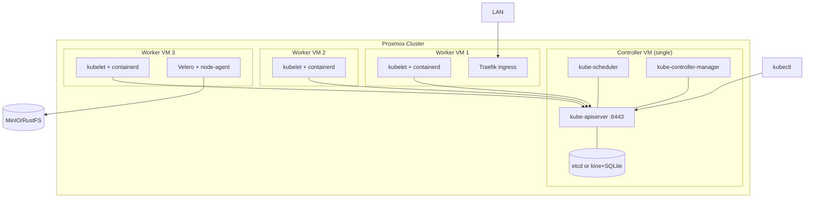
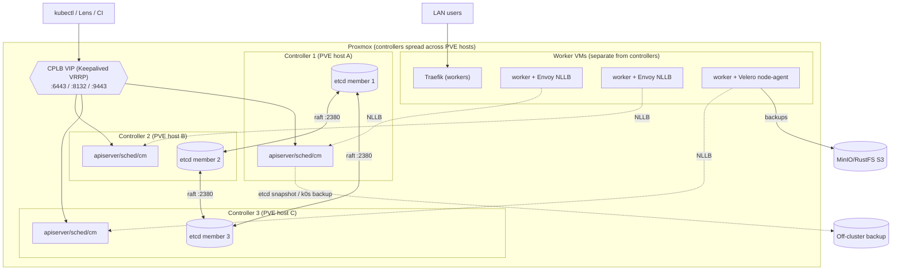

# Homelab Infrastructure Upgrade — Implementation Brief

> **Purpose of this doc:** Paste this into a new Claude / Claude Code session to implement the changes below. It summarizes decisions and specs worked out across a planning conversation. Each section has enough detail to execute from; ask me (Malcolm) before making irreversible changes (etcd datastore type, CNI provider, backup target) since those are effectively immutable post-init in k0s.

---

## 0. Environment context

- Proxmox multi-node cluster; newest addition is a **MINISFORUM MS-A2** (Ryzen 9 9955HX, 64GB DDR5 — 16GB stock + 48GB Crucial CT48G56C46S5, mismatched/asymmetric dual-channel, kept as-is — RAM is expensive right now and this workload is capacity-bound, not bandwidth-bound).
- k0s Kubernetes cluster(s) running on Proxmox VMs.
- Existing stack: AdGuard Home + Unbound (DNS, on `mactop`), step-ca (internal PKI), Traefik (in-cluster ingress), Fluent Bit → OpenObserve (logging), NetBox (IPAM/assets), wildcard Let's Encrypt via DNS-01 for `lab.theblacktonystark.com`.
- Evaluating Cilium + Hubble as CNI/kube-proxy replacement (decision pending, must be made **before** any cluster rebuild since CNI is immutable post-init in k0s).
- Hostnames: `mactop` (M4 Pro Mac Mini, 24GB), `beeftop` (older MacBook Pro).

---

## 1. RAM decision — MS-A2 (no action required)

**Decision:** Keep the mismatched 16GB + 48GB (64GB total) config. Do NOT buy a matched 2×48GB (96GB) kit right now.

**Rationale:** Asymmetric dual-channel mode pairs 16GB from each stick in true dual-channel, with the remaining 32GB running single-channel — not a full single-channel penalty. Proxmox + VMs + k0s is a capacity-bound workload, not bandwidth-bound, so this doesn't meaningfully hurt. ~55GB is available for VMs after Proxmox overhead, which is enough for several VMs + a k0s node.

**Revisit if:** this node takes on ZFS/TrueNAS duty (ARC eats RAM fast), or VM count grows well beyond current plans. If upgrading later, the matched-pair part is **Crucial CT2K48G56C46S5** (2×48GB DDR5-5600 kit, 96GB total, board max).

**Validation step:** once RAM config is finalized, run `dmidecode -t memory` (or check Proxmox's node summary) to confirm actual negotiated speed/channel mode, so real numbers are known rather than assumed.

---

## 2. k0s full monitoring/observability stack

Deploy exporters across 5 layers. Target OpenObserve as the single pane of glass (accepts Prometheus remote_write + OTLP natively — no separate Prometheus/Grafana stack required unless preferred).

**Control plane** (scrape built-in `/metrics`, no exporter needed):
- kube-apiserver, kube-scheduler, kube-controller-manager
- etcd (or kine, if still on SQLite backend — kine metrics are more limited)
- k0s controller-level metrics

**Node/host level:**
- `node-exporter` — OS-level CPU/mem/disk/net
- `cadvisor` — per-container usage (built into kubelet, `/metrics/cadvisor`)
- `process-exporter` — optional, per-process breakdown
- `smartctl-exporter` — disk health/SMART, useful for MS-A2 NVMe

**Cluster object state:**
- `kube-state-metrics` — deployment/pod/node/PVC status, restarts, requests vs limits (commonly missed; complements cadvisor)

**Networking:**
- CoreDNS `/metrics` (query counts, latency, errors)
- If Cilium adopted: Cilium `/metrics` + Hubble flow-level metrics (replaces kube-proxy metrics)
- `blackbox-exporter` — synthetic uptime/latency probing

**Ingress/app layer:**
- Traefik native Prometheus metrics (flip on metrics entrypoint)
- Beyla (eBPF auto-instrumentation) for app-level tracing without manual instrumentation

**Task:**
1. Deploy `kube-state-metrics`, `node-exporter` (DaemonSet), `smartctl-exporter` via manifests dropped in `/var/lib/k0s/manifests/monitoring/` (k0s auto-applies).
2. Enable Traefik's metrics entrypoint and CoreDNS metrics.
3. Configure OpenObserve to accept Prometheus remote_write + OTLP; point all exporters at it.
4. **Validation:** `curl` each `/metrics` endpoint directly (or check scraper targets page) to confirm every exporter returns non-empty output — DaemonSets can run while scrape config silently misses them.

---

## 3. k0s tuning for pod churn (high create/destroy load)

**Datastore — use etcd, not kine+sqlite** (also required for HA in §4):
```yaml
spec:
  storage:
    type: etcd
    etcd:
      peerAddress: <node-ip>
      extraArgs:
        quota-backend-bytes: "8589934592"   # 8 GiB
        snapshot-count: "10000"
        heartbeat-interval: "250"
        election-timeout: "2500"
```
Run periodic defrag: `etcdctl defrag --cluster` (cron), or set `--auto-compaction-retention=1h`.

**API server:**
```yaml
spec:
  api:
    extraArgs:
      max-requests-inflight: "800"
      max-mutating-requests-inflight: "400"
      event-ttl: "1h"
```

**Controller manager:**
```yaml
extraArgs:
  kube-controller-manager:
    concurrent-deployment-syncs: "10"
    concurrent-replicaset-syncs: "10"
    kube-api-qps: "50"
    kube-api-burst: "100"
```

**Kubelet — eviction/GC (via `workerProfiles`):**
```yaml
spec:
  workerProfiles:
  - name: churn-optimized
    values:
      evictionHard:
        memory.available: "300Mi"
        nodefs.available: "10%"
        imagefs.available: "15%"
      imageGCHighThresholdPercent: 80
      imageGCLowThresholdPercent: 70
      containerLogMaxSize: "10Mi"
      containerLogMaxFiles: 5
      kubeReserved: { cpu: "500m", memory: "1Gi" }
      systemReserved: { cpu: "250m", memory: "512Mi" }
      maxPods: 250
      registryPullQPS: 10
      registryBurst: 20
```
Join workers with: `k0s worker --token-file k0s.token --profile churn-optimized`
**Gotcha:** with k0sctl, add `--profile=churn-optimized` to the host's `installFlags` or the profile ConfigMap won't actually be applied.

**containerd GC:** driven by kubelet thresholds above, not containerd config directly. For registry/runtime customization use drop-ins in `/etc/k0s/containerd.d/*.toml` (merged into managed `/etc/k0s/containerd.toml`; verify at `/run/k0s/containerd-cri.toml`).

**Guardrails (standard k8s manifests, drop in `/var/lib/k0s/manifests/`):**
- ResourceQuotas + LimitRanges per namespace
- PriorityClasses (protect CoreDNS/Traefik/monitoring from eviction storms)
- PodDisruptionBudgets

**Networking under churn:**
- If Cilium: tune `bpf-ct-global-tcp-max` / `bpf-ct-global-any-max` upward (default conntrack tables exhaust fast under churn)
- CoreDNS scaling via patches (k0s exposes this via the experimental `patches` field, not a dedicated autoscaler block):
```yaml
spec:
  network:
    coreDNS:
      patches:
        - target: { kind: Deployment, name: coredns, namespace: kube-system }
          patch:
            type: StrategicMergePatch
            content: |
              spec:
                replicas: 3
```

**HPA/VPA stabilization (if autoscaler-driven churn):**
```yaml
behavior:
  scaleDown: { stabilizationWindowSeconds: 300 }
  scaleUp: { stabilizationWindowSeconds: 60 }
```

**Validation:** synthetic churn test (loop creating/deleting a batch Job, or scale a Deployment rapidly up/down). Watch `kubectl get events --watch`, check `etcdctl endpoint status` for DB size growth, confirm no `OOMKilled`/`Evicted` pods (`kubectl get pods -A | grep -v Running`), and graph pod restart count + API latency via kube-state-metrics if wired up.

---

## 4. k0s production-grade HA upgrade (target architecture)

**Decision: build toward Option 2 (3-controller HA with stacked etcd)** rather than staying single control-plane, given this is meant to be a serious, long-lived homelab platform.

### Option 1 (baseline, for reference) — single control-plane
One controller (kube-apiserver, scheduler, controller-manager, etcd-or-kine) + fan-out workers. Fine only if control-plane downtime during maintenance is acceptable.



### Option 2 (target) — 3-controller HA, stacked etcd, CPLB + NLLB



**Quorum:** 3 controllers tolerates 1 failure (recommended for homelab scale). Avoid 2 (no quorum with 1 down). 5 only if you routinely lose 2 controllers simultaneously.

**Load balancer:** k0s's built-in **CPLB (Keepalived VRRP)** for the external VIP + **NLLB (Envoy)** for internal worker→apiserver traffic. Use external HAProxy only if the LAN blocks multicast/GARP.

**k0sctl.yaml (target state):**
```yaml
apiVersion: k0sctl.k0sproject.io/v1beta1
kind: Cluster
metadata:
  name: k0s-homelab
spec:
  hosts:
    - role: controller
      ssh: { address: 192.168.10.11, user: root, keyPath: ~/.ssh/id_rsa }
    - role: controller
      ssh: { address: 192.168.10.12, user: root, keyPath: ~/.ssh/id_rsa }
    - role: controller
      ssh: { address: 192.168.10.13, user: root, keyPath: ~/.ssh/id_rsa }
    - role: worker
      ssh: { address: 192.168.10.21, user: root, keyPath: ~/.ssh/id_rsa }
    - role: worker
      ssh: { address: 192.168.10.22, user: root, keyPath: ~/.ssh/id_rsa }
  k0s:
    version: v1.34.9+k0s.0
    config:
      spec:
        storage:
          type: etcd
        network:
          provider: kuberouter        # or "custom" if Cilium adopted
          controlPlaneLoadBalancing:
            enabled: true
            type: Keepalived
            keepalived:
              vrrpInstances:
                - virtualIPs: ["192.168.10.100/24"]
                  authPass: "changeme"
              virtualServers:
                - ipAddress: "192.168.10.100"
          nodeLocalLoadBalancing:
            enabled: true
            type: EnvoyProxy
```
**Note:** when using CPLB VirtualServers, do NOT also set a non-empty `spec.api.externalAddress`. If using external HAProxy instead, drop the CPLB block, set `spec.api.externalAddress: <LB IP>`, and add that IP to `spec.api.sans` on every controller.

**Rollout plan (live homelab, staged, with validation gates):**

1. **Stage 0 — safety net (no cluster changes):** `k0s backup`, copy off-box + encrypt. Stand up MinIO, create `velero` bucket + keys. Install Velero, run a bootstrap backup. **Gate:** backup shows `Phase: Completed`, objects visible in MinIO console.
2. **Stage 1 — datastore to etcd:** cannot migrate kine→etcd in place cleanly. Recommended: build the HA cluster fresh with etcd, migrate workloads via Velero restore, rather than in-place surgery.
3. **Stage 2 — go HA:** provision 3 controller VMs spread across different Proxmox hosts (so one PVE host failure ≠ quorum loss). Deploy via k0sctl.yaml above. **Gate:** `k0s etcd member-list` shows 3 members; `etcdctl endpoint health` all healthy; `kubectl get nodes` lists everything. Point kubectl/Traefik at the CPLB VIP, not a single controller.
4. **Stage 3 — failover drill:** hard-stop the active controller VM, confirm VIP moves, API stays reachable, workers keep functioning via NLLB, etcd keeps quorum (2/3). Bring the node back, confirm rejoin.
5. **Stage 4 — tuning & CNI:** apply §3 extraArgs/worker profile one change at a time, watch apiserver latency/etcd fsync. If adopting Cilium, decide before/during this rebuild (CNI immutable post-init) — `provider: custom`, `kubeProxy.disabled: true`, Helm-install with `kubeProxyReplacement=true`, `k8sServiceHost=<VIP>`.
6. **Stage 5 — backup hardening:** add Velero Schedules (below) once a CSI-snapshot-capable driver is in place.

**Etcd backup/DR:**
- Layer 1 (k0s native): `k0s backup --save-path=<dir>` — captures PKI, etcd/kine snapshot, k0s.yaml, manifests, helm config. **Does NOT capture PersistentVolumes.** Restore: `k0s restore <archive>` on a fresh controller, `externalAddress` must be unchanged.
- Layer 2 (raw etcd, know it): `k0s etcd member-list`; health via `etcdctl --endpoints=https://127.0.0.1:2379 --cacert=/var/lib/k0s/pki/etcd/ca.crt --cert=/var/lib/k0s/pki/etcd/server.crt --key=/var/lib/k0s/pki/etcd/server.key endpoint health`.
- Controller replacement (no downtime, ≥3 controllers): `kubectl patch etcdmember <name> -p '{"spec":{"leave":true}}' --type merge` then `kubectl wait etcdmember <name> --for condition=Joined=False`, or `k0s etcd leave --peer-address <IP>`. k0s cannot auto-shrink etcd — always remove the member before shutting the node down.
- **Watch the etcd 3.5→3.6 jump** between k0s 1.33→1.34: upgrade to etcd ≥3.5.26 before moving to 3.6 to avoid "zombie member" quorum issues.

**Velero backup plan (PV data + resources → S3):**
- Primary target: **MinIO** (self-hosted). Note: MinIO Community repo was archived read-only April 25, 2026, source-only, no prebuilt binaries — pin a known-good image or build from source, plan a longer-term path.
- **RustFS** is a viable S3-compatible alternative (Rust, Apache-2.0, claims better small-object perf) but is **alpha** — pilot in staging only, don't make it primary yet.
- CSI driver for k0s-on-Proxmox: **Proxmox CSI plugin** (snapshot support, needs clustered Proxmox) or **Longhorn** (replicated block storage, easiest CSI-snapshot story) — pick one before wiring CSI Snapshot Data Movement. `local-path-provisioner` has no snapshots; use Velero File System Backup (FSB) instead for those PVs.
- Install (Helm, versions current as of mid-2026 — re-verify at execution time): Velero v1.17.2 + velero-plugin-for-aws v1.13.2 (CSI plugin now merged into Velero core).

```yaml
# velero-values.yaml
configuration:
  backupStorageLocation:
    - name: default
      provider: aws
      bucket: velero
      default: true
      config:
        region: minio
        s3ForcePathStyle: "true"
        s3Url: http://minio.minio.svc:9000     # or RustFS endpoint
  volumeSnapshotLocation:
    - name: default
      provider: aws
      config: { region: minio }
  features: EnableCSI
credentials:
  useSecret: true
  secretContents:
    cloud: |
      [default]
      aws_access_key_id=velero
      aws_secret_access_key=REDACTED
initContainers:
  - name: velero-plugin-for-aws
    image: velero/velero-plugin-for-aws:v1.13.2
    volumeMounts:
      - { mountPath: /target, name: plugins }
deployNodeAgent: true
```
```bash
helm install velero vmware-tanzu/velero -n velero --create-namespace -f velero-values.yaml
```

**Schedules:**
```yaml
apiVersion: velero.io/v1
kind: Schedule
metadata: { name: nightly-full, namespace: velero }
spec:
  schedule: "0 2 * * *"
  template:
    ttl: 720h0m0s
    snapshotVolumes: true
    snapshotMoveData: true
    includedNamespaces: ["*"]
---
apiVersion: velero.io/v1
kind: Schedule
metadata: { name: hourly-stateful, namespace: velero }
spec:
  schedule: "0 * * * *"
  template:
    ttl: 72h0m0s
    snapshotVolumes: true
    snapshotMoveData: true
    includedNamespaces: [databases, netbox, openobserve]
```
**Gate:** a scheduled backup Completes AND a **test restore into a scratch namespace** succeeds — not just "backup completed."

**GitOps (ArgoCD):** explicitly deferred for now. When adopted later, it would manage the `/var/lib/k0s/manifests/` addon manifests + Velero schedules + Cilium values declaratively from Git, replacing manual Helm installs. No further action needed now.

**Known gotchas to carry into implementation:**
- `extraArgs`/`rawArgs`/component patches are "outside k0s support" — no k0s-published tuned defaults, load-test every numeric value.
- CNI and storage-backend type are effectively immutable post-init — decide before building.
- kine/SQLite single-node **cannot** join controllers into an HA set — etcd is mandatory for HA.
- CPLB/Keepalived needs multicast + GARP on the LAN — verify this works before committing to it over external HAProxy.
- NLLB is internal-only; existing workers must restart to adopt it.

---

## 5. Primary gateway — host-level reverse proxy (outside k8s)

**Goal:** one LAN entry point routing to k8s cluster(s), macOS services (mactop/beeftop), and Linux services (bare metal/LXC/VM) — not running inside k8s.

**Decision: Traefik standalone**, on a dedicated always-on Proxmox VM/LXC (not on a laptop) with a static IP. AdGuard/Unbound resolves `*.lab.theblacktonystark.com` to this IP.

**Architecture principle:** don't have this gateway talk to any k8s API directly. Treat each k8s cluster's own in-cluster Traefik ingress as one upstream target — the cluster keeps doing its own fine-grained routing. All three backend types (k8s cluster, macOS service, Linux service) are then just "an IP:port" from this gateway's perspective, defined identically:

```yaml
# /etc/traefik/dynamic/netbox.yaml
http:
  routers:
    netbox:
      rule: "Host(`netbox.lab.theblacktonystark.com`)"
      service: netbox
      tls: {}
  services:
    netbox:
      loadBalancer:
        servers:
          - url: "http://192.168.10.30:8080"
```

**Dynamic config mechanism — two-tier decision:**
- **Now / small scale:** Traefik **file provider** (`watch: true` on a directory), one YAML per service, git-managed, fits existing `just`-based automation workflow.
- **Later / larger scale (~20-30+ non-k8s services):** upgrade to **Traefik + Consul Catalog** — a Consul agent on each Mac/Linux host registers its services with health checks, Traefik watches the catalog and updates routes automatically (real service discovery for non-k8s hosts, mirroring what k8s gives for free in-cluster).
- **Not recommended for this use case:** Traefik's plain **KV Store provider** (Consul/etcd/Redis/ZooKeeper) — this is a different feature than Consul Catalog. It reads manually-written router/service definitions out of a KV store (no auto-discovery, no health checks) — solves "centralized config storage for multiple writers," not "auto-register my fleet." Skip unless multiple people/scripts need to write config concurrently.

**TLS:** terminate once at the gateway using the existing wildcard Let's Encrypt cert (DNS-01). Backends stay plain HTTP on the trusted LAN unless step-ca mTLS is specifically wanted for zero-trust between gateway and backend.

**Task list:**
1. Provision a small dedicated LXC/VM on Proxmox with a static IP for the gateway.
2. Install Traefik standalone (binary or container via systemd/docker), configure static config with file provider pointed at `/etc/traefik/dynamic/`, `watch: true`.
3. Wire in the existing wildcard cert (or a certResolver hitting DNS-01 directly from this host).
4. Add one dynamic-config YAML per existing service (k8s cluster ingress VIP, macOS launchd services, Linux systemd services).
5. Update AdGuard/Unbound to resolve relevant hostnames to the gateway's static IP.
6. **Validation:** `curl -v https://<service>.lab.theblacktonystark.com` for each configured route from a LAN client; confirm correct backend reached and cert chain valid.
7. (Future, once service count grows) evaluate Consul Catalog migration — stand up Consul agents on Mac/Linux hosts, switch Traefik provider, deprecate manual file-per-service.

---

## Open decisions still needing a call before implementation starts

- [ ] Adopt Cilium+Hubble as CNI now (during the HA rebuild) or stay on kube-router for now? (Must decide before Stage 2 in §4 — immutable post-init.)
- [ ] MinIO vs RustFS as Velero's actual S3 target for go-live (recommendation: MinIO primary, RustFS pilot only).
- [ ] Proxmox CSI plugin vs Longhorn for PV storage backing k0s workers.
- [ ] Timeline: tackle §4 (HA cluster rebuild) before or after §5 (reverse proxy gateway)? They're independent but §5 is lower-risk/faster to stand up first if a quick win is wanted.
