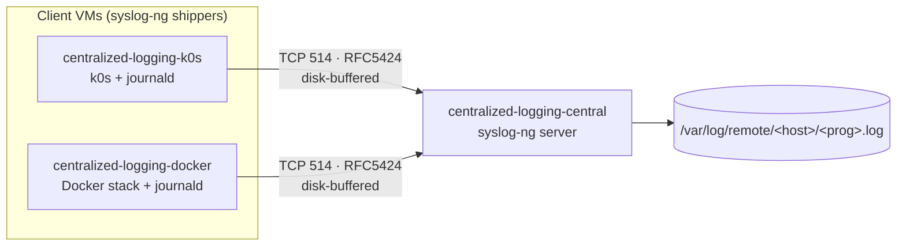
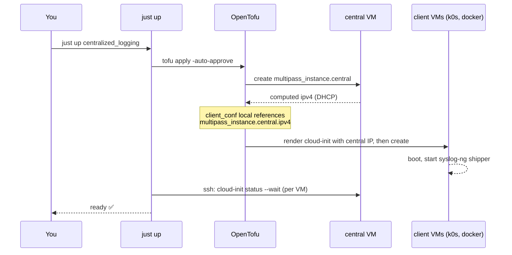
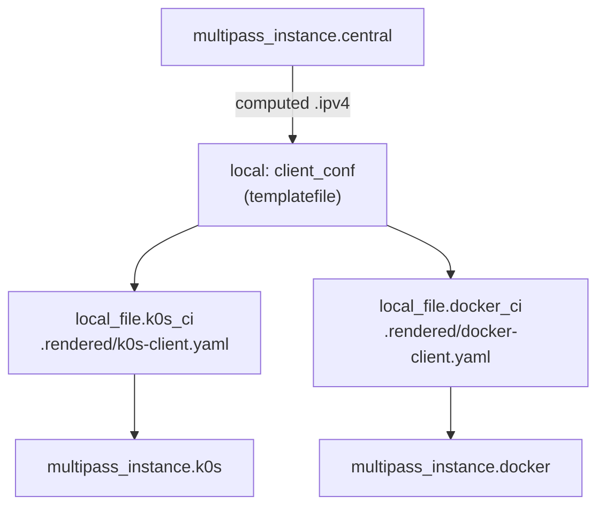
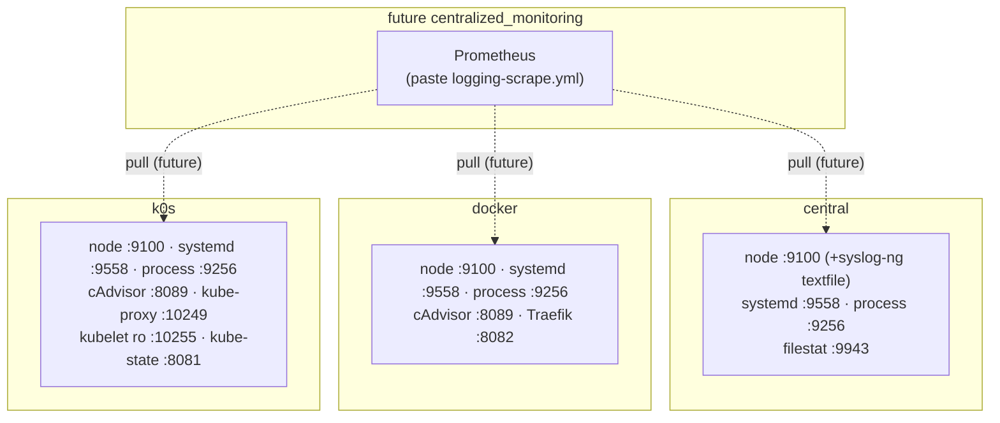

# 📘 Using the `centralized_logging` cluster

A hands-on guide to running, inspecting, and modifying the **centralized_logging** lab — three
[Multipass][multipass] VMs, provisioned by [OpenTofu][opentofu], that demonstrate centralized
log shipping with [**syslog-ng**][syslog-ng]. Two client VMs run real workloads (a
[Kubernetes][kubernetes] node and a [Docker][docker] stack) and ship **all** of their logs over
[TCP][tcp]/[RFC&nbsp;5424][rfc5424] to one collector.

> **TL;DR** — from the repo root:
> ```sh
> just check centralized_logging   # hermetic: fmt + validate + tofu test (no VMs)
> just up    centralized_logging   # one apply -> all 3 VMs, waits for cloud-init
> just verify centralized_logging  # live: pytest + testinfra over SSH
> just logs  centralized_logging   # list collected log files on central
> just destroy centralized_logging # tofu destroy (one cluster, gone)
> just down                        # graceful `multipass stop --all` (all VMs, preserved)
> ```

For the **why** behind the design, read the spec:
📐 [`specs/centralized_logging.md`](../../specs/centralized_logging.md). This document is the
**how-to-use** companion. New to the repo? Start at the
📚 [documentation hub](../../docs/README.md).

---

## Contents

- [1. Overview & topology](#1-overview--topology)
- [2. Prerequisites](#2-prerequisites)
- [3. Quickstart](#3-quickstart)
- [4. The lifecycle, step by step](#4-the-lifecycle-step-by-step)
- [5. What cloud-init provisions on each VM](#5-what-cloud-init-provisions-on-each-vm)
- [6. Configuration reference](#6-configuration-reference)
- [7. Using the running cluster](#7-using-the-running-cluster)
- [8. How log shipping works](#8-how-log-shipping-works)
- [9. Metrics & exporter layer](#9-metrics--exporter-layer)
- [10. Testing & verification](#10-testing--verification)
- [11. Changing configuration](#11-changing-configuration)
- [12. Troubleshooting](#12-troubleshooting)
- [13. Technology stack & reference links](#13-technology-stack--reference-links)
- [14. Further reading](#14-further-reading)

---

## 1. Overview & topology

The lab proves an end-to-end log pipeline: two **client** VMs run real workloads (a single-node
[Kubernetes][kubernetes] cluster via [k0s][k0s] and a [Docker][docker] monitoring stack) and ship
**all** of their logs to one **central** collector, which writes them to disk partitioned by host
and program.

| VM (Multipass name) | Role | Cloud-init template | Sizing |
|---------------------|------|---------------------|--------|
| `centralized-logging-central` | [syslog-ng][syslog-ng] **server** → `/var/log/remote/<host>/<prog>.log` | [`central.yaml.tftpl`](cloud-init/central.yaml.tftpl) | 2 vCPU / 2G / **40G** |
| `centralized-logging-k0s` | syslog-ng client + single-node [k0s][k0s] | [`k0s-client.yaml.tftpl`](cloud-init/k0s-client.yaml.tftpl) | 2 vCPU / 2G / 20G |
| `centralized-logging-docker` | syslog-ng client + [Docker][docker] stack | [`docker-client.yaml.tftpl`](cloud-init/docker-client.yaml.tftpl) | 2 vCPU / **4G** / 25G |

**Total:** 6 vCPU / 8G RAM / 85G disk — comfortable on a 16G+ host.



Every log source on the clients funnels through [**journald**][journald], which syslog-ng reads
via its stock [`system()`][syslog-ng-system] source — so Kubernetes pod logs and Docker container
logs reach central with **no per-workload configuration**.

> 🎯 **The real-world goal.** This lab is an MVP stand-in for shipping UniFi/Ubiquiti and host
> logs to a single collector, prototyped on Multipass before promotion to
> [Proxmox][proxmox]. syslog-ng was chosen because the eventual central sinks
> ([VictoriaLogs][victorialogs] / [OpenObserve][openobserve]) both ingest RFC&nbsp;5424, so the
> shipper layer stays reusable when the sink is swapped. See the
> [spec](../../specs/centralized_logging.md) for the full rationale.

---

## 2. Prerequisites

| Tool | Minimum | Used for | Links |
|------|---------|----------|-------|
| `multipass` | latest | local Ubuntu VM host (Proxmox stand-in) | [home][multipass] · [GitHub][multipass-gh] · [docs][multipass-docs] |
| `tofu` (OpenTofu) | **≥ 1.7** | provision VMs + render cloud-init | [home][opentofu] · [GitHub][opentofu-gh] · [docs][opentofu-docs] |
| `just` | latest | task runner ([`Justfile`](../../Justfile) recipes) | [GitHub][just] · [manual][just-docs] |
| `uv` | latest | Python env for the `verify` testinfra loop | [home][uv] · [GitHub][uv-gh] |

You also need a recent [Ubuntu 24.04][ubuntu] image (Multipass downloads it on first `up`) and an
SSH keypair (below).

**Providers** (fetched automatically by `tofu init`, pinned in [`versions.tf`](versions.tf) and
locked in [`.terraform.lock.hcl`](.terraform.lock.hcl)):

- [`larstobi/multipass ~> 1.4`][provider-multipass] — drives Multipass
  ([provider source][provider-multipass-gh]).
- [`hashicorp/local ~> 2.4`][provider-local] — writes the rendered cloud-init files to
  `.rendered/`.

### SSH keypair

The VMs inject your **public** key via [cloud-init][cloud-init] so the `verify` suite (and
`just ssh`) can log in as `ubuntu`. By default the cluster expects `~/.ssh/id_ed25519[.pub]`.
Create one if needed with [`ssh-keygen`][ssh-keygen]:

```sh
ssh-keygen -t ed25519 -f ~/.ssh/id_ed25519
```

Override the key with either mechanism:

- `CLUSTER_SSH_KEY=/path/to/private_key just ssh centralized_logging central` (used by the
  [`Justfile`](../../Justfile) and [`conftest.py`](tests/testinfra/conftest.py))
- `tofu -chdir=clusters/centralized_logging apply -var ssh_pubkey_path=/path/to/key.pub`

---

## 3. Quickstart

All recipes take the **cluster folder name** (`centralized_logging`) as their only argument.
Run from the repo root. The full recipe list lives in the [`Justfile`](../../Justfile); see all of
them with `just --list`.

```sh
# 1. Hermetic inner loop — no VMs touched. Run this constantly while editing.
just check centralized_logging

# 2. Launch all three VMs in one apply; blocks until every VM finishes cloud-init.
just up centralized_logging

# 3. Live end-to-end verification over SSH (pytest + testinfra).
just verify centralized_logging

# 4. Peek at the logs central has collected.
just logs centralized_logging

# 5. Open a shell on any VM by role.
just ssh centralized_logging central

# 6. Tear it all down (delete the VMs; `just down` only stops them).
just destroy centralized_logging
```

`just status` (→ `multipass list`) shows every VM on the host.

| Recipe | Does | Touches VMs? |
|--------|------|--------------|
| [`just init`](../../Justfile) | `tofu init` (fetch providers) | no |
| [`just plan`](../../Justfile) | `tofu plan` | no |
| [`just check`](../../Justfile) | `tofu fmt -check` + `validate` + hermetic `tofu test` | no |
| [`just up`](../../Justfile) | `tofu apply` then wait on `cloud-init status --wait` per VM | **yes** (creates) |
| [`just verify`](../../Justfile) | `uv run pytest` (testinfra over SSH) | yes (reads) |
| [`just logs`](../../Justfile) | `find /var/log/remote -type f` on central | yes (reads) |
| [`just ssh`](../../Justfile) | SSH into `<cluster>-<role>` | yes (reads) |
| [`just status`](../../Justfile) | `multipass list` | yes (reads) |
| [`just destroy`](../../Justfile) | `tofu destroy` (one cluster) | **yes** (deletes) |
| [`just down`](../../Justfile) | `multipass stop --all` (no arg; all VMs, preserved) | yes (stops) |
| [`just help`](../../Justfile) | curated workflow overview + `just --list` | no |

---

## 4. The lifecycle, step by step

`just up` runs `tofu apply` and then **waits for cloud-init to finish on every VM** before
returning, so the cluster is genuinely ready when the recipe exits (see the `up` recipe in the
[`Justfile`](../../Justfile)).



### Runtime IP injection

[Multipass][multipass] hands out [DHCP][dhcp] addresses, so peer IPs can't be hardcoded. The trick
lives in [`main.tf`](main.tf): the `client_conf` local renders the syslog-ng client config with
`central_ip = multipass_instance.central.ipv4`. That single reference makes OpenTofu **create
`central` first**, read its live IP, splice it into each client's cloud-init via
[`templatefile()`][tf-templatefile], and only then launch the clients — which therefore boot
already knowing where to ship logs. No service discovery required. The `hosts` output
(`{role: {name, ipv4}}`) is the same contract [`conftest.py`](tests/testinfra/conftest.py)
consumes to build its SSH targets.



---

## 5. What cloud-init provisions on each VM

Every VM boots from an [Ubuntu 24.04][ubuntu] image and is configured by a
[cloud-init][cloud-init] `#cloud-config` file rendered from a `.tftpl` template. All three install
the same base packages — `syslog-ng`, [`curl`][curl], [`vim`][vim], [`htop`][htop],
[`jq`][jq] — inject your SSH key, and wire `@include "/etc/syslog-ng/conf.d/*.conf"` into the main
syslog-ng config before restarting the service.

| VM | Template | What its `runcmd` does beyond the base |
|----|----------|----------------------------------------|
| **central** | [`central.yaml.tftpl`](cloud-init/central.yaml.tftpl) | Drops the [server config](cloud-init/syslog-ng/server.conf.tftpl) into `/etc/syslog-ng/conf.d/10-central.conf`, creates `/var/log/remote`, enables + restarts syslog-ng. |
| **k0s** | [`k0s-client.yaml.tftpl`](cloud-init/k0s-client.yaml.tftpl) | Drops the [client config](cloud-init/syslog-ng/client.conf.tftpl), then installs [k0s][k0s] via [`get.k0s.sh`][k0s-install] and runs `k0s install controller --single` + `k0s start` (controller **and** worker in one node). |
| **docker** | [`docker-client.yaml.tftpl`](cloud-init/docker-client.yaml.tftpl) | Drops the client config, writes [`/etc/docker/daemon.json`][docker-daemon] with `"log-driver": "journald"`, writes the [`compose.yaml`](cloud-init/docker/compose.yaml.tftpl) + Prometheus/Alertmanager configs to `/opt/stack/`, installs Docker via [`get.docker.com`][docker-install], then `docker compose up -d`. |

> 🔑 The `journald` [log-driver][docker-logdriver] on the Docker VM is what makes container logs
> ship to central "for free": the daemon routes every container's stdout/stderr into
> [journald][journald], and syslog-ng's `system()` source reads journald. On the k0s VM,
> [containerd][containerd]/k0s services log to [systemd][systemd]/journald the same way.

> 📊 Each VM's `runcmd` **also installs a flag-gated Prometheus exporter bundle** (a copied
> `install-exporter.sh` drops binaries as systemd units; central + clients get a `syslog-ng-ctl
> stats prometheus` textfile timer; the k0s VM also applies a kube-state-metrics manifest). Nothing
> scrapes them yet — they're exposed for a future `centralized_monitoring` Prometheus. See
> [§9 Metrics & exporter layer](#9-metrics--exporter-layer).

---

## 6. Configuration reference

All variables are defined in [`variables.tf`](variables.tf); defaults live in
[`terraform.tfvars`](terraform.tfvars). Override per-apply with [`-var`][tf-var] or by editing
`terraform.tfvars`.

### Input variables

| Variable | Type | Default | Description |
|----------|------|---------|-------------|
| `name_prefix` | `string` | `"centralized-logging"` | Prefix for Multipass instance names (hyphens only — underscores are invalid in Multipass names). |
| `image` | `string` | `"24.04"` | [Ubuntu image][ubuntu] alias/version passed to Multipass. |
| `syslog_port` | `number` | `514` | TCP port central listens on and clients ship to. |
| `ssh_pubkey_path` | `string` | `"~/.ssh/id_ed25519.pub"` | Path to the SSH **public** key injected into the `ubuntu` user. |
| `ssh_pubkey` | `string` | `""` | Inline public key; overrides `ssh_pubkey_path` when non-empty (used by hermetic tests). |
| `hostname_source` | `string` | `"keep"` | `$HOST` foldering strategy on central — `keep` \| `dns` \| `ip` (validated). See [below](#hostname_source--where-remote-logs-get-foldered). |
| `central` | `object({cpus, memory, disk})` | `{2, "2G", "40G"}` | Sizing for the central VM. |
| `k0s_client` | `object({cpus, memory, disk})` | `{2, "2G", "20G"}` | Sizing for the k0s VM. |
| `docker_client` | `object({cpus, memory, disk})` | `{2, "4G", "25G"}` | Sizing for the Docker VM. |

#### Metrics feature flags

Each `enable_*` flag gates an exporter's **install** in cloud-init (there is no local scrape to gate —
see [§9](#9-metrics--exporter-layer)). A disabled flag means the exporter is not installed, not
running, and skipped by the live test suite. All are `bool`, threaded via `local.flags` in
[`main.tf`](main.tf).

| Variable | Default | Scope · port |
|----------|---------|--------------|
| `enable_node_exporter` | `true` | all VMs · `:9100` (also serves the syslog-ng textfile `.prom`) |
| `enable_syslogng_metrics` | `true` | all VMs · via `:9100` (textfile timer → `syslog-ng-ctl stats prometheus`) |
| `enable_systemd_exporter` | `true` | all VMs · `:9558` (per-unit health, e.g. `syslog-ng.service`) |
| `enable_journald_exporter` | **`false`** | all VMs · `:12345` — upstream binary is **x86-64-only**, so off on the arm64 lab (works on amd64 Proxmox) |
| `enable_process_exporter` | `true` | all VMs · `:9256` |
| `enable_filestat_exporter` | `true` | **central only** · `:9943` (watches `/var/log/remote/*`) |
| `enable_cadvisor` | `true` | docker + k0s · `:8089` (`:8080` is taken by Traefik / kube-router) |
| `enable_traefik_metrics` | `true` | docker only · `:8082` (Traefik Prometheus endpoint) |
| `enable_kube_metrics` | `true` | k0s only · kube-proxy `:10249`, kubelet read-only `:10255` |
| `enable_kube_state_metrics` | `true` | k0s only · `:8081` (hostNetwork Deployment) |

### Outputs

Defined in [`outputs.tf`](outputs.tf); read them with
`tofu -chdir=clusters/centralized_logging output [-json] <name>`.

| Output | Description |
|--------|-------------|
| `central_ipv4` / `k0s_ipv4` / `docker_ipv4` | IPv4 of each VM. |
| `hosts` | `{role: {name, ipv4}}` for every VM — the contract [`conftest.py`](tests/testinfra/conftest.py) consumes. |
| `hostname_source` | The active `$HOST` foldering strategy (`keep` \| `dns` \| `ip`). |
| `enabled_exporters` | Sorted list of active metrics `enable_*` flags; the live suite parametrizes over it (disabled = skipped). |
| `metrics_targets` | `{role: {ip, exporters: {name: port}}}` — the discovery map a future Prometheus uses to fill in [`logging-scrape.yml`](cloud-init/prometheus/logging-scrape.yml). |
| `shell_hints` | Handy commands: `multipass shell`, log listing, and `open http://<docker-ip>:8080` (Traefik) / `:3000` (Grafana). |

### `hostname_source` — where remote logs get foldered

Logs land at `/var/log/remote/$HOST/$PROGRAM.log`. How central decides `$HOST` is controlled by
this variable, which renders different syslog-ng options into
[`server.conf.tftpl`](cloud-init/syslog-ng/server.conf.tftpl):

| Value | Rendered syslog-ng options | Behavior | Needs DNS? |
|-------|----------------------------|----------|------------|
| `keep` *(default)* | [`keep-hostname(yes)`][syslog-ng-options] | Trust the client-reported hostname (e.g. `centralized-logging-k0s`). | No |
| `dns` | `keep-hostname(no)` `use-dns(yes)` `use-fqdn(no)` | Reverse-resolve the sender IP. | Yes (PTR records) |
| `ip` | `keep-hostname(no)` `use-dns(no)` | Folder by raw sender IP. | No |

`keep` is the default because homelab DNS is unreliable and this lab has no PTR records.
**Changing this value requires a full `just destroy` + `just up`** — see
[§11 Changing configuration](#11-changing-configuration).

---

## 7. Using the running cluster

### Shell access

```sh
just ssh centralized_logging central   # or: k0s | docker
```

This resolves the role's IP from the `hosts` output and `ssh`-es in as `ubuntu` with your
injected key (host-key checking disabled, since VMs are recreated each `just up`).

> ℹ️ In this environment `multipass shell`/`exec` may report **"No route to host"** — the host
> reaches the VMs **directly over SSH** instead, which is exactly what `just ssh` does. Prefer
> `just ssh` over the `multipass shell` hint printed in `shell_hints`.

### Viewing collected logs

```sh
just logs centralized_logging          # find /var/log/remote -type f on central
just ssh centralized_logging central
#   then, on central:
sudo tail -f /var/log/remote/centralized-logging-k0s/*.log
```

### Reaching the Docker stack

The `docker` VM runs a small monitoring stack via [Docker Compose][docker-compose] from
[`compose.yaml.tftpl`](cloud-init/docker/compose.yaml.tftpl). Get its IP from `shell_hints` (or
`tofu output docker_ipv4`) and open:

| Service | Port | Image | Notes |
|---------|------|-------|-------|
| [Traefik][traefik] dashboard | `:8080` | `traefik:v3.1` | reverse proxy; [Docker provider][traefik-docker] auto-discovers labelled containers; web entrypoint on `:80` |
| [Heimdall][heimdall] | `:80` (via Traefik) | `lscr.io/linuxserver/heimdall` | service portal, routed at `PathPrefix(/)` |
| [Grafana][grafana] | `:3000` | `grafana/grafana` | login `admin` / `admin` (`GF_SECURITY_ADMIN_PASSWORD`) |
| [Prometheus][prometheus] | `:9090` | `prom/prometheus` | scrapes itself + `traefik:8080` (see [`prometheus.yml`](cloud-init/docker-client.yaml.tftpl)) |
| [Alertmanager][alertmanager] | `:9093` | `prom/alertmanager` | `devnull` receiver (demo — drops everything) |

```sh
open http://<docker-ip>:8080   # Traefik dashboard
open http://<docker-ip>:3000   # Grafana (admin/admin)
```

You can also inspect the stack from inside the VM with [`docker compose`][docker-compose]:

```sh
just ssh centralized_logging docker
docker compose -f /opt/stack/compose.yaml ps
docker compose -f /opt/stack/compose.yaml logs traefik
```

### Checking k0s

```sh
just ssh centralized_logging k0s
sudo k0s status
sudo k0s kubectl get nodes        # k0s bundles kubectl
sudo k0s kubectl get pods -A
```

See the [k0s docs][k0s-docs] for the full CLI.

---

## 8. How log shipping works

The pipeline is plain [syslog-ng][syslog-ng]: clients read local logs from
[journald][journald] and forward them over [TCP][tcp] using the
[RFC&nbsp;5424][rfc5424] syslog protocol; central listens and writes a file per host/program.

### Client side — [`client.conf.tftpl`](cloud-init/syslog-ng/client.conf.tftpl)

Each client ships Ubuntu's stock `s_src` source ([journald][journald] via
[`system()`][syslog-ng-system] + syslog-ng's own `internal()`) to central:

```
destination d_central {
    network(
        "${central_ip}"          # injected at render time (central's DHCP IP)
        transport("tcp")
        port(${syslog_port})     # default 514
        flags(syslog-protocol)   # RFC5424
        disk-buffer(
            mem-buf-size(163840000)   # ~156 MiB in memory
            disk-buf-size(536870912)  # 512 MiB on disk
            reliable(yes)             # survives central downtime / restarts
            dir("/var/lib/syslog-ng")
        )
    );
};

log { source(s_src); destination(d_central); flags(flow-control); };
```

The [**reliable disk buffer**][syslog-ng-diskbuffer] means a client keeps queuing logs (up to
512&nbsp;MiB) while central is down, then drains on reconnect. [`flow-control`][syslog-ng-flowcontrol]
applies backpressure rather than dropping messages.

### Server side — [`server.conf.tftpl`](cloud-init/syslog-ng/server.conf.tftpl)

Central listens for remote logs and writes them to a per-host/per-program file sink:

```
source s_net {
    network(
        ip("0.0.0.0") transport("tcp") port(${syslog_port})
        flags(syslog-protocol) max-connections(100) log-iw-size(10000)
        ${hostname_opts}                 # from var.hostname_source
    );
};

destination d_remote {
    file("/var/log/remote/$${HOST}/$${PROGRAM}.log"
         create-dirs(yes) dir-perm(0755) perm(0644));
};

log { source(s_net); destination(d_remote); };   # remote senders
log { source(s_src); destination(d_remote); };   # central's own logs
```

> Both configs deliberately reuse Ubuntu's stock `s_src` source — syslog-ng refuses to start
> with more than one [`systemd-journal()`][syslog-ng-journal] source, so the templates never
> redeclare `system()`.

The server config also carries commented stubs for swapping the [`file()`][syslog-ng-file] sink to
[VictoriaLogs][victorialogs] or [OpenObserve][openobserve] (both ingest RFC&nbsp;5424) — see the
bottom of [`server.conf.tftpl`](cloud-init/syslog-ng/server.conf.tftpl). Clients are unchanged when
the sink is swapped.

---

## 9. Metrics & exporter layer

This cluster ships a **Prometheus exporter layer** so its health and the log pipeline itself become
observable. The design principle is **"exporters present, pull deferred"**: exporters are installed
and bound to `0.0.0.0`, but **nothing scrapes them yet**. A separate
[`centralized_monitoring`](../centralized_monitoring/) Prometheus will pull them later — so there is
no dependency cycle and no peer-IP injection in this layer. The full design is in
[`specs/centralized_logging_metrics.md`](../../specs/centralized_logging_metrics.md); for a hands-on
walkthrough see [`TUTORIAL.md`](TUTORIAL.md).

> Logging **pushes** (clients → central:514); Prometheus **pulls** (scraper → exporter). This layer
> only stands up the pull *targets*. The docker VM's on-box Prometheus (`/opt/stack/prometheus.yml`)
> is intentionally **left as-is** (it still scrapes only itself + `traefik:8080`).



### Exporter inventory

All listeners bind `0.0.0.0` (arm64 binaries). Defaults follow [§6 metrics feature flags](#metrics-feature-flags).

| Exporter | central | docker | k0s | Port | Flag | Default |
|----------|:------:|:------:|:---:|------|------|:------:|
| node_exporter | ✅ | ✅ | ✅ | 9100 | `enable_node_exporter` | ✅ |
| syslog-ng metrics (textfile) | ✅ | ✅ | ✅ | via 9100 | `enable_syslogng_metrics` | ✅ |
| systemd_exporter | ✅ | ✅ | ✅ | 9558 | `enable_systemd_exporter` | ✅ |
| journald-exporter | ✅ | ✅ | ✅ | 12345 | `enable_journald_exporter` | ⬜ (x86-64-only) |
| process-exporter | ✅ | ✅ | ✅ | 9256 | `enable_process_exporter` | ✅ |
| filestat_exporter | ✅ | — | — | 9943 | `enable_filestat_exporter` | ✅ |
| cAdvisor | — | ✅ | ✅ | 8089 | `enable_cadvisor` | ✅ |
| Traefik metrics | — | ✅ | — | 8082 | `enable_traefik_metrics` | ✅ |
| kube-proxy / kubelet ro | — | — | ✅ | 10249 / 10255 | `enable_kube_metrics` | ✅ |
| kube-state-metrics | — | — | ✅ | 8081 | `enable_kube_state_metrics` | ✅ |

### syslog-ng metrics (no third-party exporter)

syslog-ng 4.1+ (these VMs run **4.3.1**) emits Prometheus text natively via
`syslog-ng-ctl stats prometheus`. A systemd timer (`syslogng-textfile.timer`, every 15s) writes that
dump to `/var/lib/node_exporter/textfile_collector/syslogng.prom`, which **node_exporter serves on
`:9100`** — one port, one binary, no extra service. Metric names start with `syslogng_` (e.g.
`syslogng_input_events_total`, `syslogng_internal_events_total{result="dropped"}`).

### Verifying the endpoints

```sh
just ssh centralized_logging central
# host + syslog-ng textfile metrics
curl -fsS http://localhost:9100/metrics | grep syslogng_ | head
# systemd_exporter sees the syslog-ng unit
curl -fsS http://localhost:9558/metrics | grep 'syslog-ng.service'
# the textfile the timer maintains
cat /var/lib/node_exporter/textfile_collector/syslogng.prom | head
```

Cross-VM reachability proves the `0.0.0.0` bind (the precondition for a future scrape):

```sh
# on the host: get each role's ip + ports
tofu -chdir=clusters/centralized_logging output -json metrics_targets
# from a peer VM, reach central's node_exporter by IP
just ssh centralized_logging k0s
curl -fsS http://<central_ip>:9100/metrics | head
```

> ⬜ `journald-exporter` (`:12345`) is **off by default** — its upstream binary is x86-64-only and
> won't run on the arm64 lab VMs, so that port is expected to be closed here. The live suite skips it.

### Future integration — wiring the monitoring cluster

Two paste-in artifacts ship with the cluster (not loaded by anything here):

- [`cloud-init/prometheus/logging-scrape.yml`](cloud-init/prometheus/logging-scrape.yml) — scrape
  jobs; replace `<central_ip>/<docker_ip>/<k0s_ip>` from `tofu output -json metrics_targets`.
- [`cloud-init/prometheus/alert.rules.yml`](cloud-init/prometheus/alert.rules.yml) — logging-health
  alerts (`SyslogNgServiceDown`, `SyslogNgEventsDropped`, `NoLogsReceivedFromClient`, …).

Add those to the future `centralized_monitoring` Prometheus to start scraping.

---

## 10. Testing & verification

Two layers, split by cost. This mirrors the repo's testing philosophy (cheap structural checks run
hermetically; behavioral checks run live against real VMs).

| Layer | Location | Cost | Recipe | What it asserts |
|-------|----------|------|--------|-----------------|
| **Hermetic** | [`tests/tofu/sizing_and_render.tftest.hcl`](tests/tofu/sizing_and_render.tftest.hcl) | free, no VMs | `just check` | sizing, image, names, and rendered cloud-init via [`mock_provider`][tf-mock] + `command = plan` |
| **Live** | [`tests/testinfra/`](tests/testinfra/) | needs running VMs | `just verify` | end-to-end behavior over SSH with [pytest][pytest] + [testinfra][testinfra] |

### Hermetic ([`sizing_and_render.tftest.hcl`](tests/tofu/sizing_and_render.tftest.hcl))

Run by [`tofu test`][tf-test] with a [`mock_provider "multipass" {}`][tf-mock] so **no VM is
launched**:

- `sizing_image_names_and_central_render` — asserts CPU/mem/disk per VM, `image == "24.04"`,
  `name_prefix`-derived names, and that the central cloud-init contains the `/var/log/remote`
  sink, the `transport("tcp")` source, the injected SSH key, and `keep-hostname(yes)`.
- `hostname_source_dns_renders_use_dns` — with `hostname_source = "dns"`, asserts the rendered
  config contains `use-dns(yes)`.

### Live ([`tests/testinfra/`](tests/testinfra/))

[`conftest.py`](tests/testinfra/conftest.py) reads the `hosts` output, builds an SSH config, and
exposes `central` / `k0s` / `docker` host fixtures (polling SSH reachability, then blocking on
[`cloud-init status --wait`][cloud-init-status] up to 600s).

| Test file | Checks |
|-----------|--------|
| [`test_central.py`](tests/testinfra/test_central.py) | syslog-ng running & enabled; TCP `514` listening; `/var/log/remote` exists |
| [`test_clients.py`](tests/testinfra/test_clients.py) | syslog-ng running + `/var/lib/syslog-ng` buffer dir on both clients; `k0s status` healthy; Docker running with `journald` log-driver; all 5 stack services up |
| [`test_e2e_shipping.py`](tests/testinfra/test_e2e_shipping.py) | **headline proof:** a [`logger`][logger]-emitted token on each client appears under `/var/log/remote/` on central; in `keep` mode it lands under the client's hostname folder |
| [`test_metrics.py`](tests/testinfra/test_metrics.py) | each enabled exporter port listens + `/metrics` returns 200 (parametrized over `enabled_exporters`, skips when off); `syslogng.prom` present with `syslogng_` series; `systemd_exporter` reports `syslog-ng.service`; cross-VM reachability proves the `0.0.0.0` bind |

Dependencies are declared in [`pyproject.toml`](tests/testinfra/pyproject.toml) and locked in
[`uv.lock`](tests/testinfra/uv.lock): [`pytest>=8`][pytest],
[`pytest-testinfra>=10`][testinfra], [`pytest-xdist>=3`][pytest-xdist], Python `>=3.11`.

### Running a single test

```sh
# one hermetic run
tofu -chdir=clusters/centralized_logging test -test-directory=tests/tofu

# one live test by keyword
cd clusters/centralized_logging/tests/testinfra && uv run pytest -v -k e2e
```

The hermetic layer also runs in CI on every push — see
[`.github/workflows/ci.yml`](../../.github/workflows/ci.yml), which auto-discovers every
`clusters/<name>/` folder.

---

## 11. Changing configuration

The [`larstobi/multipass`][provider-multipass] provider keys a VM on its `cloudinit_file`
**path**, not the file's contents. Editing a `.tftpl` template re-renders `.rendered/` but **does
not** trigger a VM replacement on `tofu apply`. To apply any cloud-init or `hostname_source`
change, recreate the cluster:

```sh
just destroy centralized_logging && just up centralized_logging
```

> Never hand-edit files under `.rendered/` — they are regenerated from the `.tftpl` templates on
> every apply (and are [gitignored](../../.gitignore), along with `.terraform/`, tofu state, and
> `logs/`).

A future improvement (noted in the [spec](../../specs/centralized_logging.md#future-work-kept-in-mind-not-built-here))
is to add a [`replace_triggered_by`][tf-replace-triggered] lifecycle rule so VMs rebuild
automatically when their cloud-init changes — removing the manual `down`/`up`.

---

## 12. Troubleshooting

| Symptom | Likely cause | Fix |
|---------|--------------|-----|
| `just ssh` / `verify` refused right after `up` | cloud-init still finishing | `just up` already waits per-VM; if you bypassed it, retry — [`conftest.py`](tests/testinfra/conftest.py) also blocks on `cloud-init status --wait` (up to 600s) |
| `multipass shell`/`exec` → "No route to host" | Multipass exec path doesn't route in this env | use `just ssh centralized_logging <role>` (direct SSH) instead |
| An exporter port isn't listening | cloud-init still installing the bundle, or its `enable_*` flag is off | wait for `cloud-init status --wait`; check `tofu output enabled_exporters`; see [§9](#9-metrics--exporter-layer) |
| `:12345` (journald) never opens | expected on arm64 — `enable_journald_exporter` is off (x86-64-only binary) | leave it off, or run on amd64; the live suite skips it |
| No logs under `/var/log/remote` | shipper or listener down | on a client: `systemctl status syslog-ng`; on central: confirm TCP `514` is listening (`ss -ltnp`) and `/var/log/remote` exists (the [`test_central.py`](tests/testinfra/test_central.py) checks) |
| Logs in wrong/odd folder | `hostname_source` mismatch | check `tofu output hostname_source`; `keep` folders by client hostname — change requires `down` + `up` |
| Stale IP after recreate | VMs got new DHCP IPs | nothing to do — `just ssh`/testinfra read fresh IPs from the `hosts` output each run |
| `just check` fails on `fmt` | unformatted `.tf` | run `tofu -chdir=clusters/centralized_logging fmt -recursive` |
| Docker stack ports not responding | stack still pulling images / starting | `just ssh ... docker` then `docker compose -f /opt/stack/compose.yaml ps` |
| `k0s status` errors | controller still starting | retry after a moment; `sudo journalctl -u k0scontroller` for detail |

To watch a VM's first boot live: `just ssh centralized_logging <role>` then
`sudo cloud-init status --long` and `sudo journalctl -u syslog-ng -f`.

---

## 13. Technology stack & reference links

Everything this lab uses, with homepage and source/docs links so you never have to go hunting.

### Toolchain (host)

| Tool | Home | Source / Docs |
|------|------|---------------|
| Multipass | [multipass.run][multipass] | [GitHub][multipass-gh] · [docs][multipass-docs] |
| OpenTofu | [opentofu.org][opentofu] | [GitHub][opentofu-gh] · [docs][opentofu-docs] |
| just | [just.systems][just-docs] | [GitHub][just] |
| uv | [astral.sh/uv][uv] | [GitHub][uv-gh] |
| cloud-init | [cloud-init.io][cloud-init] | [GitHub][cloud-init-gh] · [docs][cloud-init-docs] |

### OpenTofu providers

| Provider | Registry | Source |
|----------|----------|--------|
| `larstobi/multipass` | [registry][provider-multipass] | [GitHub][provider-multipass-gh] |
| `hashicorp/local` | [registry][provider-local] | [docs][provider-local] |

### Log pipeline

| Component | Home | Source / Docs |
|-----------|------|---------------|
| syslog-ng (Open Source Edition) | [syslog-ng.com][syslog-ng] | [GitHub][syslog-ng-gh] · [admin guide][syslog-ng-adminguide] |
| systemd-journald | [freedesktop.org][journald] | [systemd][systemd] |
| RFC 5424 (Syslog Protocol) | [IETF][rfc5424] | — |
| VictoriaLogs *(future sink)* | [docs][victorialogs] | [GitHub][victorialogs-gh] |
| OpenObserve *(future sink)* | [openobserve.ai][openobserve] | [GitHub][openobserve-gh] |

### Client workloads

| Component | Home | Source / Docs |
|-----------|------|---------------|
| k0s (Kubernetes) | [k0sproject.io][k0s] | [GitHub][k0s-gh] · [docs][k0s-docs] |
| Kubernetes | [kubernetes.io][kubernetes] | — |
| containerd | [containerd.io][containerd] | — |
| Docker | [docker.com][docker] | [docs][docker-docs] · [Compose][docker-compose] |
| Traefik | [traefik.io][traefik] | [GitHub][traefik-gh] · [docs][traefik-docs] |
| Grafana | [grafana.com][grafana] | [GitHub][grafana-gh] |
| Prometheus | [prometheus.io][prometheus] | [GitHub][prometheus-gh] |
| Alertmanager | [docs][alertmanager] | [GitHub][alertmanager-gh] |
| Heimdall | [heimdall.site][heimdall] | [GitHub][heimdall-gh] |

### Exporters (metrics layer)

Installed flag-gated via a copied `install-exporter.sh` (arm64 `{ARCH}` substitution). See
[§9](#9-metrics--exporter-layer) and [`specs/centralized_logging_metrics.md`](../../specs/centralized_logging_metrics.md).

| Exporter | Version | Port | Upstream |
|----------|---------|------|----------|
| node_exporter | 1.8.2 | 9100 | [prometheus/node_exporter](https://github.com/prometheus/node_exporter) |
| systemd_exporter | 0.7.0 | 9558 | [prometheus-community/systemd_exporter](https://github.com/prometheus-community/systemd_exporter) |
| process-exporter | 0.8.4 | 9256 | [ncabatoff/process-exporter](https://github.com/ncabatoff/process-exporter) |
| filestat_exporter | 0.4.5 | 9943 | [michael-doubez/filestat_exporter](https://github.com/michael-doubez/filestat_exporter) |
| cAdvisor | 0.49.1 | 8089 | [google/cadvisor](https://github.com/google/cadvisor) |
| kube-state-metrics | 2.13.0 | 8081 | [kubernetes/kube-state-metrics](https://github.com/kubernetes/kube-state-metrics) |
| journald-exporter *(off — x86-64 only)* | 1.0.0 | 12345 | [dead-claudia/journald-exporter](https://github.com/dead-claudia/journald-exporter) |
| syslog-ng metrics | native (4.3.1) | via 9100 | [`syslog-ng-ctl stats prometheus`](https://www.syslog-ng.com/community/b/blog/posts/syslog-ng-prometheus-exporter) |

### Test & deployment targets

| Component | Home | Source / Docs |
|-----------|------|---------------|
| pytest | [docs][pytest] | [GitHub][pytest-gh] |
| pytest-testinfra | [docs][testinfra] | [GitHub][testinfra-gh] |
| pytest-xdist | [GitHub][pytest-xdist] | — |
| Proxmox VE *(future target)* | [proxmox.com][proxmox] | — |
| Ubuntu 24.04 LTS | [releases.ubuntu.com][ubuntu] | — |

---

## 14. Further reading

- 📐 [`specs/centralized_logging.md`](../../specs/centralized_logging.md) — full design rationale
- 📊 [`specs/centralized_logging_metrics.md`](../../specs/centralized_logging_metrics.md) — metrics/exporter-layer design
- 🧭 [`TUTORIAL.md`](TUTORIAL.md) — hands-on "stand up & verify the metrics layer" walkthrough
- 📚 [`docs/README.md`](docs/README.md) — deep reference suite hub (architecture, endpoints, feature flags, dependencies, operations)
- 📖 [`README.md`](README.md) — this cluster's quick-reference card
- 📚 [`docs/README.md`](../../docs/README.md) — repo documentation hub
- 🏠 [root `README.md`](../../README.md) — repo overview and conventions
- 🤖 [`CLAUDE.md`](../../CLAUDE.md) — repo conventions and `.claude/` automation
- ⚙️ [`Justfile`](../../Justfile) — every orchestration recipe
- ✅ [`.github/workflows/ci.yml`](../../.github/workflows/ci.yml) — hermetic CI pipeline

<!-- ───────────────────────────── reference links ───────────────────────────── -->
<!-- Toolchain -->
[multipass]: https://multipass.run/
[multipass-gh]: https://github.com/canonical/multipass
[multipass-docs]: https://multipass.run/docs
[opentofu]: https://opentofu.org/
[opentofu-gh]: https://github.com/opentofu/opentofu
[opentofu-docs]: https://opentofu.org/docs/
[just]: https://github.com/casey/just
[just-docs]: https://just.systems/man/en/
[uv]: https://docs.astral.sh/uv/
[uv-gh]: https://github.com/astral-sh/uv
[cloud-init]: https://cloud-init.io/
[cloud-init-gh]: https://github.com/canonical/cloud-init
[cloud-init-docs]: https://docs.cloud-init.io/
[cloud-init-status]: https://docs.cloud-init.io/en/latest/reference/cli.html#status
[ubuntu]: https://releases.ubuntu.com/24.04/
[ssh-keygen]: https://man.openbsd.org/ssh-keygen.1

<!-- Providers -->
[provider-multipass]: https://registry.terraform.io/providers/larstobi/multipass
[provider-multipass-gh]: https://github.com/larstobi/terraform-provider-multipass
[provider-local]: https://registry.terraform.io/providers/hashicorp/local

<!-- OpenTofu language refs -->
[tf-templatefile]: https://opentofu.org/docs/language/functions/templatefile/
[tf-var]: https://opentofu.org/docs/cli/commands/plan/#var-name-value
[tf-test]: https://opentofu.org/docs/cli/commands/test/
[tf-mock]: https://opentofu.org/docs/language/tests/mocking/
[tf-replace-triggered]: https://opentofu.org/docs/language/meta-arguments/lifecycle/#replace_triggered_by

<!-- syslog-ng -->
[syslog-ng]: https://www.syslog-ng.com/technical-documents/list/syslog-ng-open-source-edition
[syslog-ng-gh]: https://github.com/syslog-ng/syslog-ng
[syslog-ng-adminguide]: https://syslog-ng.github.io/admin-guide/
[syslog-ng-system]: https://syslog-ng.github.io/admin-guide/060_Sources/030_System/README
[syslog-ng-journal]: https://syslog-ng.github.io/admin-guide/060_Sources/category_systemd-journal/README
[syslog-ng-options]: https://syslog-ng.github.io/admin-guide/060_Sources/000_Collecting_log_messages/006_Collecting_messages/README
[syslog-ng-diskbuffer]: https://syslog-ng.github.io/admin-guide/120_Destinations/000_Configuring_destinations/004_Disk_buffer/README
[syslog-ng-flowcontrol]: https://syslog-ng.github.io/admin-guide/090_Routing_messages/004_Flow_control/README
[syslog-ng-file]: https://syslog-ng.github.io/admin-guide/120_Destinations/115_File/README

<!-- Log protocol & journald -->
[rfc5424]: https://datatracker.ietf.org/doc/html/rfc5424
[journald]: https://www.freedesktop.org/software/systemd/man/latest/systemd-journald.service.html
[systemd]: https://systemd.io/
[logger]: https://man7.org/linux/man-pages/man1/logger.1.html
[tcp]: https://datatracker.ietf.org/doc/html/rfc9293
[dhcp]: https://datatracker.ietf.org/doc/html/rfc2131

<!-- Future sinks -->
[victorialogs]: https://docs.victoriametrics.com/victorialogs/
[victorialogs-gh]: https://github.com/VictoriaMetrics/VictoriaMetrics
[openobserve]: https://openobserve.ai/
[openobserve-gh]: https://github.com/openobserve/openobserve

<!-- k0s / Kubernetes / containerd -->
[k0s]: https://k0sproject.io/
[k0s-gh]: https://github.com/k0sproject/k0s
[k0s-docs]: https://docs.k0sproject.io/
[k0s-install]: https://docs.k0sproject.io/stable/install/
[kubernetes]: https://kubernetes.io/
[containerd]: https://containerd.io/

<!-- Docker & stack -->
[docker]: https://www.docker.com/
[docker-docs]: https://docs.docker.com/
[docker-compose]: https://docs.docker.com/compose/
[docker-install]: https://docs.docker.com/engine/install/ubuntu/
[docker-daemon]: https://docs.docker.com/reference/cli/dockerd/#daemon-configuration-file
[docker-logdriver]: https://docs.docker.com/engine/logging/drivers/journald/
[traefik]: https://traefik.io/
[traefik-gh]: https://github.com/traefik/traefik
[traefik-docs]: https://doc.traefik.io/traefik/
[traefik-docker]: https://doc.traefik.io/traefik/providers/docker/
[grafana]: https://grafana.com/
[grafana-gh]: https://github.com/grafana/grafana
[prometheus]: https://prometheus.io/
[prometheus-gh]: https://github.com/prometheus/prometheus
[alertmanager]: https://prometheus.io/docs/alerting/latest/alertmanager/
[alertmanager-gh]: https://github.com/prometheus/alertmanager
[heimdall]: https://heimdall.site/
[heimdall-gh]: https://github.com/linuxserver/Heimdall

<!-- Tests & targets -->
[pytest]: https://docs.pytest.org/
[pytest-gh]: https://github.com/pytest-dev/pytest
[testinfra]: https://testinfra.readthedocs.io/
[testinfra-gh]: https://github.com/pytest-dev/pytest-testinfra
[pytest-xdist]: https://github.com/pytest-dev/pytest-xdist
[proxmox]: https://www.proxmox.com/en/proxmox-virtual-environment/overview

<!-- CLI utilities -->
[curl]: https://curl.se/
[jq]: https://jqlang.github.io/jq/
[htop]: https://htop.dev/
[vim]: https://www.vim.org/
