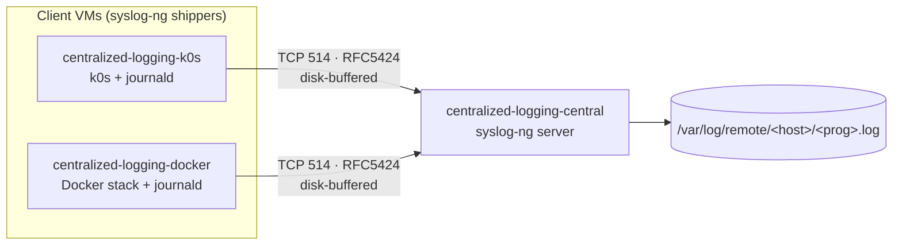
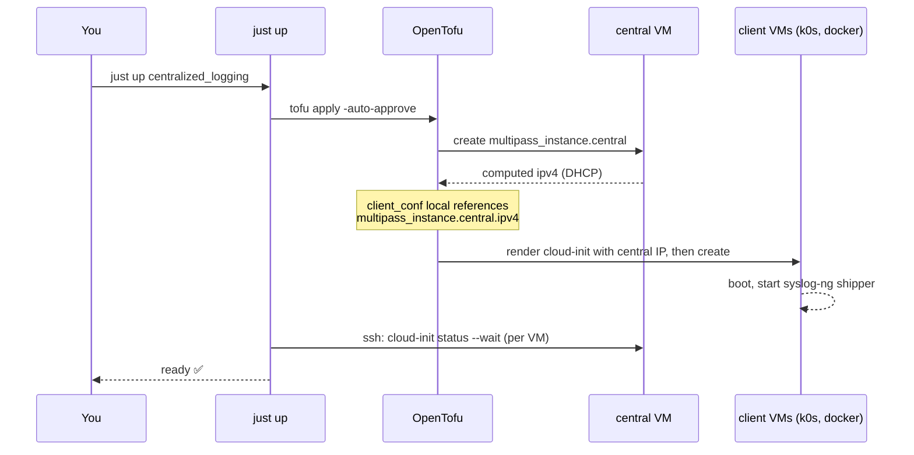

# 📘 Using the `centralized_logging` cluster

A hands-on guide to running, inspecting, and modifying the **centralized_logging** lab — three
[Multipass](https://multipass.run/) VMs, provisioned by [OpenTofu](https://opentofu.org/), that
demonstrate centralized log shipping with [**syslog-ng**](https://www.syslog-ng.com/technical-documents/list/syslog-ng-open-source-edition).

> **TL;DR** — from the repo root:
> ```sh
> just check centralized_logging   # hermetic: fmt + validate + tofu test (no VMs)
> just up    centralized_logging   # one apply -> all 3 VMs, waits for cloud-init
> just verify centralized_logging  # live: pytest + testinfra over SSH
> just logs  centralized_logging   # list collected log files on central
> just down  centralized_logging   # destroy
> ```

For the **why** behind the design, read the spec:
📐 [`specs/centralized_logging.md`](../../specs/centralized_logging.md). This document is the
**how-to-use** companion.

---

## Contents

- [1. Overview & topology](#1-overview--topology)
- [2. Prerequisites](#2-prerequisites)
- [3. Quickstart](#3-quickstart)
- [4. The lifecycle, step by step](#4-the-lifecycle-step-by-step)
- [5. Configuration reference](#5-configuration-reference)
- [6. Using the running cluster](#6-using-the-running-cluster)
- [7. How log shipping works](#7-how-log-shipping-works)
- [8. Testing & verification](#8-testing--verification)
- [9. Changing configuration](#9-changing-configuration)
- [10. Troubleshooting](#10-troubleshooting)
- [11. Further reading](#11-further-reading)

---

## 1. Overview & topology

The lab proves an end-to-end log pipeline: two **client** VMs run real workloads (a single-node
Kubernetes cluster and a Docker monitoring stack) and ship **all** of their logs to one
**central** collector, which writes them to disk partitioned by host and program.

| VM (Multipass name) | Role | Cloud-init template | Sizing |
|---------------------|------|---------------------|--------|
| `centralized-logging-central` | syslog-ng **server** → `/var/log/remote/<host>/<prog>.log` | [`central.yaml.tftpl`](cloud-init/central.yaml.tftpl) | 2 vCPU / 2G / **40G** |
| `centralized-logging-k0s` | syslog-ng client + single-node [k0s](https://k0sproject.io/) | [`k0s-client.yaml.tftpl`](cloud-init/k0s-client.yaml.tftpl) | 2 vCPU / 2G / 20G |
| `centralized-logging-docker` | syslog-ng client + Docker stack | [`docker-client.yaml.tftpl`](cloud-init/docker-client.yaml.tftpl) | 2 vCPU / **4G** / 25G |

**Total:** 6 vCPU / 8G RAM / 85G disk — comfortable on a 16G+ host.



Every log source on the clients funnels through **journald**, which syslog-ng reads via its
stock `system()` source — so Kubernetes pod logs and Docker container logs reach central with
**no per-workload configuration**.

---

## 2. Prerequisites

| Tool | Minimum | Used for |
|------|---------|----------|
| [`multipass`](https://multipass.run/) | latest | local Ubuntu VM host (Proxmox stand-in) |
| [`tofu`](https://opentofu.org/) (OpenTofu) | **≥ 1.7** | provision VMs + render cloud-init |
| [`just`](https://github.com/casey/just) | latest | task runner ([`Justfile`](../../Justfile) recipes) |
| [`uv`](https://docs.astral.sh/uv/) | latest | Python env for the `verify` testinfra loop |

**Providers** (fetched automatically by `tofu init`):
[`larstobi/multipass ~> 1.4`](https://registry.terraform.io/providers/larstobi/multipass) +
[`hashicorp/local ~> 2.4`](https://registry.terraform.io/providers/hashicorp/local) — pinned in
[`versions.tf`](versions.tf).

### SSH keypair

The VMs inject your **public** key via cloud-init so the `verify` suite (and `just ssh`) can log
in as `ubuntu`. By default the cluster expects `~/.ssh/id_ed25519[.pub]`. Create one if needed:

```sh
ssh-keygen -t ed25519 -f ~/.ssh/id_ed25519
```

Override the key with either mechanism:

- `CLUSTER_SSH_KEY=/path/to/private_key just ssh centralized_logging central` (used by the
  [`Justfile`](../../Justfile) and [`conftest.py`](tests/testinfra/conftest.py))
- `tofu -chdir=clusters/centralized_logging apply -var ssh_pubkey_path=/path/to/key.pub`

---

## 3. Quickstart

All recipes take the **cluster folder name** (`centralized_logging`) as their only argument.
Run from the repo root.

```sh
# 1. Hermetic inner loop — no VMs touched. Run this constantly while editing.
just check centralized_logging

# 2. Launch all three VMs in one apply; blocks until every VM finishes cloud-init.
just up centralized_logging

# 3. Live end-to-end verification over SSH (pytest + testinfra).
just verify centralized_logging

# 4. Peek at the logs central has collected.
just logs centralized_logging

# 5. Open a shell on any VM by role.
just ssh centralized_logging central

# 6. Tear it all down.
just down centralized_logging
```

`just status` (→ `multipass list`) shows every VM on the host. See all recipes with
`just --list`.

---

## 4. The lifecycle, step by step

`just up` runs `tofu apply` and then **waits for cloud-init to finish on every VM** before
returning, so the cluster is genuinely ready when the recipe exits (see the `up` recipe in the
[`Justfile`](../../Justfile)).



### Runtime IP injection

Multipass hands out DHCP addresses, so peer IPs can't be hardcoded. The trick lives in
[`main.tf`](main.tf): the `client_conf` local renders the syslog-ng client config with
`central_ip = multipass_instance.central.ipv4`. That single reference makes OpenTofu **create
`central` first**, read its live IP, splice it into each client's cloud-init, and only then
launch the clients — which therefore boot already knowing where to ship logs. No service
discovery required. The `hosts` output (`{role: {name, ipv4}}`) is the same contract
[`conftest.py`](tests/testinfra/conftest.py) consumes to build its SSH targets.

---

## 5. Configuration reference

All variables are defined in [`variables.tf`](variables.tf); defaults live in
[`terraform.tfvars`](terraform.tfvars). Override per-apply with `-var` or by editing
`terraform.tfvars`.

### Input variables

| Variable | Type | Default | Description |
|----------|------|---------|-------------|
| `name_prefix` | `string` | `"centralized-logging"` | Prefix for Multipass instance names (hyphens only — underscores are invalid in Multipass names). |
| `image` | `string` | `"24.04"` | Ubuntu image alias/version passed to Multipass. |
| `syslog_port` | `number` | `514` | TCP port central listens on and clients ship to. |
| `ssh_pubkey_path` | `string` | `"~/.ssh/id_ed25519.pub"` | Path to the SSH **public** key injected into the `ubuntu` user. |
| `ssh_pubkey` | `string` | `""` | Inline public key; overrides `ssh_pubkey_path` when non-empty (used by hermetic tests). |
| `hostname_source` | `string` | `"keep"` | `$HOST` foldering strategy on central — `keep` \| `dns` \| `ip` (validated). See below. |
| `central` | `object({cpus, memory, disk})` | `{2, "2G", "40G"}` | Sizing for the central VM. |
| `k0s_client` | `object({cpus, memory, disk})` | `{2, "2G", "20G"}` | Sizing for the k0s VM. |
| `docker_client` | `object({cpus, memory, disk})` | `{2, "4G", "25G"}` | Sizing for the Docker VM. |

### Outputs

Defined in [`outputs.tf`](outputs.tf); read them with
`tofu -chdir=clusters/centralized_logging output [-json] <name>`.

| Output | Description |
|--------|-------------|
| `central_ipv4` / `k0s_ipv4` / `docker_ipv4` | IPv4 of each VM. |
| `hosts` | `{role: {name, ipv4}}` for every VM — the contract [`conftest.py`](tests/testinfra/conftest.py) consumes. |
| `hostname_source` | The active `$HOST` foldering strategy (`keep` \| `dns` \| `ip`). |
| `shell_hints` | Handy commands: `multipass shell`, log listing, and `open http://<docker-ip>:8080` (Traefik) / `:3000` (Grafana). |

### `hostname_source` — where remote logs get foldered

Logs land at `/var/log/remote/$HOST/$PROGRAM.log`. How central decides `$HOST` is controlled by
this variable, which renders different syslog-ng options into
[`server.conf.tftpl`](cloud-init/syslog-ng/server.conf.tftpl):

| Value | Rendered syslog-ng options | Behavior | Needs DNS? |
|-------|----------------------------|----------|------------|
| `keep` *(default)* | `keep-hostname(yes)` | Trust the client-reported hostname (e.g. `centralized-logging-k0s`). | No |
| `dns` | `keep-hostname(no)` `use-dns(yes)` `use-fqdn(no)` | Reverse-resolve the sender IP. | Yes (PTR records) |
| `ip` | `keep-hostname(no)` `use-dns(no)` | Folder by raw sender IP. | No |

`keep` is the default because homelab DNS is unreliable and this lab has no PTR records.
**Changing this value requires a full `just down` + `just up`** — see
[§9 Changing configuration](#9-changing-configuration).

---

## 6. Using the running cluster

### Shell access

```sh
just ssh centralized_logging central   # or: k0s | docker
```

This resolves the role's IP from the `hosts` output and `ssh`-es in as `ubuntu` with your
injected key (host-key checking disabled, since VMs are recreated each `just up`).

> ℹ️ In this environment `multipass shell`/`exec` may report **"No route to host"** — the host
> reaches the VMs **directly over SSH** instead, which is exactly what `just ssh` does. Prefer
> `just ssh` over the `multipass shell` hint printed in `shell_hints`.

### Viewing collected logs

```sh
just logs centralized_logging          # find /var/log/remote -type f on central
just ssh centralized_logging central
#   then, on central:
sudo tail -f /var/log/remote/centralized-logging-k0s/*.log
```

### Reaching the Docker stack

The `docker` VM runs a small monitoring stack from
[`compose.yaml.tftpl`](cloud-init/docker/compose.yaml.tftpl). Get its IP from `shell_hints` (or
`tofu output docker_ipv4`) and open:

| Service | Port | Notes |
|---------|------|-------|
| [Traefik](https://traefik.io/) dashboard | `:8080` | reverse proxy |
| [Grafana](https://grafana.com/) | `:3000` | login `admin` / `admin` |
| [Prometheus](https://prometheus.io/) | `:9090` | scrapes self + Traefik |
| [Alertmanager](https://prometheus.io/docs/alerting/latest/alertmanager/) | `:9093` | null receiver (demo) |
| [Heimdall](https://heimdall.site/) | via Traefik | service portal |

### Checking k0s

```sh
just ssh centralized_logging k0s
sudo k0s status
sudo k0s kubectl get nodes
```

---

## 7. How log shipping works

### Client side — [`client.conf.tftpl`](cloud-init/syslog-ng/client.conf.tftpl)

Each client ships Ubuntu's stock `s_src` source (journald via `system()` + syslog-ng's own
`internal()`) to central:

```
destination d_central {
    network(
        "${central_ip}"          # injected at render time (central's DHCP IP)
        transport("tcp")
        port(${syslog_port})     # default 514
        flags(syslog-protocol)   # RFC5424
        disk-buffer(
            mem-buf-size(163840000)   # ~156 MiB in memory
            disk-buf-size(536870912)  # 512 MiB on disk
            reliable(yes)             # survives central downtime / restarts
            dir("/var/lib/syslog-ng")
        )
    );
};

log { source(s_src); destination(d_central); flags(flow-control); };
```

The **reliable disk buffer** means a client keeps queuing logs (up to 512 MiB) while central is
down, then drains on reconnect. `flow-control` applies backpressure rather than dropping
messages.

### Server side — [`server.conf.tftpl`](cloud-init/syslog-ng/server.conf.tftpl)

Central listens for remote logs and writes them to a per-host/per-program file sink:

```
source s_net {
    network(
        ip("0.0.0.0") transport("tcp") port(${syslog_port})
        flags(syslog-protocol) max-connections(100) log-iw-size(10000)
        ${hostname_opts}                 # from var.hostname_source
    );
};

destination d_remote {
    file("/var/log/remote/$${HOST}/$${PROGRAM}.log"
         create-dirs(yes) dir-perm(0755) perm(0644));
};

log { source(s_net); destination(d_remote); };   # remote senders
log { source(s_src); destination(d_remote); };   # central's own logs
```

> Both configs deliberately reuse Ubuntu's stock `s_src` source — syslog-ng refuses to start
> with more than one `systemd-journal()` source, so the templates never redeclare `system()`.

The server config also carries commented stubs for swapping the file sink to
[VictoriaLogs](https://docs.victoriametrics.com/victorialogs/) or
[OpenObserve](https://openobserve.ai/) (both ingest RFC5424) — see the bottom of
[`server.conf.tftpl`](cloud-init/syslog-ng/server.conf.tftpl).

---

## 8. Testing & verification

Two layers, split by cost:

| Layer | Location | Cost | Recipe | What it asserts |
|-------|----------|------|--------|-----------------|
| **Hermetic** | [`tests/tofu/sizing_and_render.tftest.hcl`](tests/tofu/sizing_and_render.tftest.hcl) | free, no VMs | `just check` | sizing, image, names, and rendered cloud-init via `mock_provider "multipass" {}` + `command = plan` |
| **Live** | [`tests/testinfra/`](tests/testinfra/) | needs running VMs | `just verify` | end-to-end behavior over SSH with [pytest](https://docs.pytest.org/) + [testinfra](https://testinfra.readthedocs.io/) |

### Hermetic ([`sizing_and_render.tftest.hcl`](tests/tofu/sizing_and_render.tftest.hcl))

- `sizing_image_names_and_central_render` — asserts CPU/mem/disk per VM, `image == "24.04"`,
  `name_prefix`-derived names, and that the central cloud-init contains the `/var/log/remote`
  sink, the `transport("tcp")` source, the injected SSH key, and `keep-hostname(yes)`.
- `hostname_source_dns_renders_use_dns` — with `hostname_source = "dns"`, asserts the rendered
  config contains `use-dns(yes)`.

### Live ([`tests/testinfra/`](tests/testinfra/))

[`conftest.py`](tests/testinfra/conftest.py) reads the `hosts` output, builds an SSH config, and
exposes `central` / `k0s` / `docker` host fixtures (polling SSH reachability, then blocking on
`cloud-init status --wait`).

| Test file | Checks |
|-----------|--------|
| [`test_central.py`](tests/testinfra/test_central.py) | syslog-ng running & enabled; TCP `514` listening; `/var/log/remote` exists |
| [`test_clients.py`](tests/testinfra/test_clients.py) | syslog-ng running + `/var/lib/syslog-ng` buffer dir on both clients; `k0s status` healthy; Docker running with `journald` log-driver; all 5 stack services up |
| [`test_e2e_shipping.py`](tests/testinfra/test_e2e_shipping.py) | **headline proof:** a `logger`-emitted token on each client appears under `/var/log/remote/` on central; in `keep` mode it lands under the client's hostname folder |

Dependencies are declared in [`pyproject.toml`](tests/testinfra/pyproject.toml)
(`pytest>=8`, `pytest-testinfra>=10`, `pytest-xdist>=3`, Python `>=3.11`).

### Running a single test

```sh
# one hermetic run
tofu -chdir=clusters/centralized_logging test -test-directory=tests/tofu

# one live test by keyword
cd clusters/centralized_logging/tests/testinfra && uv run pytest -v -k e2e
```

---

## 9. Changing configuration

The [`larstobi/multipass`](https://registry.terraform.io/providers/larstobi/multipass) provider
keys a VM on its `cloudinit_file` **path**, not the file's contents. Editing a `.tftpl` template
re-renders `.rendered/` but **does not** trigger a VM replacement on `tofu apply`. To apply any
cloud-init or `hostname_source` change, recreate the cluster:

```sh
just down centralized_logging && just up centralized_logging
```

> Never hand-edit files under `.rendered/` — they are regenerated from the `.tftpl` templates on
> every apply (and are gitignored, along with `.terraform/`, tofu state, and `logs/`).

---

## 10. Troubleshooting

| Symptom | Likely cause | Fix |
|---------|--------------|-----|
| `just ssh` / `verify` refused right after `up` | cloud-init still finishing | `just up` already waits per-VM; if you bypassed it, retry — `conftest.py` also blocks on `cloud-init status --wait` (up to 600s) |
| `multipass shell`/`exec` → "No route to host" | Multipass exec path doesn't route in this env | use `just ssh centralized_logging <role>` (direct SSH) instead |
| No logs under `/var/log/remote` | shipper or listener down | on a client: `systemctl status syslog-ng`; on central: confirm TCP `514` is listening and `/var/log/remote` exists (the [`test_central.py`](tests/testinfra/test_central.py) checks) |
| Logs in wrong/odd folder | `hostname_source` mismatch | check `tofu output hostname_source`; `keep` folders by client hostname — change requires `down` + `up` |
| Stale IP after recreate | VMs got new DHCP IPs | nothing to do — `just ssh`/testinfra read fresh IPs from the `hosts` output each run |
| `just check` fails on `fmt` | unformatted `.tf` | run `tofu -chdir=clusters/centralized_logging fmt -recursive` |

---

## 11. Further reading

- 📐 [`specs/centralized_logging.md`](../../specs/centralized_logging.md) — full design rationale
- 📖 [`README.md`](README.md) — this cluster's quick-reference
- 📚 [`docs/README.md`](../../docs/README.md) — repo documentation hub
- 🏠 [root `README.md`](../../README.md) — repo overview and conventions
- ⚙️ [`Justfile`](../../Justfile) — every orchestration recipe
- ✅ [`.github/workflows/ci.yml`](../../.github/workflows/ci.yml) — hermetic CI pipeline
