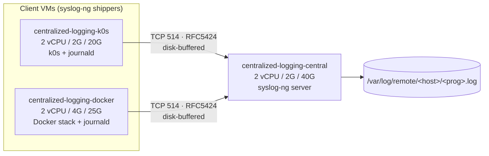

# centralized_logging — Documentation

Comprehensive reference for the **`centralized_logging`** cluster: three
[Multipass](https://multipass.run/) VMs, provisioned by [OpenTofu](https://opentofu.org/), that
demonstrate centralized log shipping with [syslog-ng](https://www.syslog-ng.com/).

Two client VMs run real workloads (a single-node [k0s](https://k0sproject.io/) host and a
[Docker](https://www.docker.com/) stack) and **push** all of their logs over TCP/RFC 5424 to one
collector. This doc set is the deep reference; the cluster's
[`README.md`](../README.md) and [`USAGE.md`](../USAGE.md) remain the concise entry points, the
design rationale lives in
[`specs/centralized_logging.md`](../../../specs/centralized_logging.md) and
[`specs/centralized_logging_metrics.md`](../../../specs/centralized_logging_metrics.md), and a
hands-on walkthrough lives in [`TUTORIAL.md`](../TUTORIAL.md).

## Documentation map

| Doc | What's inside |
|-----|---------------|
| [architecture.md](architecture.md) | System topology + `tofu apply` sequence diagrams, VM sizing, OpenTofu resource/local/output inventory, the push IP edge, the `hosts` contract |
| [endpoints.md](endpoints.md) | The log-shipping listener; on-box web UIs; every exporter port per VM; useful HTTP endpoints |
| [feature-flags.md](feature-flags.md) | The full `enable_*` matrix and why a flag here gates install only (no local scrape job) |
| [dependencies.md](dependencies.md) | Every open-source project used — OpenTofu providers, log pipeline, client workloads, pinned exporter binaries, test toolchain — with versions and links |
| [operations.md](operations.md) | `just` lifecycle recipes, the two-layer test model, and known caveats/security notes |

## Topology at a glance



> Logging **pushes** (clients → central), so the runtime-IP dependency edge is the natural one:
> central is created **first**, its DHCP `ipv4` is read by OpenTofu and baked into each client's
> syslog-ng config, then the clients boot. The sibling `centralized_monitoring` cluster inverts
> this because Prometheus **pulls**. See [architecture.md](architecture.md).

## Quickstart

```sh
just check  centralized_logging   # hermetic: tofu fmt + validate + test (no VMs)
just up     centralized_logging   # one apply -> all 3 VMs, waits for cloud-init
just verify centralized_logging   # live: pytest + testinfra over SSH
just logs   centralized_logging   # list collected log files on central
just ssh    centralized_logging central
just destroy centralized_logging  # tofu destroy (one cluster, gone)
just down                         # graceful `multipass stop --all` (all VMs, preserved)
```

Requires OpenTofu ≥ 1.7, `multipass`, `uv`, `just`, and an SSH keypair at
`~/.ssh/id_ed25519[.pub]` (injected via cloud-init for the testinfra verify loop).

After `just up`, the `shell_hints` output prints ready-to-use commands, and `just open
centralized_logging` opens the docker VM's dashboards (Traefik, Heimdall, Grafana, Prometheus,
Alertmanager):

```sh
just open centralized_logging          # core human dashboards
just open centralized_logging --full   # + every enabled /metrics endpoint
```
