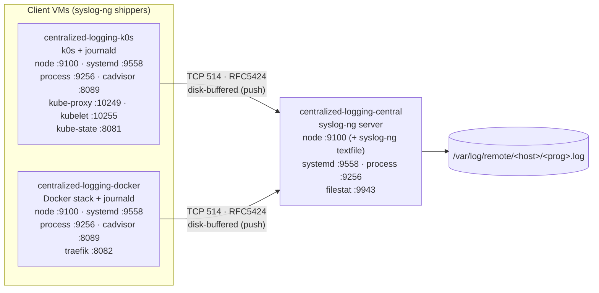
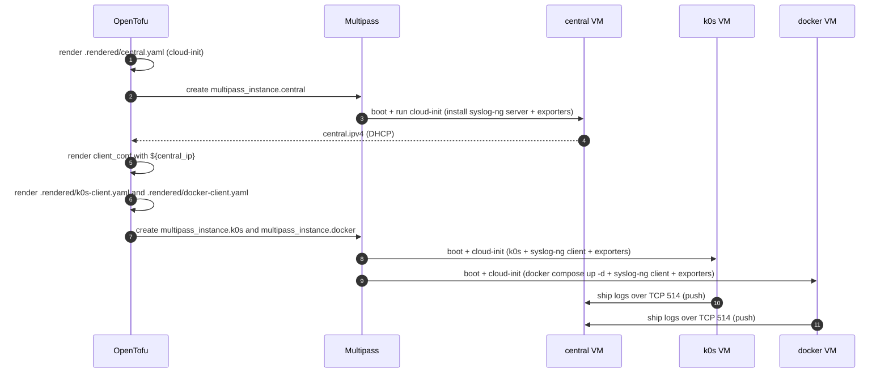

# Architecture

The `centralized_logging` cluster is a **three-VM, push-based** log-shipping pipeline. Two
client VMs run real workloads (a single-node [k0s](https://k0sproject.io/) host and a
[Docker](https://www.docker.com/) stack) and ship every log to one
[syslog-ng](https://www.syslog-ng.com/) collector over TCP. All infrastructure is defined in
OpenTofu under [`clusters/centralized_logging/`](../) and provisioned via cloud-init.

- [VMs and sizing](#vms-and-sizing)
- [System topology](#system-topology)
- [The (push) IP edge](#the-push-ip-edge)
- [`tofu apply` ordering](#tofu-apply-ordering)
- [OpenTofu inventory](#opentofu-inventory)
- [The `hosts` output contract](#the-hosts-output-contract)
- [Data flow](#data-flow)

## VMs and sizing

| VM (Multipass name) | Role | vCPU | RAM | Disk | Image | Created | Runs |
|---------------------|------|------|-----|------|-------|---------|------|
| `centralized-logging-central` | `central` | 2 | 2G | 40G | Ubuntu `24.04` | **1st** | syslog-ng server → `/var/log/remote/<host>/<prog>.log`; flag-gated exporter bundle (node, syslog-ng textfile, systemd, journald, process, filestat) |
| `centralized-logging-k0s` | `k0s` | 2 | 2G | 20G | Ubuntu `24.04` | 2nd | syslog-ng client + single-node k0s (controller + worker); exporter bundle (+ cAdvisor, kube metrics, kube-state-metrics) |
| `centralized-logging-docker` | `docker` | 2 | 4G | 25G | Ubuntu `24.04` | 2nd | syslog-ng client + Docker Compose stack (Traefik, Heimdall, Grafana, Prometheus, Alertmanager); exporter bundle (+ cAdvisor, Traefik metrics) |

Total default footprint: **6 vCPU / 8G RAM / 85G disk** — comfortable on a 16G+ host. Sizing is
parameterized via the `central`, `k0s_client`, and `docker_client` object variables (see
[OpenTofu inventory](#opentofu-inventory)) and defaulted in
[`terraform.tfvars`](../terraform.tfvars).

Instance names are `${var.name_prefix}-<role>` (default prefix `centralized-logging`). Cluster
folders may use underscores; Multipass instance names use hyphens.

## System topology



Every log source on the clients funnels through **journald**, which syslog-ng reads via its
stock `system()` source — so Kubernetes pod logs and Docker container logs reach central with
no per-workload configuration. See [endpoints.md](endpoints.md) for every exporter port and
[operations.md](operations.md) for the test model.

## The (push) IP edge

The sibling `centralized_monitoring` cluster **pulls** (server → client), so its dependency edge
is inverted vs. this cluster. Here syslog-ng **pushes** (clients → central), so the natural
dependency edge holds: **central must exist and have a DHCP IP before each client's syslog-ng
config can be rendered** with a destination to ship to.

OpenTofu creates the central VM first, reads its computed `ipv4`, and renders each client's
syslog-ng config from that value via `templatefile(...)` in [`main.tf`](../main.tf). The
reference to `multipass_instance.central.ipv4` is the edge that forces correct ordering inside a
single `tofu apply`:

```
multipass_instance.k0s / multipass_instance.docker
  └─ local_file.k0s_ci / local_file.docker_ci    (client cloud-init content)
       └─ local.client_conf                      (rendered syslog-ng client config)
            └─ multipass_instance.central.ipv4    (runtime DHCP IP)
                 └─ multipass_instance.central     (created first)
```

`${central_ip}` is the **single injected runtime value**; both clients' syslog-ng destinations
target `${central_ip}:${var.syslog_port}` (default `514`).

## `tofu apply` ordering



`just up` then blocks on `cloud-init status --wait` over SSH for each VM before returning.

## OpenTofu inventory

Files in [`clusters/centralized_logging/`](../):

| File | Contents |
|------|----------|
| [`versions.tf`](../versions.tf) | `required_version >= 1.7`; providers `larstobi/multipass ~> 1.4`, `hashicorp/local ~> 2.4` |
| [`providers.tf`](../providers.tf) | `provider "multipass" {}` (CLI defaults, no config) |
| [`variables.tf`](../variables.tf) | sizing, image, SSH key, `syslog_port`, `hostname_source`, and all `enable_*` metrics flags |
| [`main.tf`](../main.tf) | locals, `templatefile` rendering, the three `multipass_instance` + three `local_file` resources |
| [`outputs.tf`](../outputs.tf) | `central_ipv4`, `k0s_ipv4`, `docker_ipv4`, `hosts`, `hostname_source`, `enabled_exporters`, `metrics_targets`, `shell_hints`, `web_urls` |
| [`terraform.tfvars`](../terraform.tfvars) | default values for discoverability |

### Resources

| Resource | Type | Notes |
|----------|------|-------|
| `local_file.central_ci` | `local_file` | renders `.rendered/central.yaml` from `cloud-init/central.yaml.tftpl` |
| `multipass_instance.central` | `multipass_instance` | the syslog-ng collector — **created first** |
| `local_file.k0s_ci` | `local_file` | renders `.rendered/k0s-client.yaml` (embeds `client_conf`) |
| `multipass_instance.k0s` | `multipass_instance` | syslog-ng client + k0s — created second |
| `local_file.docker_ci` | `local_file` | renders `.rendered/docker-client.yaml` (embeds `client_conf` + `compose_conf`) |
| `multipass_instance.docker` | `multipass_instance` | syslog-ng client + Docker stack — created second |

> The `larstobi/multipass` provider keys the instance on the cloud-init **file path**, not its
> content (`cloudinit_file` takes a path). Editing a template re-renders `.rendered/*.yaml` but
> does **not** recreate the VM — see [operations.md](operations.md#applying-config-changes).

### Key locals

| Local | Value / purpose |
|-------|-----------------|
| `ssh_pubkey` | inline `var.ssh_pubkey` wins, else the file at `var.ssh_pubkey_path`, else empty |
| `central_name` / `k0s_name` / `docker_name` | `${var.name_prefix}-central` / `-k0s` / `-docker` |
| `flags` | map of every metrics `enable_*` var, threaded into **every** `templatefile()` call so each cloud-init template renders its own `%{ if enable_x ~}…%{ endif ~}` install blocks — mirrors `centralized_monitoring/main.tf`, but install-only (no local scrape job; see [feature-flags.md](feature-flags.md)) |
| `enabled_exporters` | `sort([for k, v in local.flags : k if v])` — the active set, exported and consumed by the live tests |
| `hostname_opts` | syslog-ng options rendered from `var.hostname_source` (`keep` \| `dns` \| `ip`) |
| `server_conf` | rendered from `server.conf.tftpl` with `syslog_port` + `hostname_opts` |
| `compose_conf` | rendered from `compose.yaml.tftpl` with `local.flags` (gates the Traefik metrics entrypoint) |
| `client_conf` | rendered from `client.conf.tftpl` with `central_ip = multipass_instance.central.ipv4` — the runtime-IP injection point |

## The `hosts` output contract

`outputs.tf` exposes `hosts` as the SSH-target contract consumed by
[`tests/testinfra/conftest.py`](../tests/testinfra/conftest.py) and the `just ssh`/`just up`
recipes:

```hcl
hosts = {
  central = { name = "centralized-logging-central", ipv4 = "<runtime-ipv4>" }
  k0s     = { name = "centralized-logging-k0s",      ipv4 = "<runtime-ipv4>" }
  docker  = { name = "centralized-logging-docker",   ipv4 = "<runtime-ipv4>" }
}
```

Companion outputs:

| Output | Type | Consumer |
|--------|------|----------|
| `central_ipv4` / `k0s_ipv4` / `docker_ipv4` | `string` | convenience |
| `hosts` | `map(object({name, ipv4}))` | testinfra SSH targets; `just ssh`/`just up` |
| `hostname_source` | `string` | the active `$HOST` foldering strategy on central |
| `enabled_exporters` | `list(string)` | testinfra parametrization (skip disabled exporters) |
| `metrics_targets` | `map(object({ip, exporters}))` | discovery map for a future `centralized_monitoring` scrape — see [feature-flags.md](feature-flags.md#future-monitoring-integration) |
| `shell_hints` | `string` | post-apply convenience commands |
| `web_urls` | `object({core, all})` | browser URLs for `just open centralized_logging [--full]` |

## Data flow

1. **Logs (push):** each client's syslog-ng reads journald via the stock `system()` source and
   ships every event over TCP `514` (RFC 5424) to `${central_ip}`, with a reliable disk buffer
   that queues up to 512 MiB if central is unreachable.
2. **Storage:** central writes incoming logs to `/var/log/remote/$HOST/$PROGRAM.log`, foldered
   per [`hostname_source`](feature-flags.md).
3. **Metrics (pull, future):** every VM also runs a flag-gated exporter bundle bound to
   `0.0.0.0`, but **nothing scrapes them locally** — they're exposed for a future
   `centralized_monitoring` Prometheus. See [endpoints.md](endpoints.md) for every port and
   [dependencies.md](dependencies.md) for the projects behind each component.
