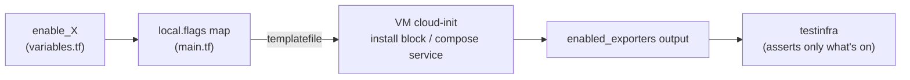

# Feature Flags

Every metrics exporter is an individual `enable_*` boolean defined in
[`variables.tf`](../variables.tf). Unlike `centralized_monitoring`, a flag here gates **install
only** — there is no local Prometheus to also gate a scrape job in, because this cluster doesn't
run one (see [architecture decision](#install-only-not-install--scrape) below).

- [Install-only, not install + scrape](#install-only-not-install--scrape)
- [The full flag matrix](#the-full-flag-matrix)
- [`enabled_exporters` and the test suite](#enabled_exporters-and-the-test-suite)
- [Changing the footprint](#changing-the-footprint)
- [Coroot + ingress (opt-in, not exporters)](#coroot--ingress-opt-in-not-exporters)
- [Future monitoring integration](#future-monitoring-integration)

## Install-only, not install + scrape



In `centralized_monitoring`, `local.flags` feeds both the cloud-init install **and** the
server's `prometheus.yml` scrape job. Here there is no server-side Prometheus, so the same
`local.flags` map only feeds cloud-init: a disabled flag means the exporter is **not installed**
on the VM and **not running** — full stop. The live tests skip that exporter's assertions
(parametrized over `enabled_exporters`). This is a deliberate **"exporters present, pull
deferred"** design (see
[`specs/centralized_logging_metrics.md`](../../../specs/centralized_logging_metrics.md) §3) —
the plan is for the sibling `centralized_monitoring` Prometheus to scrape these endpoints later,
which avoids a dependency cycle and any need for peer-IP injection in this layer.

## The full flag matrix

| Flag | Default | Scope | Port | Role |
|------|:-------:|-------|------|------|
| `enable_node_exporter` | ✅ | all VMs | `9100` | host metrics; also serves the syslog-ng textfile `.prom` |
| `enable_syslogng_metrics` | ✅ | all VMs | via `9100` | syslog-ng native stats via textfile collector (requires `enable_node_exporter`) |
| `enable_systemd_exporter` | ✅ | all VMs | `9558` | per-unit health (e.g. `syslog-ng.service`) |
| `enable_journald_exporter` | ⬜ | all VMs | `12345` | off by default: upstream ships an x86-64-only prebuilt binary, which doesn't run on the lab's arm64 VMs (works on amd64 Proxmox) |
| `enable_process_exporter` | ✅ | all VMs | `9256` | per-process CPU/mem (syslog-ng, dockerd, k0s) |
| `enable_filestat_exporter` | ✅ | central only | `9943` | size/mtime of `/var/log/remote/*` — detect a client that stopped shipping |
| `enable_cadvisor` | ✅ | docker + k0s | `8089` | container metrics (`:8080` is taken by Traefik / kube-router) |
| `enable_traefik_metrics` | ✅ | docker only | `8082` | Traefik's Prometheus metrics endpoint |
| `enable_kube_metrics` | ✅ | k0s only | `10249` / `10255` | kubelet read-only port, so kube-proxy and kubelet/cAdvisor are scrapable without a token |
| `enable_kube_state_metrics` | ✅ | k0s only | `8081` | hostNetwork Deployment |
| `enable_netdata` | ✅ | all VMs | `19999` | Netdata real-time agent — per-second host/container/systemd metrics + a built-in dashboard; Prometheus export at `/api/v1/allmetrics?format=prometheus` |

All eleven flags default **on** except `enable_journald_exporter` — the lab is small enough to run
the full set, with that single exception carved out for an architecture incompatibility (not a
"nice-to-have" tier like `centralized_monitoring`'s eBPF/osquery add-ons).

### Netdata (real-time agent, all VMs)

`enable_netdata` is the one flag that is **both** install-gated *and* scraped locally: the agent
is installed on all three VMs (via the upstream `kickstart.sh`, standalone — no Netdata Cloud
claim, telemetry disabled, updates pinned), **and** the docker VM's own Prometheus renders a
`logging-netdata` job (`central`/`__SELF_IP__`/`k0s` on `:19999`). It overlaps `node_exporter`
and `cAdvisor` on purpose — Netdata adds per-second resolution and a zero-config built-in
dashboard on `:19999`. Live coverage: [`test_netdata.py`](../tests/testinfra/test_netdata.py)
(service running + `:19999` listening + Prometheus endpoint + the `logging-netdata` target `up`).

## `enabled_exporters` and the test suite

`outputs.tf` exposes `enabled_exporters = sort([for k, v in local.flags : k if v])` — a sorted
list of the flags that are on. The live suite
([`tests/testinfra/test_metrics.py`](../tests/testinfra/test_metrics.py)) reads it and
**parametrizes** over it, so each exporter test runs only when its flag is enabled (disabled
exporters are *skipped*, not failed). This keeps the test surface in lockstep with the deployed
footprint — see [operations.md](operations.md#testing).

## Changing the footprint

To change a default, set the variable — e.g. via `-var` or by editing
[`terraform.tfvars`](../terraform.tfvars):

```sh
# turn on journald-exporter (e.g. testing on amd64 Proxmox)
tofu -chdir=clusters/centralized_logging apply -var 'enable_journald_exporter=true'

# slim down to host + syslog-ng metrics only
tofu -chdir=clusters/centralized_logging apply \
  -var 'enable_systemd_exporter=false' -var 'enable_process_exporter=false' \
  -var 'enable_cadvisor=false' -var 'enable_traefik_metrics=false' \
  -var 'enable_kube_metrics=false' -var 'enable_kube_state_metrics=false' \
  -var 'enable_filestat_exporter=false'
```

> Because the provider keys the VM on the cloud-init **file path** (not content), changing a
> flag re-renders `.rendered/*.yaml` but does **not** recreate a running VM. To apply, recreate
> the cluster: `just destroy centralized_logging && just up centralized_logging`. See
> [operations.md](operations.md#applying-config-changes).

## Coroot + ingress (opt-in, not exporters)

Two flags beyond the exporter layer deploy [Coroot](https://github.com/coroot/coroot) — a
self-hosted, eBPF-based observability platform (metrics, logs, traces, continuous profiling, a
service map, SLOs) — onto the **k0s node**, and an ingress controller to expose its UI. Both
default **off** and are deliberately kept **out of `local.flags`/`enabled_exporters`** (they are
not `/metrics` exporters); they are surfaced separately via the `enabled_features` output, which
the live [`test_coroot.py`](../tests/testinfra/test_coroot.py) reads to skip when off. Full design:
[`specs/coroot.md`](../../../specs/coroot.md).

| Flag | Default | Scope | What it does |
|------|:-------:|-------|--------------|
| `enable_coroot` | ⬜ | k0s only | Deploys the Coroot stack (server + eBPF node-agent + cluster-agent + bundled Prometheus + ClickHouse) via the `coroot-operator` / `coroot-ce` Helm charts, declaratively in cloud-init. Installs an OpenEBS default `StorageClass` for the PVCs. |
| `enable_ingress` | ⬜ | k0s only | Installs an `ingress-nginx` controller (hostNetwork, binds the k0s VM's `:80`/`:443`) and exposes Coroot's UI through it. Independent of `enable_coroot`; when off, the UI is still reachable via its NodePort. |

Key differences from the exporter flags:

- **Self-hosted, no secrets.** Coroot needs no cloud account or API keys, so the whole install is
  declarative in the k0s cloud-init (no host-driven step). Unlike Pixie (the rejected alternative),
  arm64 is fully supported.
- **Auto-sizing.** Coroot bundles Prometheus + ClickHouse, so `enable_coroot=true` **auto-bumps**
  the k0s VM to 4 vCPU / 8G / 50G (`local.k0s_size` in [`main.tf`](../main.tf)). The default
  (coroot-off) cluster keeps the small 2 vCPU / 2G / 20G k0s VM — no manual `tfvars` edit.
- **Chart-default overrides.** The rendered
  [`coroot-values.yaml.tftpl`](../cloud-init/coroot/coroot-values.yaml.tftpl) trims the chart's
  laptop-hostile defaults: ClickHouse storage `100Gi → 10Gi` (would exceed the VM disk) and the
  server memory request `4Gi → 2Gi`.
- **UI exposure.** Always on a NodePort (`http://<k0s_ip>:30080`, browser-friendly); additionally
  via ingress (`curl -H 'Host: coroot.local' http://<k0s_ip>/`) when `enable_ingress`.

```sh
# turn both on (the VM auto-resizes; requires a recreate to apply cloud-init)
tofu -chdir=clusters/centralized_logging apply -var enable_coroot=true -var enable_ingress=true
# or uncomment the block in terraform.tfvars, then: just recreate centralized_logging

just coroot-status centralized_logging   # Coroot pods on the k0s node
just coroot-deploy centralized_logging   # re-run the installer (idempotent repair)
just open centralized_logging            # opens the Coroot UI alongside the other dashboards
```

## Future monitoring integration

Two paste-in artifacts ship with the cluster today (not loaded by anything here):

- [`cloud-init/prometheus/logging-scrape.yml`](../cloud-init/prometheus/logging-scrape.yml) —
  scrape jobs; fill in `<central_ip>`/`<docker_ip>`/`<k0s_ip>` from
  `tofu output -json metrics_targets`.
- [`cloud-init/prometheus/alert.rules.yml`](../cloud-init/prometheus/alert.rules.yml) —
  logging-health alerts (`SyslogNgServiceDown`, `SyslogNgEventsDropped`,
  `NoLogsReceivedFromClient`, …).

Add those to the `centralized_monitoring` Prometheus to start scraping this cluster — see
[`specs/centralized_logging_metrics.md`](../../../specs/centralized_logging_metrics.md) §9 for
the full job list.
