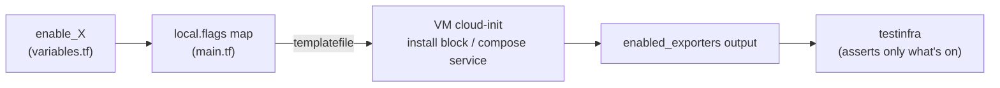

# Feature Flags

Every metrics exporter is an individual `enable_*` boolean defined in
[`variables.tf`](../variables.tf). Unlike `centralized_monitoring`, a flag here gates **install
only** — there is no local Prometheus to also gate a scrape job in, because this cluster doesn't
run one (see [architecture decision](#install-only-not-install--scrape) below).

- [Install-only, not install + scrape](#install-only-not-install--scrape)
- [The full flag matrix](#the-full-flag-matrix)
- [`enabled_exporters` and the test suite](#enabled_exporters-and-the-test-suite)
- [Changing the footprint](#changing-the-footprint)
- [Future monitoring integration](#future-monitoring-integration)

## Install-only, not install + scrape



In `centralized_monitoring`, `local.flags` feeds both the cloud-init install **and** the
server's `prometheus.yml` scrape job. Here there is no server-side Prometheus, so the same
`local.flags` map only feeds cloud-init: a disabled flag means the exporter is **not installed**
on the VM and **not running** — full stop. The live tests skip that exporter's assertions
(parametrized over `enabled_exporters`). This is a deliberate **"exporters present, pull
deferred"** design (see
[`specs/centralized_logging_metrics.md`](../../../specs/centralized_logging_metrics.md) §3) —
the plan is for the sibling `centralized_monitoring` Prometheus to scrape these endpoints later,
which avoids a dependency cycle and any need for peer-IP injection in this layer.

## The full flag matrix

| Flag | Default | Scope | Port | Role |
|------|:-------:|-------|------|------|
| `enable_node_exporter` | ✅ | all VMs | `9100` | host metrics; also serves the syslog-ng textfile `.prom` |
| `enable_syslogng_metrics` | ✅ | all VMs | via `9100` | syslog-ng native stats via textfile collector (requires `enable_node_exporter`) |
| `enable_systemd_exporter` | ✅ | all VMs | `9558` | per-unit health (e.g. `syslog-ng.service`) |
| `enable_journald_exporter` | ⬜ | all VMs | `12345` | off by default: upstream ships an x86-64-only prebuilt binary, which doesn't run on the lab's arm64 VMs (works on amd64 Proxmox) |
| `enable_process_exporter` | ✅ | all VMs | `9256` | per-process CPU/mem (syslog-ng, dockerd, k0s) |
| `enable_filestat_exporter` | ✅ | central only | `9943` | size/mtime of `/var/log/remote/*` — detect a client that stopped shipping |
| `enable_cadvisor` | ✅ | docker + k0s | `8089` | container metrics (`:8080` is taken by Traefik / kube-router) |
| `enable_traefik_metrics` | ✅ | docker only | `8082` | Traefik's Prometheus metrics endpoint |
| `enable_kube_metrics` | ✅ | k0s only | `10249` / `10255` | kubelet read-only port, so kube-proxy and kubelet/cAdvisor are scrapable without a token |
| `enable_kube_state_metrics` | ✅ | k0s only | `8081` | hostNetwork Deployment |

All ten flags default **on** except `enable_journald_exporter` — the lab is small enough to run
the full set, with that single exception carved out for an architecture incompatibility (not a
"nice-to-have" tier like `centralized_monitoring`'s eBPF/osquery add-ons).

## `enabled_exporters` and the test suite

`outputs.tf` exposes `enabled_exporters = sort([for k, v in local.flags : k if v])` — a sorted
list of the flags that are on. The live suite
([`tests/testinfra/test_metrics.py`](../tests/testinfra/test_metrics.py)) reads it and
**parametrizes** over it, so each exporter test runs only when its flag is enabled (disabled
exporters are *skipped*, not failed). This keeps the test surface in lockstep with the deployed
footprint — see [operations.md](operations.md#testing).

## Changing the footprint

To change a default, set the variable — e.g. via `-var` or by editing
[`terraform.tfvars`](../terraform.tfvars):

```sh
# turn on journald-exporter (e.g. testing on amd64 Proxmox)
tofu -chdir=clusters/centralized_logging apply -var 'enable_journald_exporter=true'

# slim down to host + syslog-ng metrics only
tofu -chdir=clusters/centralized_logging apply \
  -var 'enable_systemd_exporter=false' -var 'enable_process_exporter=false' \
  -var 'enable_cadvisor=false' -var 'enable_traefik_metrics=false' \
  -var 'enable_kube_metrics=false' -var 'enable_kube_state_metrics=false' \
  -var 'enable_filestat_exporter=false'
```

> Because the provider keys the VM on the cloud-init **file path** (not content), changing a
> flag re-renders `.rendered/*.yaml` but does **not** recreate a running VM. To apply, recreate
> the cluster: `just destroy centralized_logging && just up centralized_logging`. See
> [operations.md](operations.md#applying-config-changes).

## Future monitoring integration

Two paste-in artifacts ship with the cluster today (not loaded by anything here):

- [`cloud-init/prometheus/logging-scrape.yml`](../cloud-init/prometheus/logging-scrape.yml) —
  scrape jobs; fill in `<central_ip>`/`<docker_ip>`/`<k0s_ip>` from
  `tofu output -json metrics_targets`.
- [`cloud-init/prometheus/alert.rules.yml`](../cloud-init/prometheus/alert.rules.yml) —
  logging-health alerts (`SyslogNgServiceDown`, `SyslogNgEventsDropped`,
  `NoLogsReceivedFromClient`, …).

Add those to the `centralized_monitoring` Prometheus to start scraping this cluster — see
[`specs/centralized_logging_metrics.md`](../../../specs/centralized_logging_metrics.md) §9 for
the full job list.
