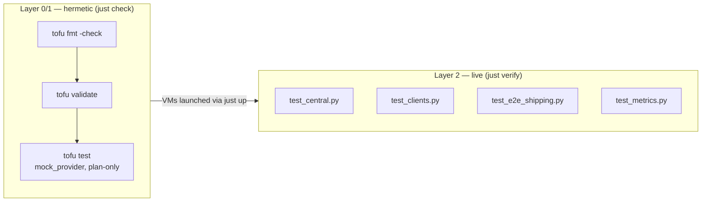

# Operations & Testing

Lifecycle, the two-layer test model, and the security/lab caveats you should know before
promoting this to a real target.

- [Lifecycle recipes](#lifecycle-recipes)
- [Folder → VM naming](#folder--vm-naming)
- [Applying config changes](#applying-config-changes)
- [Testing](#testing)
- [Troubleshooting](#troubleshooting)
- [Security & lab caveats](#security--lab-caveats)

## Lifecycle recipes

The root [`Justfile`](../../../Justfile) orchestrates every cluster **by folder name** — the
folder name is the only argument these recipes take.

| Recipe | Runs | Cost |
|--------|------|------|
| `just init centralized_logging` | `tofu init` | — |
| `just plan centralized_logging` | `tofu plan` | — |
| `just check centralized_logging` | `tofu fmt -check -recursive` + `validate` + `tofu test -test-directory=tests/tofu` | **hermetic — no VMs** |
| `just up centralized_logging` | `tofu apply -auto-approve`, then block on `cloud-init status --wait` over SSH for each VM | launches all 3 VMs |
| `just verify centralized_logging` | `cd tests/testinfra && uv run pytest -v` | **live — SSH to running VMs** |
| `just logs centralized_logging` | `find /var/log/remote -type f` on central | live — reads |
| `just ssh centralized_logging <role>` | resolve `hosts.<role>.ipv4`, SSH as `ubuntu` | — |
| `just destroy centralized_logging` | `tofu destroy -auto-approve` | tears all 3 VMs down |
| `just down` | `multipass stop --all` (no arg) | stops **all** VMs, preserved |
| `just status` | `multipass list` | — |
| `just help` | curated workflow overview + `just --list` | — |

SSH uses `~/.ssh/id_ed25519` (override with `CLUSTER_SSH_KEY`), with
`StrictHostKeyChecking=no` (host keys reset every `up`). Roles for `just ssh` are `central`,
`k0s`, and `docker`.

Run a single test directly:

```sh
# one hermetic run
tofu -chdir=clusters/centralized_logging test -test-directory=tests/tofu

# one live test by keyword
cd clusters/centralized_logging/tests/testinfra && uv run pytest -v -k e2e
```

## Folder → VM naming

The cluster lives in `clusters/centralized_logging/` (underscore). Multipass instance names use
hyphens and are derived from `var.name_prefix` (default `centralized-logging`):

| Role | Folder reference | Multipass instance |
|------|------------------|--------------------|
| central | `centralized_logging` / `central` | `centralized-logging-central` |
| k0s | `centralized_logging` / `k0s` | `centralized-logging-k0s` |
| docker | `centralized_logging` / `docker` | `centralized-logging-docker` |

`just` passes the folder name to `tofu -chdir`; the `hosts` output maps each role to its
`{name, ipv4}`.

## Applying config changes

> **Gotcha:** the `larstobi/multipass` provider keys the instance on the cloud-init **file
> path** (`cloudinit_file` takes a path), not its content. Editing a template (e.g. flipping a
> metrics flag or changing `hostname_source`) re-renders `.rendered/*.yaml` but does **not**
> recreate a running VM. Recreating `central` alone also changes its DHCP IP, invalidating the
> destination address both clients baked in.

To apply any change, recreate the whole cluster:

```sh
just destroy centralized_logging && just up centralized_logging
```

Generated `.rendered/*.yaml` is gitignored and re-rendered every apply — don't hand-edit it. A
future improvement (noted in the spec) is a
[`replace_triggered_by`](https://opentofu.org/docs/language/meta-arguments/lifecycle/#replace_triggered_by)
lifecycle rule so VMs rebuild automatically when their cloud-init changes.

## Testing

Two layers, each matched to its cost (the project convention — cheap structural checks go
hermetic, behavioral end-to-end checks go live).



### Hermetic — [`tests/tofu/sizing_and_render.tftest.hcl`](../tests/tofu/sizing_and_render.tftest.hcl)

`mock_provider "multipass" {}` with a stub IP, `command = plan` — asserts rendered output
without launching VMs:

- `sizing_image_names_and_central_render` — CPU/mem/disk per VM, `image == "24.04"`,
  `name_prefix`-derived names, and that central's cloud-init contains the `/var/log/remote`
  sink, the `transport("tcp")` source, the injected SSH key, and `keep-hostname(yes)`.
- `hostname_source_dns_renders_use_dns` — with `hostname_source = "dns"`, asserts the rendered
  config contains `use-dns(yes)`.

### Live — [`tests/testinfra/`](../tests/testinfra/)

[`conftest.py`](../tests/testinfra/conftest.py) reads the `hosts` output, builds an SSH config,
and exposes `central` / `k0s` / `docker` host fixtures (polling SSH reachability, then blocking
on `cloud-init status --wait` up to 600s).

| Test file | Asserts |
|------|---------|
| [`test_central.py`](../tests/testinfra/test_central.py) | syslog-ng running & enabled; TCP `514` listening; `/var/log/remote` exists |
| [`test_clients.py`](../tests/testinfra/test_clients.py) | syslog-ng running + `/var/lib/syslog-ng` buffer dir on both clients; `k0s status` healthy; Docker running with `journald` log-driver; all 5 on-box stack services up |
| [`test_e2e_shipping.py`](../tests/testinfra/test_e2e_shipping.py) | **headline**: a `logger`-emitted token on each client appears under `/var/log/remote/` on central; in `keep` mode it lands under the client's hostname folder |
| [`test_metrics.py`](../tests/testinfra/test_metrics.py) | each enabled exporter port listens + `/metrics` returns 200 (parametrized over `enabled_exporters`, skips when off); `syslogng.prom` present with `syslogng_` series; `systemd_exporter` reports `syslog-ng.service`; cross-VM reachability proves the `0.0.0.0` bind |

Dependencies are declared in [`pyproject.toml`](../tests/testinfra/pyproject.toml) and locked in
[`uv.lock`](../tests/testinfra/uv.lock) — see [dependencies.md](dependencies.md#test-toolchain).

The hermetic layer also runs in CI on every push — see
[`.github/workflows/ci.yml`](../../../.github/workflows/ci.yml), which auto-discovers every
`clusters/<name>/` folder.

## Troubleshooting

| Symptom | Cause / fix |
|---------|-------------|
| `just ssh` / `verify` refused right after `up` | cloud-init still finishing — `just up` already waits per-VM; if you bypassed it, retry (`conftest.py` also blocks on `cloud-init status --wait`, up to 600s) |
| `multipass shell`/`exec` → "No route to host" | use `just ssh centralized_logging <role>` (direct SSH) instead |
| An exporter port isn't listening | cloud-init still installing the bundle, or its `enable_*` flag is off — check `tofu output enabled_exporters`; see [feature-flags.md](feature-flags.md) |
| `:12345` (journald) never opens | expected on arm64 — `enable_journald_exporter` is off (x86-64-only binary); leave it off or run on amd64 |
| No logs under `/var/log/remote` | shipper or listener down — on a client: `systemctl status syslog-ng`; on central: confirm TCP `514` is listening (`ss -ltnp`) and `/var/log/remote` exists |
| Logs in wrong/odd folder | `hostname_source` mismatch — check `tofu output hostname_source`; `keep` folders by client hostname, change requires `down` + `up` |
| Stale IP after recreate | VMs got new DHCP IPs — nothing to do, `just ssh`/testinfra read fresh IPs from the `hosts` output each run |
| `just check` fails on `fmt` | unformatted `.tf` — run `tofu -chdir=clusters/centralized_logging fmt -recursive` |
| Docker stack ports not responding | stack still pulling images / starting — `just ssh ... docker` then `docker compose -f /opt/stack/compose.yaml ps` |
| `k0s status` errors | controller still starting — retry after a moment; `sudo journalctl -u k0scontroller` for detail |

To watch a VM's first boot live: `just ssh centralized_logging <role>` then
`sudo cloud-init status --long` and `sudo journalctl -u syslog-ng -f`.

## Security & lab caveats

This is a **lab** stack — tighten these before any real target:

- **No authentication on the syslog-ng listener.** TCP `514` accepts from any sender on the
  private Multipass subnet; there's no TLS or peer auth.
- **Default Grafana creds** `admin` / `admin` (on-box stack, unrelated to the metrics layer).
- **Alertmanager** routes to a null `devnull` receiver — no paging in the lab.
- **Unauthenticated exporters.** All metrics-layer exporters are unauthenticated `/metrics`
  endpoints bound `0.0.0.0` on the private subnet — fine for a lab, not for a routed network.
  No `ufw` is configured today.
- **journald-exporter is arm64-incompatible**, so it defaults off on this lab's VMs (works on
  amd64 Proxmox) — see [feature-flags.md](feature-flags.md).
- **kubelet read-only port `10255`** is HTTP with **no auth** (enabled deliberately so a future
  scraper can reach it without a token) — same tradeoff `centralized_monitoring` makes.
- **No secrets.** Nothing in this layer reads `.env` or needs credentials.

See the spec's risk/open-questions section
([`specs/centralized_logging_metrics.md`](../../../specs/centralized_logging_metrics.md) §13)
for the full rationale, and
[`specs/centralized_logging.md`](../../../specs/centralized_logging.md#future-work-kept-in-mind-not-built-here)
for future work: converging the sink into VictoriaLogs/OpenObserve, wiring the
`centralized_monitoring` scrape, and promotion to Proxmox via Ansible (the testinfra suite
carries over).
