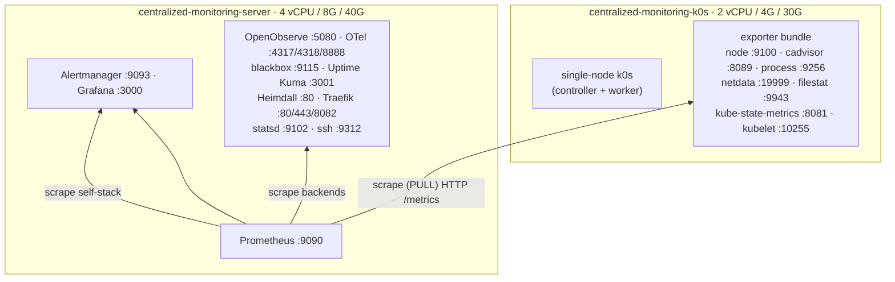

# centralized_monitoring — Documentation

Comprehensive reference for the **`centralized_monitoring`** cluster shipped on the
`feature-cluster-monitor` branch: a 2-VM, **pull-based** Prometheus / Grafana / OpenObserve
observability stack with feature-flagged, tiered exporters, deployed to local
[Multipass](https://multipass.run/) VMs by [OpenTofu](https://opentofu.org/).

A Prometheus **server** *pulls* metrics, traces, and uptime from a fully-instrumented single-node
[**k0s**](https://k0sproject.io/) host. This doc set is the deep reference; the cluster's
[`README.md`](../README.md) and [`USAGE.md`](../USAGE.md) remain the concise entry points, and the
design rationale lives in [`specs/centralized_monitoring.md`](../../../specs/centralized_monitoring.md)
and [`specs/e2e-centralized-monitoring.md`](../../../specs/e2e-centralized-monitoring.md).

## Documentation map

| Doc | What's inside |
|-----|---------------|
| [architecture.md](architecture.md) | System topology + `tofu apply` sequence diagrams, VM sizing, OpenTofu resource/local/output inventory, the inverted IP edge, the `hosts` contract |
| [endpoints.md](endpoints.md) | Every service → port → protocol → purpose; web UIs; Prometheus scrape-job table; useful HTTP API endpoints |
| [feature-flags.md](feature-flags.md) | The full MVP / Reach / Nice-to-have `enable_*` matrix and how one flag gates VM install + compose service + scrape job |
| [dependencies.md](dependencies.md) | Every open-source project used — OpenTofu providers, Docker images, pinned exporter binaries, k0s + kube-state-metrics, apt packages, install scripts — with versions and links |
| [operations.md](operations.md) | `just` lifecycle recipes, the two-layer test model, and known caveats/security notes |

## Topology at a glance



> Prometheus **pulls**, so the runtime-IP dependency edge is inverted vs the logging cluster: the
> k0s host is created **first**, its DHCP `ipv4` is read by OpenTofu and baked into the server's
> `prometheus.yml`, then the server boots. See [architecture.md](architecture.md).

## Quickstart

```sh
just check  centralized_monitoring   # hermetic: tofu fmt + validate + test (no VMs)
just up     centralized_monitoring   # one apply -> k0s first, then server scrapes it
multipass list                       # 2 Running with IPs
just verify centralized_monitoring   # live: services up / all targets up / blackbox / grafana
just ssh    centralized_monitoring server
just destroy centralized_monitoring  # tofu destroy (one cluster, gone)
just down                            # graceful `multipass stop --all` (all VMs, preserved)
```

Requires OpenTofu ≥ 1.7, `multipass`, `uv`, `just`, and an SSH keypair at
`~/.ssh/id_ed25519[.pub]` (injected via cloud-init for the testinfra verify loop).

After `just up`, the `shell_hints` output prints ready-to-use URLs:

```sh
open http://<server-ip>:9090/targets   # Prometheus targets
open http://<server-ip>:3000           # Grafana (admin/admin)
open http://<server-ip>:5080           # OpenObserve
open http://<server-ip>:3001           # Uptime Kuma
```
