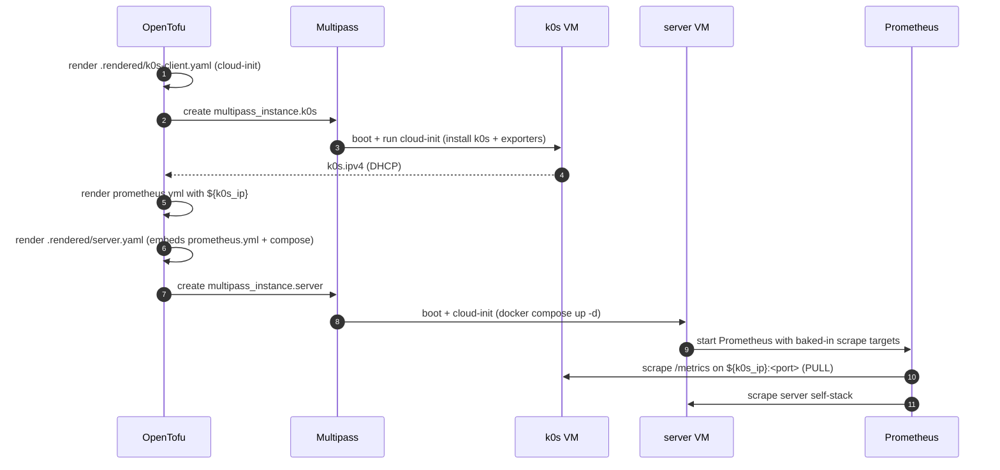

# Architecture

The `centralized_monitoring` cluster is a **two-VM, pull-based** observability stack. A Prometheus
server scrapes a fully-instrumented single-node [k0s](https://k0sproject.io/) host over HTTP. All
infrastructure is defined in OpenTofu under
[`clusters/centralized_monitoring/`](../) and provisioned via cloud-init.

- [VMs and sizing](#vms-and-sizing)
- [System topology](#system-topology)
- [The inverted IP edge (pull vs push)](#the-inverted-ip-edge-pull-vs-push)
- [`tofu apply` ordering](#tofu-apply-ordering)
- [OpenTofu inventory](#opentofu-inventory)
- [The `hosts` output contract](#the-hosts-output-contract)
- [Data flow](#data-flow)

## VMs and sizing

| VM (Multipass name) | Role | vCPU | RAM | Disk | Image | Created | Runs |
|---------------------|------|------|-----|------|-------|---------|------|
| `centralized-monitoring-server` | `server` | 4 | 8G | 40G | Ubuntu `24.04` | **2nd** | Docker Compose stack: Prometheus, Alertmanager, Grafana, OpenObserve, OTel Collector, blackbox, Heimdall, Uptime Kuma, Traefik, statsd/ssh exporters |
| `centralized-monitoring-k0s` | `k0s` | 2 | 4G | 30G | Ubuntu `24.04` | **1st** | single-node k0s + flag-gated exporter bundle (node, cadvisor, process, netdata, filestat, kube-state-metrics, kubelet) |

Total default footprint: **6 vCPU / 12G RAM / 70G disk** — comfortable on a 24G+ host. Sizing is
parameterized via the `server` and `k0s_client` object variables (see [OpenTofu inventory](#opentofu-inventory)).

Instance names are `${var.name_prefix}-<role>` (default prefix `centralized-monitoring`). Cluster
folders may use underscores; Multipass instance names use hyphens.

## System topology

```mermaid
flowchart BT
    subgraph K0S["centralized-monitoring-k0s (monitored host)"]
        direction TB
        k0s["k0s --single<br/>controller + worker"]
        node1["node_exporter :9100"]
        cad1["cadvisor :8089"]
        proc["process-exporter :9256"]
        nd["netdata :19999"]
        fs["filestat_exporter :9943"]
        ksm["kube-state-metrics :8081<br/>(hostNetwork Deployment)"]
        kubelet["kubelet read-only :10255"]
    end

    subgraph SRV["centralized-monitoring-server (observability hub)"]
        direction TB
        prom["Prometheus :9090"]
        am["Alertmanager :9093"]
        graf["Grafana :3000"]
        oo["OpenObserve :5080"]
        otel["OTel Collector<br/>:4317 gRPC · :4318 HTTP · :8888"]
        bb["blackbox_exporter :9115"]
        kuma["Uptime Kuma :3001"]
        heim["Heimdall :80"]
        traefik["Traefik :80/:443/:8082"]
        statsd["statsd_exporter :9102 · :8125/udp"]
        sshx["ssh_exporter :9312"]
        node2["node_exporter :9100"]
        cad2["cadvisor :8080"]
    end

    prom -- "scrape /metrics (PULL)" --> node1 & cad1 & proc & nd & fs & ksm & kubelet
    prom -- "self-stack /metrics" --> am & graf & otel & node2 & cad2 & statsd & sshx & traefik
    bb -- "HTTP probes" --> graf & oo
    bb -. "probe k0s node" .-> node1
    prom -- "probe results" --> bb
    am -- "alerts" --> prom
    graf -- "queries" --> prom & oo
    otel -- "traces/logs OTLP" --> oo
```



## The inverted IP edge (pull vs push)

The sibling `centralized_logging` cluster **pushes** (clients → central), so the central VM is
created first. Here Prometheus **pulls** (server → client), so the dependency edge flips: the scrape
**target must exist and have a DHCP IP before the server's `prometheus.yml` can be rendered**.

OpenTofu creates the k0s host first, reads its computed `ipv4`, and renders the server's
`prometheus.yml` from that value via `templatefile(...)` in [`main.tf`](../main.tf). The reference
to `multipass_instance.k0s.ipv4` is the edge that forces correct ordering inside a single
`tofu apply`:

```
multipass_instance.server
  └─ local_file.server_ci          (server cloud-init content)
       └─ local.prometheus_yml     (rendered scrape config)
            └─ multipass_instance.k0s.ipv4   (runtime DHCP IP)
                 └─ multipass_instance.k0s   (created first)
```

`${k0s_ip}` is the **single injected runtime value**; every client scrape job targets
`${k0s_ip}:<port>`.

## `tofu apply` ordering



`just up` then blocks on `cloud-init status --wait` over SSH for each VM before returning.

## OpenTofu inventory

Files in [`clusters/centralized_monitoring/`](../):

| File | Contents |
|------|----------|
| [`versions.tf`](../versions.tf) | `required_version >= 1.7`; providers `larstobi/multipass ~> 1.4`, `hashicorp/local ~> 2.4` |
| [`providers.tf`](../providers.tf) | `provider "multipass" {}` (CLI defaults, no config) |
| [`variables.tf`](../variables.tf) | sizing, image, SSH key, scrape interval, Grafana password, and all `enable_*` flags |
| [`main.tf`](../main.tf) | locals, `templatefile` rendering, the two `multipass_instance` + two `local_file` resources |
| [`outputs.tf`](../outputs.tf) | `server_ipv4`, `k0s_ipv4`, `hosts`, `enabled_exporters`, `shell_hints` |
| [`terraform.tfvars`](../terraform.tfvars) | default values + commented flag toggles for discoverability |

### Resources

| Resource | Type | Notes |
|----------|------|-------|
| `local_file.k0s_ci` | `local_file` | renders `.rendered/k0s-client.yaml` from `cloud-init/k0s-client.yaml.tftpl` |
| `multipass_instance.k0s` | `multipass_instance` | the monitored host — **created first** |
| `local_file.server_ci` | `local_file` | renders `.rendered/server.yaml` (embeds `prometheus.yml` + compose + static configs) |
| `multipass_instance.server` | `multipass_instance` | the observability hub — **created second** |

> The `larstobi/multipass` provider keys the instance on the cloud-init **file path**, not its
> content (`cloudinit_file` takes a path). Editing a template re-renders `.rendered/*.yaml` but does
> **not** recreate the VM — see [operations.md](operations.md#applying-config-changes).

### Key locals

| Local | Value / purpose |
|-------|-----------------|
| `ssh_pubkey` | inline `var.ssh_pubkey` wins, else the file at `var.ssh_pubkey_path`, else empty |
| `server_name` / `k0s_name` | `${var.name_prefix}-server` / `${var.name_prefix}-k0s` |
| `openobserve_password` | `Complexpass#123` — OpenObserve rejects weak passwords; reused by the Grafana datasource basic auth |
| `flags` | map of every `enable_*` var, threaded into **every** `templatefile()` so each template renders its own `%{ if enable_x ~}…%{ endif ~}` blocks |
| `enabled_exporters` | `sort([for k, v in local.flags : k if v])` — the active set, exported and consumed by the live tests |
| `prometheus_yml` | rendered from `prometheus.yml.tftpl` with injected `k0s_ip` + `scrape_interval` |
| `compose_conf` | rendered from `compose.yaml.tftpl` with `grafana_admin_password` + `openobserve_password` |
| `grafana_datasources` | rendered datasources (Prometheus always; OpenObserve when enabled) |

## The `hosts` output contract

`outputs.tf` exposes `hosts` as the SSH-target contract consumed by
[`tests/testinfra/conftest.py`](../tests/testinfra/conftest.py) and the `just ssh`/`just up` recipes:

```hcl
hosts = {
  server = { name = "centralized-monitoring-server", ipv4 = "<runtime-ipv4>" }
  k0s    = { name = "centralized-monitoring-k0s",    ipv4 = "<runtime-ipv4>" }
}
```

Companion outputs:

| Output | Type | Consumer |
|--------|------|----------|
| `server_ipv4` / `k0s_ipv4` | `string` | convenience |
| `hosts` | `map(object({name, ipv4}))` | testinfra SSH targets; `just ssh`/`just up` |
| `enabled_exporters` | `list(string)` | testinfra parametrization (skip disabled exporters) |
| `shell_hints` | `string` (sensitive) | post-apply convenience URLs |

## Data flow

1. **Metrics (pull):** Prometheus scrapes `/metrics` from k0s exporters at `${k0s_ip}:<port>` and
   from the server's own stack over the Compose network (service DNS names like `grafana:3000`).
2. **Metrics → OpenObserve (`remote_write`):** when `enable_openobserve` is on, Prometheus
   `remote_write`s **every** scraped series (server + k0s) to
   `http://openobserve:5080/api/default/prometheus/api/v1/write` (basic auth) → OpenObserve `metrics`
   stream. This is the pull→OpenObserve bridge; Grafana can then query either datasource.
3. **Server logs → OpenObserve:** the server OTel Collector's `filelog` receivers tail Docker
   container logs (`/var/lib/docker/containers/*/*.log`) and host `/var/log/syslog`, exporting to
   OpenObserve streams `container_logs` / `host_logs` (per-stream `stream-name` header).
4. **k0s logs → OpenObserve:** an `otelcol-contrib` agent on the k0s VM ships node syslog + Kubernetes
   pod logs (`/var/log/pods/*`) to the server's OpenObserve (streams `k0s_host` / `k0s_pods`). The k0s
   VM is created before the server, so the agent boots with a `127.0.0.1` placeholder and is
   re-pointed at the real server IP **post-apply** by `terraform_data.k0s_log_shipper`
   (`multipass transfer` + `systemctl restart`). Gated on `enable_openobserve` + `enable_k0s_log_shipping`.
5. **Traces/logs (push, optional):** apps send OTLP to the OTel Collector (`:4317`/`:4318`), which
   forwards traces and logs to OpenObserve (`otlp_logs`) and exposes pipeline metrics.
6. **Probing:** the `blackbox` job hands target URLs to `blackbox_exporter`, which probes them and
   returns `probe_success`/`probe_duration_seconds` for Prometheus.
7. **Visualization:** Grafana queries the auto-provisioned Prometheus (and OpenObserve) datasources.
8. **Alerting:** Prometheus evaluates `alert.rules.yml` and routes to Alertmanager (null receiver in
   the lab).

`just verify-api centralized_monitoring` asserts ingestion is actually live — `openobserve_cli.py
check --require-metrics --require-logs` fails unless PromQL `up` returns series and a logs stream has
recent rows.

See [endpoints.md](endpoints.md) for every port and scrape job, and [dependencies.md](dependencies.md)
for the projects behind each component.
