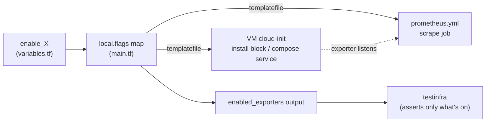

# Feature Flags & Tiers

Every exporter and optional integration is an individual `enable_*` boolean defined in
[`variables.tf`](../variables.tf). A single flag gates **three things at once**, so a disabled flag
leaves no trace anywhere in the running system.

- [How one flag gates everything](#how-one-flag-gates-everything)
- [Tier posture](#tier-posture)
- [The full flag matrix](#the-full-flag-matrix)
- [`enabled_exporters` and the test suite](#enabled_exporters-and-the-test-suite)
- [Changing the footprint](#changing-the-footprint)

## How one flag gates everything



The `local.flags` map (every `enable_*` var) is merged into **every** `templatefile()` call in
[`main.tf`](../main.tf). Each template renders its own `%{ if enable_x ~}…%{ endif ~}` conditionals.
So when a flag is `false`:

- the exporter is **not installed** on the VM (cloud-init block omitted), and
- the service is **not in** the Docker Compose file (server) or has no systemd unit (k0s), and
- the **scrape job does not exist** in `prometheus.yml`, and
- the live tests **skip** that exporter's assertions (parametrized over `enabled_exporters`).

The Prometheus / Grafana / Alertmanager spine is always on (no flag).

## Tier posture

| Tier | Default | Intent |
|------|---------|--------|
| **MVP** | ON | Minimum viable observability platform |
| **Reach** | ON (2 exceptions OFF) | Production-grade reach: k8s, uptime, ingress, extra exporters |
| **Nice-to-have** | OFF | Specialized add-ons (eBPF, osquery, media, scripts, Vector) |

The two Reach exceptions are **off by default because they are lab-hostile**:
`enable_nut_exporter` needs a real UPS / `upsd` daemon (absent in a VM), and `enable_nftables_exporter`
ships only as a Python tool with no portable binary release. Both stay flag-available — flip them on
for a target host that supports them.

## The full flag matrix

Legend: **Default** ✅ on / ⬜ off · **Host** = where it runs.

### MVP (default ON)

| Flag | Default | Host | Port | Role |
|------|:-------:|------|------|------|
| `enable_otel` | ✅ | server | 4317/4318/8888 | OTel Collector: OTLP gateway + filelog → OpenObserve (container_logs/host_logs) |
| `enable_openobserve` | ✅ | server | 5080 | metrics (Prometheus remote_write) + logs + traces store + Grafana datasource |
| `enable_k0s_log_shipping` | ✅ | k0s | *(push)* | otelcol-contrib agent: k0s host + pod logs → OpenObserve (endpoint injected post-apply) |
| `enable_blackbox` | ✅ | server | 9115 | HTTP/TCP/ICMP endpoint probes |
| `enable_node_exporter` | ✅ | both | 9100 | OS host + systemd-unit metrics |
| `enable_cadvisor` | ✅ | both | 8080 (server) / 8089 (k0s) | container metrics |
| `enable_process_exporter` | ✅ | k0s | 9256 | per-process metrics (v0.8.7; curated groups, `-threads=false -gather-smaps=false -remove-empty-groups`) |
| `enable_systemd_exporter` | ✅ | k0s | 9558 | per-unit health/resource metrics (curated `--unit-include` + `--enable-restart-count`) |
| `enable_netdata` | ✅ | both | 19999 | real-time agent (per-second host/container metrics + built-in dashboard; Prometheus export at `/api/v1/allmetrics?format=prometheus`). Server agent is host-installed and reached by Prometheus via `host.docker.internal`; k0s over its DHCP IP. Scraped series are surfaced in Grafana's `Netdata/` folder (fleet/instance/containers); targets carry friendly `instance` labels (`monitoring-server`/`monitoring-k0s`). See `specs/dashboard-update.md` |

### Reach (default ON)

| Flag | Default | Host | Port | Role |
|------|:-------:|------|------|------|
| `enable_kube_state_metrics` | ✅ | k0s | 8081 | k8s object state (hostNetwork Deployment) |
| `enable_kubelet_scrape` | ✅ | k0s | 10255 | kubelet/cAdvisor via read-only port (no auth) |
| `enable_heimdall` | ✅ | server | 80 (or via Traefik) | homepage / link dashboard |
| `enable_heimdall_seed` | ✅ | server | — | auto-seed Heimdall tiles at boot via cloud-init (needs `enable_heimdall`) |
| `enable_uptime_kuma` | ✅ | server | 3001 | human status page + notifications |
| `enable_traefik` | ✅ | server | 80/443/8082 | ingress fronting the stack + `/metrics` |
| `enable_statsd_exporter` | ✅ | server | 9102 (TCP), 8125 (UDP) | StatsD → Prometheus bridge |
| `enable_ssh_exporter` | ✅ | server | 9312 | SSH endpoint probes |
| `enable_filestat_exporter` | ✅ | k0s | 9943 | file size/mtime/stat metrics |
| `enable_nut_exporter` | ⬜ | k0s | 9199 | UPS / NUT metrics — **off: needs real UPS/upsd** |
| `enable_nftables_exporter` | ⬜ | k0s | 9630 | firewall rule counters — **off: no portable binary** |

### Nice-to-have (default OFF)

| Flag | Default | Host | Port | Role | Notes |
|------|:-------:|------|------|------|-------|
| `enable_osquery_exporter` | ⬜ | k0s | 9450 | osquery results → metrics | installs `osquery` apt pkg |
| `enable_ebpf_exporter` | ⬜ | k0s | 9435 | custom eBPF metrics | needs `linux-headers` |
| `enable_texporter` | ⬜ | k0s | 9101 | eBPF network-traffic metrics | needs `linux-headers` |
| `enable_ffmpeg_exporter` | ⬜ | k0s | 9618 | FFmpeg job metrics | installs `ffmpeg`; media workloads |
| `enable_script_exporter` | ⬜ | k0s | 9469 | arbitrary shell-script metrics | `/probe` |
| `enable_vector` | ⬜ | server | 8686 | observability pipeline | alt to OTel; future logging route |

## `enabled_exporters` and the test suite

`outputs.tf` exposes `enabled_exporters = sort([for k, v in local.flags : k if v])` — a sorted list
of the flags that are on. The live suite ([`tests/testinfra/conftest.py`](../tests/testinfra/conftest.py))
reads it and **parametrizes** over it, so each exporter test runs only when its flag is enabled
(disabled exporters are *skipped*, not failed). This keeps the test surface in lockstep with the
deployed footprint — see [operations.md](operations.md#testing).

## Changing the footprint

Defaults already encode MVP+Reach-on / Nice-off. To change them, set the variable — e.g. in
[`terraform.tfvars`](../terraform.tfvars) (which carries commented toggles for discoverability) or via
`-var`:

```sh
# turn a Nice-to-have exporter on
tofu -chdir=clusters/centralized_monitoring apply -var 'enable_ebpf_exporter=true'

# slim down to spine + node only
tofu -chdir=clusters/centralized_monitoring apply \
  -var 'enable_otel=false' -var 'enable_openobserve=false' -var 'enable_netdata=false'
```

> Because the provider keys the VM on the cloud-init **file path** (not content), changing a flag
> re-renders `.rendered/*.yaml` but does **not** recreate a running VM. To apply, recreate the
> cluster: `just destroy centralized_monitoring && just up centralized_monitoring`. See
> [operations.md](operations.md#applying-config-changes).

## Cross-cluster scraping — `extra_scrape_targets`

Not an `enable_*` flag: a `list(object({ job=string, ip=string, port=optional(number,9100) }))`
(default `[]`) that adds one static-config Prometheus job per entry so this hub can scrape VMs in
**other** clusters. It is normally populated by `just up-connected` via a gitignored
`.cross-cluster.auto.tfvars.json`, not by hand. Because the running server isn't recreated on a
cloud-init content change, `up-connected` re-renders `prometheus.yml`, scp's it onto the server, and
restarts the Prometheus container to pick up new targets. See
[`specs/cross-cluster.md`](../../../specs/cross-cluster.md).
