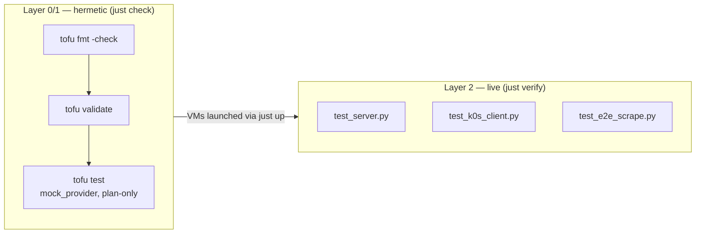

# Operations & Testing

Lifecycle, the two-layer test model, and the security/lab caveats you should know before promoting
this to a real target.

- [Lifecycle recipes](#lifecycle-recipes)
- [Folder → VM naming](#folder--vm-naming)
- [Applying config changes](#applying-config-changes)
- [Testing](#testing)
- [Troubleshooting](#troubleshooting)
- [Security & lab caveats](#security--lab-caveats)

## Lifecycle recipes

The root [`Justfile`](../../../Justfile) orchestrates every cluster **by folder name** — the folder
name is the only argument these recipes take.

| Recipe | Runs | Cost |
|--------|------|------|
| `just init centralized_monitoring` | `tofu init` | — |
| `just plan centralized_monitoring` | `tofu plan` | — |
| `just check centralized_monitoring` | `tofu fmt -check -recursive` + `validate` + `tofu test -test-directory=tests/tofu` | **hermetic — no VMs** |
| `just up centralized_monitoring` | `tofu apply -auto-approve`, then block on `cloud-init status --wait` over SSH for each VM | launches both VMs |
| `just verify centralized_monitoring` | `cd tests/testinfra && uv run pytest -v` | **live — SSH to running VMs** |
| `just ssh centralized_monitoring <role>` | resolve `hosts.<role>.ipv4`, SSH as `ubuntu` | — |
| `just destroy centralized_monitoring` | `tofu destroy -auto-approve` | tears both VMs down |
| `just down` | `multipass stop --all` (no arg) | stops **all** VMs, preserved |
| `just status` | `multipass list` | — |
| `just help` | curated workflow overview + `just --list` | — |

SSH uses `~/.ssh/id_ed25519` (override with `CLUSTER_SSH_KEY`), with
`StrictHostKeyChecking=no` (host keys reset every `up`). Roles for `just ssh` are `server` and `k0s`.

Run a single test directly:

```sh
# one hermetic run
tofu -chdir=clusters/centralized_monitoring test -test-directory=tests/tofu

# one live test
cd clusters/centralized_monitoring/tests/testinfra && uv run pytest -v -k e2e
```

## Folder → VM naming

The cluster lives in `clusters/centralized_monitoring/` (underscore). Multipass instance names use
hyphens and are derived from `var.name_prefix` (default `centralized-monitoring`):

| Role | Folder reference | Multipass instance |
|------|------------------|--------------------|
| server | `centralized_monitoring` / `server` | `centralized-monitoring-server` |
| k0s | `centralized_monitoring` / `k0s` | `centralized-monitoring-k0s` |

`just` passes the folder name to `tofu -chdir`; the `hosts` output maps each role to its `{name, ipv4}`.

## Applying config changes

> **Gotcha:** the `larstobi/multipass` provider keys the instance on the cloud-init **file path**
> (`cloudinit_file` takes a path), not its content. Editing a template (e.g. changing
> `prometheus_scrape_interval` or a flag) re-renders `.rendered/*.yaml` but does **not** recreate a
> running VM. Recreating the k0s host alone also changes its DHCP IP, invalidating the scrape target
> the server baked in.

To apply any change, recreate the whole cluster:

```sh
just destroy centralized_monitoring && just up centralized_monitoring
```

Generated `.rendered/*.yaml` is gitignored and re-rendered every apply — don't hand-edit it.

## Testing

Two layers, each matched to its cost (the project convention — cheap structural checks go hermetic,
behavioral end-to-end checks go live).



### Hermetic — [`tests/tofu/sizing_and_render.tftest.hcl`](../tests/tofu/sizing_and_render.tftest.hcl)

`mock_provider "multipass" {}` with a stub IP, `command = plan` — asserts rendered output without
launching VMs:

- VM sizing / image / instance names (server `4/8G/40G`, k0s `2/4G/30G`, prefix `centralized-monitoring-*`).
- The injected k0s IP appears as a scrape target (`node` job → `<ip>:9100`).
- Default-on scrape jobs + Compose services + the k0s exporter bundle render; the SSH key is injected.
- `prometheus_scrape_interval` override renders (`30s`).
- An eBPF toggle-on renders its install block (with `linux-headers`) and the `ebpf` job; a nut
  toggle-on renders its block/job. Nice jobs and lab-hostile jobs are absent by default.

### Live — [`tests/testinfra/`](../tests/testinfra/)

pytest + testinfra over SSH, parametrized over the `enabled_exporters` output so disabled exporters
are **skipped, not failed**. [`conftest.py`](../tests/testinfra/conftest.py) builds SSH hosts from the
`hosts` output and waits for SSH + `cloud-init status --wait`.

| File | Asserts |
|------|---------|
| [`test_server.py`](../tests/testinfra/test_server.py) | Docker running; spine ports `9090`/`9093`/`3000` listening; each enabled server service's port is listening (e.g. openobserve `5080`, otel `4317`, blackbox `9115`, kuma `3001`, traefik `8082`, statsd `9102`, ssh `9312`, node `9100`, cadvisor `8080`, vector `8686`) |
| [`test_k0s_client.py`](../tests/testinfra/test_k0s_client.py) | `k0s status` healthy; each enabled exporter's port listening (node `9100`, cadvisor `8089`, process `9256`, netdata `19999`, filestat `9943`, + off-by-default ports when toggled); kube-state-metrics Deployment available |
| [`test_e2e_scrape.py`](../tests/testinfra/test_e2e_scrape.py) | **headline**: all Prometheus targets `health == up`; client `up == 1` + `node_load1` present; blackbox `probe_success 1`; Grafana datasources provisioned (Prometheus always, OpenObserve when enabled) |

## Troubleshooting

| Symptom | Cause / fix |
|---------|-------------|
| a Prometheus target is `down` | exporter still installing — re-check after cloud-init settles. Off-by-default exporter release URLs may need a version bump (see [`k0s-client.yaml.tftpl`](../cloud-init/k0s-client.yaml.tftpl)) |
| config edit didn't take | provider keys on cloud-init **path**, not content — recreate the cluster (`just destroy centralized_monitoring && just up centralized_monitoring`) |
| `just verify` can't reach a VM | confirm `~/.ssh/id_ed25519` matches the injected pubkey; host keys reset every `up` (testinfra disables host-key checking) |
| OpenObserve datasource missing in Grafana | check the grafana container logs; the datasource uses OpenObserve's PromQL API with basic auth |

## Security & lab caveats

This is a **lab** stack — tighten these before any real target:

- **`:latest` image tags** for most server services (Prometheus, Grafana, OpenObserve, OTel, etc.) —
  non-reproducible. Pin digests/tags for production.
- **Default Grafana creds** `admin` / `admin` (`grafana_admin_password`, sensitive).
- **OpenObserve root** `admin@example.com` / `Complexpass#123` — hardcoded in `main.tf` locals and
  reused for the Grafana datasource basic auth.
- The OTel Collector's OpenObserve export uses a placeholder Basic auth header
  (`root@example.com:admin`) that does **not** match the OpenObserve root above — wiring the real
  token is *Future work* (noted in [`collector-config.yaml`](../cloud-init/otel/collector-config.yaml)).
- **kubelet read-only port `10255`** is HTTP with **no auth** (enabled deliberately so the server can
  scrape without a token).
- **Alertmanager** routes to a null `devnull` receiver — no paging in the lab.
- **ssh_exporter** ships a placeholder `monitor`/`monitor` module; real probe targets are Future work.

See the spec's *Future work* section
([`specs/centralized_monitoring.md`](../../../specs/centralized_monitoring.md)): converge logging into
OpenObserve, client-side OTLP push, real Alertmanager notifiers, and promotion to Proxmox via Ansible
(the testinfra suite carries over).
