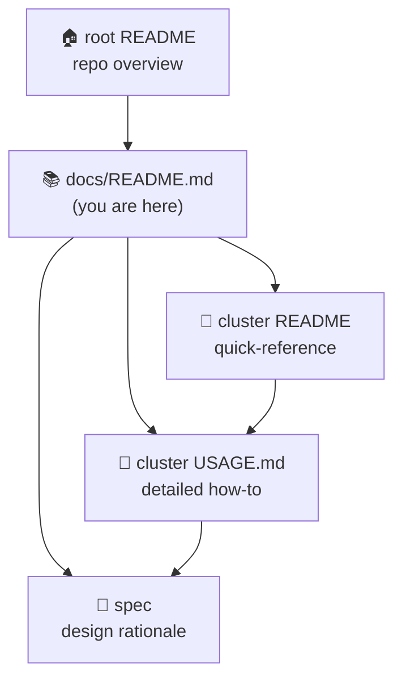

# 📚 multipass-lab documentation hub

The entry point for everything written about this repo. Start here, grab a quickstart, then
click through to the **detailed in-folder guide** for whichever lab you're running.

> New to the repo? Read the [root `README.md`](../README.md) first for the big picture, then
> come back here to drill into a specific lab.



---

## Documentation map

| Doc | What's here |
|-----|-------------|
| 🏠 [root `README.md`](../README.md) | Repo overview, labs table, shared conventions, toolchain. |
| 📚 [`docs/README.md`](README.md) | **This hub** — quickstart + links into the detailed lab docs. |
| 📖 [`clusters/centralized_logging/README.md`](../clusters/centralized_logging/README.md) | The lab's **quick-reference** card (topology table + 5-line quickstart). |
| 📘 [`clusters/centralized_logging/USAGE.md`](../clusters/centralized_logging/USAGE.md) | The lab's **detailed how-to-use guide** — config reference, diagrams, troubleshooting. |
| 🧭 [`clusters/centralized_logging/TUTORIAL.md`](../clusters/centralized_logging/TUTORIAL.md) | Hands-on **"stand up & verify the metrics layer"** walkthrough. |
| 📚 [`clusters/centralized_logging/docs/`](../clusters/centralized_logging/docs/) | Deep reference suite — architecture, endpoints, feature flags, dependencies, operations. |
| 📐 [`specs/centralized_logging.md`](../specs/centralized_logging.md) | Full **design rationale** for the centralized-logging lab. |
| 📊 [`specs/centralized_logging_metrics.md`](../specs/centralized_logging_metrics.md) | Design for the lab's **Prometheus exporter layer** (endpoints, flags, future scrape). |
| 📖 [`clusters/centralized_monitoring/README.md`](../clusters/centralized_monitoring/README.md) | The lab's **quick-reference** card (topology table + quickstart). |
| 📘 [`clusters/centralized_monitoring/USAGE.md`](../clusters/centralized_monitoring/USAGE.md) | The lab's **detailed how-to-use guide**. |
| 📚 [`clusters/centralized_monitoring/docs/`](../clusters/centralized_monitoring/docs/) | Deep reference suite — architecture, endpoints, feature flags, dependencies, operations. |
| 📐 [`specs/centralized_monitoring.md`](../specs/centralized_monitoring.md) | Full **design rationale** for the centralized-monitoring lab. |
| 🧪 [`specs/e2e-centralized-monitoring.md`](../specs/e2e-centralized-monitoring.md) | End-to-end monitoring design. |
| 🤖 [`CLAUDE.md`](../CLAUDE.md) | Repo conventions and `.claude/` automation guidance. |
| ⚙️ [`Justfile`](../Justfile) | Every orchestration recipe (`init`/`plan`/`up`/`down`/`check`/`verify`/`status`/`ssh`/`logs`). |
| ✅ [`.github/workflows/ci.yml`](../.github/workflows/ci.yml) | Hermetic CI — auto-discovers every `clusters/<name>/` folder. |

---

## Quickstart

All recipes take the **cluster folder name** as their only argument. Run from the repo root.

```sh
just check  centralized_logging   # hermetic: tofu fmt + validate + test (no VMs)
just up     centralized_logging   # tofu apply -> launches all VMs in one apply
just verify centralized_logging   # live: pytest + testinfra over SSH against running VMs
just logs   centralized_logging   # list collected log files on the central VM
just down   centralized_logging   # tofu destroy

just status                       # multipass list
just ssh    centralized_logging central   # shell onto the <name>-<role> VM
```

👉 **For full details** — prerequisites, configuration reference, the lifecycle, log-shipping
internals, and troubleshooting — see
📘 [`clusters/centralized_logging/USAGE.md`](../clusters/centralized_logging/USAGE.md).

---

## Labs

### centralized_logging

Three [Multipass](https://multipass.run/) VMs demonstrating syslog-ng log shipping into one
collector, with runtime DHCP-IP injection between peers. The lab also ships a flag-gated
**Prometheus exporter layer** (node/syslog-ng/systemd/process + cAdvisor/kube metrics) exposed for a
future `centralized_monitoring` scrape.

| VM | Role | Sizing |
|----|------|--------|
| `centralized-logging-central` | syslog-ng **server** → `/var/log/remote/<host>/<prog>.log` | 2 vCPU / 2G / 40G |
| `centralized-logging-k0s` | syslog-ng client + single-node k0s | 2 vCPU / 2G / 20G |
| `centralized-logging-docker` | syslog-ng client + Docker stack | 2 vCPU / 4G / 25G |

**Docs:** 📚 [docs/](../clusters/centralized_logging/docs/) ·
📘 [USAGE](../clusters/centralized_logging/USAGE.md) ·
📖 [README](../clusters/centralized_logging/README.md) ·
📐 [spec](../specs/centralized_logging.md)

### centralized_monitoring

Two [Multipass](https://multipass.run/) VMs demonstrating a **pull-based** Prometheus / Grafana /
OpenObserve observability stack, with feature-flagged, tiered (MVP/Reach/Nice-to-have) exporters.
The runtime-IP injection edge is inverted vs. `centralized_logging`: the k0s client is created
**first** so its DHCP IP can be baked into the server's `prometheus.yml` scrape config.

| VM | Role | Sizing |
|----|------|--------|
| `centralized-monitoring-server` | Prometheus/Grafana/OpenObserve/Alertmanager hub | 4 vCPU / 8G / 40G |
| `centralized-monitoring-k0s` | single-node k0s + exporter bundle | 2 vCPU / 4G / 30G |

**Docs:** 📚 [docs/](../clusters/centralized_monitoring/docs/) ·
📘 [USAGE](../clusters/centralized_monitoring/USAGE.md) ·
📖 [README](../clusters/centralized_monitoring/README.md) ·
📐 [spec](../specs/centralized_monitoring.md)

> _New labs land as new `clusters/<name>/` folders, each with its own `README.md` + `USAGE.md`.
> Add a section here and a row to the [root README labs table](../README.md#labs) when you
> introduce one._
