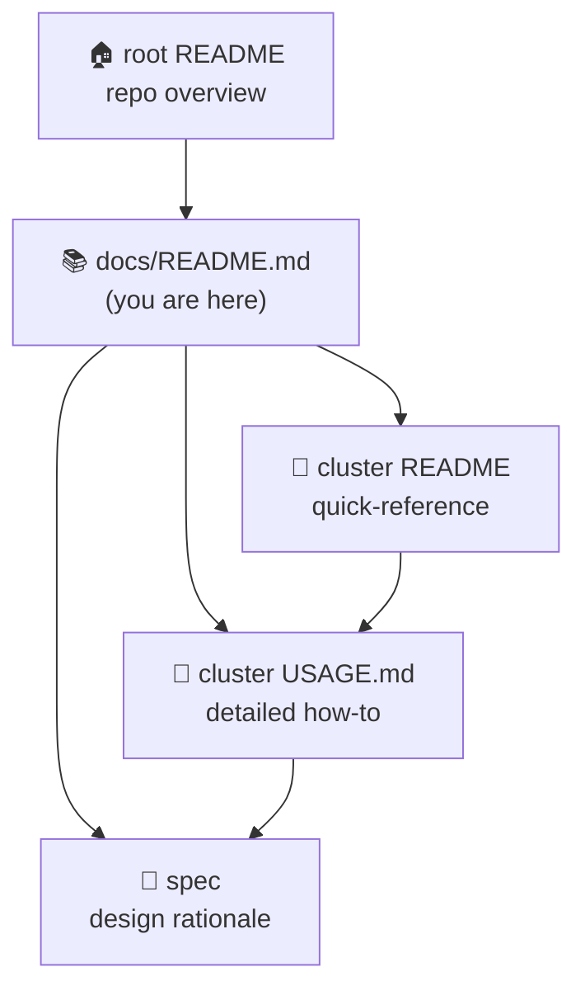

# 📚 multipass-lab documentation hub

The entry point for everything written about this repo. Start here, grab a quickstart, then
click through to the **detailed in-folder guide** for whichever lab you're running.

> New to the repo? Read the [root `README.md`](../README.md) first for the big picture, then
> come back here to drill into a specific lab.



---

## Documentation map

| Doc | What's here |
|-----|-------------|
| 🏠 [root `README.md`](../README.md) | Repo overview, labs table, shared conventions, toolchain. |
| 📚 [`docs/README.md`](README.md) | **This hub** — quickstart + links into the detailed lab docs. |
| 🧭 [`docs/TUTORIAL.md`](TUTORIAL.md) | **Cross-cluster getting-started** — bring up either cluster and interact with every service, with host/docker/k0s mermaid diagrams. Start here for hands-on. |
| 📖 [`clusters/centralized_logging/README.md`](../clusters/centralized_logging/README.md) | The lab's **quick-reference** card (topology table + 5-line quickstart). |
| 📘 [`clusters/centralized_logging/USAGE.md`](../clusters/centralized_logging/USAGE.md) | The lab's **detailed how-to-use guide** — config reference, diagrams, troubleshooting. |
| 🧭 [`clusters/centralized_logging/TUTORIAL.md`](../clusters/centralized_logging/TUTORIAL.md) | Hands-on **"stand up & verify the metrics layer"** walkthrough. |
| 📚 [`clusters/centralized_logging/docs/`](../clusters/centralized_logging/docs/) | Deep reference suite — architecture, endpoints, feature flags, dependencies, operations. |
| 📐 [`specs/centralized_logging.md`](../specs/centralized_logging.md) | Full **design rationale** for the centralized-logging lab. |
| 📊 [`specs/centralized_logging_metrics.md`](../specs/centralized_logging_metrics.md) | Design for the lab's **Prometheus exporter layer** (endpoints, flags, future scrape). |
| 📖 [`clusters/centralized_monitoring/README.md`](../clusters/centralized_monitoring/README.md) | The lab's **quick-reference** card (topology table + quickstart). |
| 📘 [`clusters/centralized_monitoring/USAGE.md`](../clusters/centralized_monitoring/USAGE.md) | The lab's **detailed how-to-use guide**. |
| 📚 [`clusters/centralized_monitoring/docs/`](../clusters/centralized_monitoring/docs/) | Deep reference suite — architecture, endpoints, feature flags, dependencies, operations. |
| 📐 [`specs/centralized_monitoring.md`](../specs/centralized_monitoring.md) | Full **design rationale** for the centralized-monitoring lab. |
| 🧪 [`specs/e2e-centralized-monitoring.md`](../specs/e2e-centralized-monitoring.md) | End-to-end monitoring design. |
| 📥 [`specs/openobserve.md`](../specs/openobserve.md) | Design for **OpenObserve ingestion** (Prometheus `remote_write` + OTel filelog + k0s log shipping). |
| 🐝 [`specs/locustio.md`](../specs/locustio.md) | Design for the **host-run Locust load generators** (`just locust*`). |
| ⚙️ [`clusters/centralized_k0s/docs/feature-flags.md`](../clusters/centralized_k0s/docs/feature-flags.md) | k0s cluster **feature-flag reference** (HA, Cilium, log shipping, Netdata). |
| 📐 [`specs/centralized_k0s.md`](../specs/centralized_k0s.md) | Full **design rationale** for the multi-node k0sctl-formed k0s lab (default + HA topologies). |
| 📐 [`specs/centralized_k0s/build-plans/`](../specs/centralized_k0s/build-plans/) | k0s **build-plan shards** — core, k0sctl, node, vector-tests. |
| 📖 [`clusters/centralized_pki/README.md`](../clusters/centralized_pki/README.md) | The lab's **quick-reference** card for the internal CA + fleet-edge Traefik. |
| 📘 [`clusters/centralized_pki/USAGE.md`](../clusters/centralized_pki/USAGE.md) | The lab's **detailed how-to-use guide**. |
| 🔑 [`clusters/centralized_pki/DEFAULT_PASSWORDS.md`](../clusters/centralized_pki/DEFAULT_PASSWORDS.md) | Dev-default secrets (step-ca, Authelia, Vaultwarden) — all overridable via `TF_VAR_*`. |
| 📐 [`specs/centralized_pki.md`](../specs/centralized_pki.md) | Full **design rationale** for the internal CA + Traefik/Authelia/Vaultwarden lab. |
| 📐 [`specs/pki-and-dns.md`](../specs/pki-and-dns.md) | Combined design for **internal-CA trust, Phase-2 TLS, and DNS auto-registration** across clusters. |
| 📐 [`specs/dynamic-traefik.md`](../specs/dynamic-traefik.md) | Design for the **fleet-edge Traefik** reverse proxy hosted by `centralized_pki`. |
| 📖 [`clusters/centralized_unifi/README.md`](../clusters/centralized_unifi/README.md) | The lab's **quick-reference** card for the UniFi USG→Controller syslog simulation. |
| 📐 [`specs/centralized_unifi.md`](../specs/centralized_unifi.md) | Full **design rationale** for the version-exact UniFi log-plane simulation. |
| 📐 [`specs/centralized_netbox.md`](../specs/centralized_netbox.md) | Full **design rationale** for the NetBox DCIM/IPAM lab (self-registration, sizing, testing). |
| 📐 [`specs/cli-netbox.md`](../specs/cli-netbox.md) | Design for the **`netbox_cli.py` verification CLI**. |
| 📐 [`specs/netbox-data.md`](../specs/netbox-data.md) | Design for NetBox's **seeded base data model** (org hierarchy, DCIM, IPAM, tenancy). |
| 📐 [`specs/netbox-discovery.md`](../specs/netbox-discovery.md) | Design for the **opt-in Diode/orb-agent discovery** agent. |
| 📖 [`clusters/centralized_dns/README.md`](../clusters/centralized_dns/README.md) | The lab's **quick-reference** card for the AdGuard Home + Unbound DNS hub. |
| 📘 [`clusters/centralized_dns/USAGE.md`](../clusters/centralized_dns/USAGE.md) | The lab's **detailed how-to-use guide**. |
| 🔑 [`clusters/centralized_dns/DEFAULT_PASSWORDS.md`](../clusters/centralized_dns/DEFAULT_PASSWORDS.md) | Dev-default AdGuard admin credentials. |
| 📐 [`specs/centralized_dns.md`](../specs/centralized_dns.md) | Full **design rationale** for the AdGuard Home + Unbound DNS lab. |
| 📐 [`specs/cross-cluster.md`](../specs/cross-cluster.md) | Cross-cluster **hub-ordering design** (logs, metrics, DNS, CA in `up-connected`). |
| 📅 [`specs/dns-dashboards.md`](../specs/dns-dashboards.md) | Planned design for AdGuard/Unbound **Grafana dashboards** — not yet built. |
| 🎞️ [`docs/slides/`](slides/) | **"Shipping Infrastructure With a Team of Agents"** — a 26-slide deck on how this repo was built with cmux + multi-agent fleets. Zero-dependency single file: `open docs/slides/index.html`. |
| 🤖 [`CLAUDE.md`](../CLAUDE.md) | Repo conventions and `.claude/` automation guidance. |
| ⚙️ [`Justfile`](../Justfile) | Every orchestration recipe (`init`/`plan`/`up`/`down`/`check`/`verify`/`status`/`ssh`/`logs`). |
| ✅ [`.github/workflows/ci.yml`](../.github/workflows/ci.yml) | Hermetic CI — auto-discovers every `clusters/<name>/` folder. |

---

## Quickstart

All recipes take the **cluster folder name** as their only argument. Run from the repo root.

```sh
just check  centralized_logging   # hermetic: tofu fmt + validate + test (no VMs)
just up     centralized_logging   # tofu apply -> launches all VMs in one apply
just verify centralized_logging   # live: pytest + testinfra over SSH against running VMs
just logs   centralized_logging   # list collected log files on the central VM
just destroy centralized_logging  # tofu destroy (one cluster, gone)

just status                       # multipass list
just down                         # graceful `multipass stop --all` (all VMs, preserved)
just ssh    centralized_logging central   # shell onto the <name>-<role> VM
```

👉 **For full details** — prerequisites, configuration reference, the lifecycle, log-shipping
internals, and troubleshooting — see
📘 [`clusters/centralized_logging/USAGE.md`](../clusters/centralized_logging/USAGE.md).

---

## Labs

### centralized_logging

Three [Multipass](https://multipass.run/) VMs demonstrating syslog-ng log shipping into one
collector, with runtime DHCP-IP injection between peers. The lab also ships a flag-gated
**Prometheus exporter layer** (node/syslog-ng/systemd/process + cAdvisor/kube metrics) exposed for a
future `centralized_monitoring` scrape.

| VM | Role | Sizing |
|----|------|--------|
| `centralized-logging-central` | syslog-ng **server** → `/var/log/remote/<host>/<prog>.log` | 2 vCPU / 2G / 40G |
| `centralized-logging-k0s` | syslog-ng client + single-node k0s | 2 vCPU / 2G / 20G |
| `centralized-logging-docker` | syslog-ng client + Docker stack | 2 vCPU / 4G / 25G |

**Docs:** 📚 [docs/](../clusters/centralized_logging/docs/) ·
📘 [USAGE](../clusters/centralized_logging/USAGE.md) ·
📖 [README](../clusters/centralized_logging/README.md) ·
📐 [spec](../specs/centralized_logging.md)

### centralized_monitoring

Two [Multipass](https://multipass.run/) VMs demonstrating a **pull-based** Prometheus / Grafana /
OpenObserve observability stack, with feature-flagged, tiered (MVP/Reach/Nice-to-have) exporters.
The runtime-IP injection edge is inverted vs. `centralized_logging`: the k0s client is created
**first** so its DHCP IP can be baked into the server's `prometheus.yml` scrape config.

| VM | Role | Sizing |
|----|------|--------|
| `centralized-monitoring-server` | Prometheus/Grafana/OpenObserve/Alertmanager hub | 4 vCPU / 8G / 40G |
| `centralized-monitoring-k0s` | single-node k0s + exporter bundle | 2 vCPU / 4G / 30G |

Prometheus `remote_write` plus a server OTel Collector and a k0s log-shipping agent feed real
metrics + logs into **OpenObserve**; `just locust centralized_monitoring` drives host-run load so the
dashboards fill.

**Docs:** 🧭 [TUTORIAL](TUTORIAL.md) ·
📚 [docs/](../clusters/centralized_monitoring/docs/) ·
📘 [USAGE](../clusters/centralized_monitoring/USAGE.md) ·
📖 [README](../clusters/centralized_monitoring/README.md) ·
📐 [spec](../specs/centralized_monitoring.md) ·
📥 [openobserve](../specs/openobserve.md) ·
🐝 [locustio](../specs/locustio.md)

### centralized_k0s

A `just`-orchestrated, multi-node k0s Kubernetes cluster (k0sctl-formed, etcd-backed) that levels
up the single-node k0s embedded in `centralized_monitoring`/`centralized_logging` into its own
tunable-topology lab cluster. Default topology is **no HA** — 1 controller + 2 workers (3 VMs,
single-member etcd); an opt-in HA mode (3 controllers + 3 workers + an HAProxy edge, 7 VMs total,
3-member etcd quorum) is a stand-alone deployment, not part of `just up-connected`. It has no
Grafana/Prometheus UI of its own — it's a compute cluster, not an observability stack.

| VM | Role | Sizing |
|----|------|--------|
| `centralized-k0s-controller` | etcd + control plane + kubelet/cAdvisor via `--enable-worker` (control-plane taint kept) | 3 vCPU / 3G / 20G |
| `centralized-k0s-worker-1` / `-2` | schedulable workload nodes | 2 vCPU / 4G / 30G |
| `centralized-k0s-haproxy` (HA opt-in only) | L4 passthrough edge for 6443/8132/9443 + `:8405` exporter | 1 vCPU / 1G / 10G |

**Docs:** ⚙️ [feature-flags](../clusters/centralized_k0s/docs/feature-flags.md) ·
📐 [spec](../specs/centralized_k0s.md) ·
📐 [build-plans](../specs/centralized_k0s/build-plans/) —
(no dedicated README/USAGE yet — see the spec above)

### centralized_pki

The lab's internal CA (step-ca) plus a Traefik instance that fronts Authelia (SSO forward-auth)
and Vaultwarden. Beyond its own two services, this Traefik additively doubles as the **fleet-wide
reverse-proxy edge** for clusters without their own hostname+TLS story (`centralized_netbox`,
`centralized_dns`'s AdGuard UI, `centralized_logging`'s Coroot UI).

| VM | Role | Sizing |
|----|------|--------|
| `centralized-pki-ca` | step-ca root/intermediate CA (`:9000`) | 1 vCPU / 1G / 10G |
| `centralized-pki-services` | Traefik (`:80/:443/:8080`) fronting Authelia + Vaultwarden; fleet-edge reverse proxy | 2 vCPU / 4G / 25G |

**Docs:** 📖 [README](../clusters/centralized_pki/README.md) ·
📘 [USAGE](../clusters/centralized_pki/USAGE.md) ·
🔑 [DEFAULT_PASSWORDS](../clusters/centralized_pki/DEFAULT_PASSWORDS.md) ·
📐 [spec](../specs/centralized_pki.md) ·
📐 [pki-and-dns](../specs/pki-and-dns.md) ·
📐 [dynamic-traefik](../specs/dynamic-traefik.md)

### centralized_unifi

A version-exact simulation of a UniFi homelab's log plane: two VMs reproducing the USG (rsyslog
5.8.11, emulated amd64 — wheezy has no arm64 port) forwarding syslog to the UCK Gen2 Controller
(syslog-ng 3.28.1, native arm64), with a Prometheus exporter on the collector. This is a
**log-pipeline-only** lab — there are no human-facing dashboards (`core` is explicitly empty).

| VM | Role | Sizing |
|----|------|--------|
| `centralized-unifi-usg` | USG / forwarder — rsyslog 5.8.11 in a container, forwards syslog via UDP/514 | 2 vCPU / 2G / 15G |
| `centralized-unifi-controller` | UCK Gen2 / collector — syslog-ng 3.28.1 in a container + `syslog_ng_exporter` (`:9577`) | 2 vCPU / 2G / 20G |

**Docs:** 📖 [README](../clusters/centralized_unifi/README.md) ·
📐 [spec](../specs/centralized_unifi.md) —
(no USAGE.md or docs/ dir yet — see the spec above)

### centralized_netbox

A NetBox DCIM/IPAM server plus a client VM that self-registers into it via the REST API on first
boot. An opt-in Diode/orb-agent discovery agent (`enable_discovery`, off by default) scans the
Multipass subnet and ingests results into NetBox over gRPC. NetBox is deliberately pinned to
**4.1** (not latest) so the API token stays a settable v1 plaintext value.

| VM | Role | Sizing |
|----|------|--------|
| `centralized-netbox-server` | netbox-docker stack (NetBox + worker + housekeeping + postgres + redis) | 2 vCPU / 4G / 20G |
| `centralized-netbox-client` | Minimal test VM — self-registers as a Virtual Machine on first boot | 1 vCPU / 1G / 10G |
| `centralized-netbox-agent` (opt-in, `enable_discovery`) | `orb-agent` subnet discovery → Diode ingestion | 1 vCPU / 1G / 10G |

**Docs:** 📐 [spec](../specs/centralized_netbox.md) ·
📐 [cli-netbox](../specs/cli-netbox.md) ·
📐 [netbox-data](../specs/netbox-data.md) ·
📐 [netbox-discovery](../specs/netbox-discovery.md) —
(no dedicated README/USAGE yet — see the specs above)

### centralized_dns

A single VM running AdGuard Home (`:53`) over a recursive Unbound resolver (`127.0.0.1:5335`),
both host-level under systemd — the network-wide ad-blocking DNS resolver. It's also a
**cross-cluster hub**: it comes up FIRST in `just up-connected` so every other VM can point its
resolver at it from first boot.

| VM | Role | Sizing |
|----|------|--------|
| `centralized-dns-server` | AdGuard Home (`0.0.0.0:53`, UI/API `:3000`) + Unbound (`127.0.0.1:5335`) | 2 vCPU / 2G / 20G |

**Docs:** 📖 [README](../clusters/centralized_dns/README.md) ·
📘 [USAGE](../clusters/centralized_dns/USAGE.md) ·
🔑 [DEFAULT_PASSWORDS](../clusters/centralized_dns/DEFAULT_PASSWORDS.md) ·
📐 [spec](../specs/centralized_dns.md) ·
📐 [cross-cluster](../specs/cross-cluster.md) ·
📐 [pki-and-dns](../specs/pki-and-dns.md) ·
📅 [dns-dashboards (planned)](../specs/dns-dashboards.md)

> _New labs land as new `clusters/<name>/` folders, each with its own `README.md` + `USAGE.md`
> where applicable. Add a section here and a row to the
> [root README labs table](../README.md#labs) when you introduce one._
