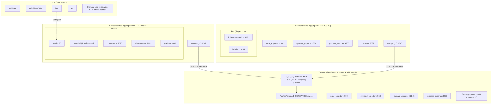
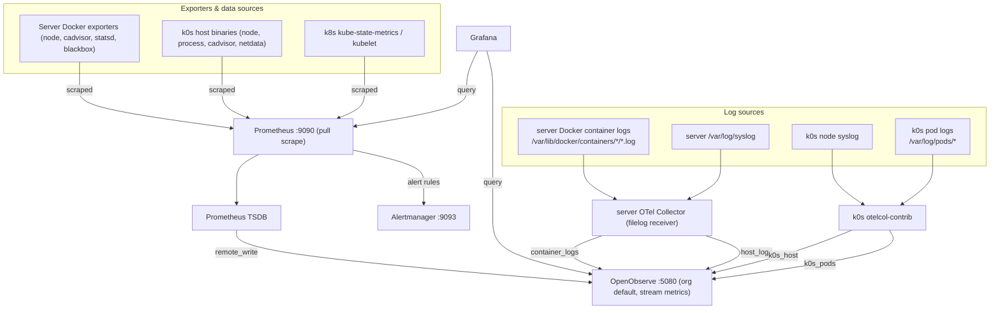
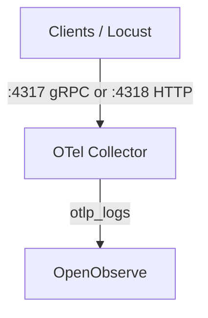
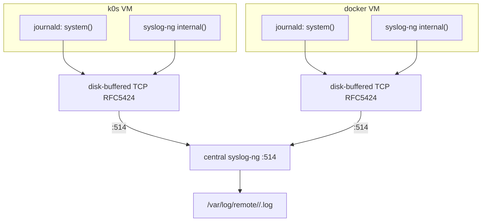

# 📘 Tutorial: Getting Started with multipass-lab

A hands-on, cross-cluster walkthrough for this repo: bring up **both** lab clusters
(`centralized_monitoring` and `centralized_logging`), verify them from the host, watch data
actually flow through Prometheus/OpenObserve/Grafana, and drive live traffic into the
dashboards with Locust. You already have the cluster code checked out — this tutorial is
about *running* it end to end, not building it from scratch.

## What you'll learn

By the end of this tutorial you will be able to:

- Explain what runs on your laptop vs. inside each VM vs. inside Docker/k0s for both clusters.
- Bring a cluster up hermetically-checked, live, and verified, in the right order.
- Trace how a metric and a log line actually travel from an exporter to a Grafana panel.
- Talk to Grafana, Prometheus, and OpenObserve from the host using the bundled CLIs.
- Generate synthetic load with Locust and watch it show up in dashboards in real time.
- Find your way around the logging cluster's syslog-ng pipeline and pull collected logs.

## What you'll build / verify

- A running `centralized_monitoring` cluster: one Docker-based "server" VM (Prometheus,
  Alertmanager, Grafana, OpenObserve, OTel Collector, and a pile of exporters) plus a
  single-node k0s VM being scraped by that Prometheus.
- A running `centralized_logging` cluster: a syslog-ng server VM, a Docker dashboard VM, and a
  k0s VM, all shipping logs to one place over TCP/RFC5424.
- Proof — via `just verify`, `just verify-api`, and a Locust load run — that metrics and logs
  are genuinely flowing, not just that services started.

## Prerequisites

- `multipass`, `tofu` (OpenTofu ≥ 1.7), `just`, and `uv` installed on the host (macOS).
- An SSH keypair at `~/.ssh/id_ed25519[.pub]` — cloud-init injects the public half into every VM.
- This repo checked out, with `/Users/malcolm/dev/bossjones/multipass-lab` as your working
  directory for every command below.
- Enough laptop headroom for two clusters worth of VMs at once (monitoring: 4 vCPU/8G +
  2 vCPU/4G; logging: 2 vCPU/2G + 2 vCPU/4G + 2 vCPU/2G) — or bring them up one at a time and
  `just destroy` the first before starting the second if resources are tight.

## Time estimate

45-60 minutes for both clusters, most of it waiting on `just up` (VM boot + cloud-init) rather
than typing. Budget ~20 minutes per cluster if you only do one.

---

## The big picture: what runs where

`centralized_monitoring` is the larger of the two clusters: two VMs, one running a Docker
Compose stack of observability tooling, the other a single-node k0s cluster acting as a scrape
target. Everything below the host boundary is either a Docker container or a k0s-managed /
systemd-managed process.

```mermaid
flowchart TB
    subgraph HOST["Host (your laptop)"]
        multipass["multipass"]
        tofu["tofu (OpenTofu)"]
        just["just"]
        uv["uv"]
        grafana_cli["grafana_cli.py"]
        prometheus_cli["prometheus_cli.py"]
        openobserve_cli["openobserve_cli.py"]
        locust_cli["locust_cli.py"]
    end

    subgraph SERVER["VM: centralized-monitoring-server (4 vCPU / 8G)"]
        subgraph DOCKER["Docker"]
            prometheus["prometheus :9090"]
            alertmanager["alertmanager :9093"]
            grafana["grafana :3000"]
            openobserve["openobserve :5080"]
            otelcol["otel-collector :4317/:4318/:8888"]
            node_exp_srv["node_exporter :9100"]
            cadvisor_srv["cadvisor :8080"]
            statsd_exp["statsd_exporter :9102 + :8125/udp"]
            blackbox["blackbox_exporter :9115"]
            heimdall["heimdall :80"]
            uptimekuma["uptime-kuma :3001"]
        end
    end

    subgraph K0S["VM: centralized-monitoring-k0s (2 vCPU / 4G)"]
        subgraph K0SNS["k0s / Kubernetes (single-node: controller+worker)"]
            ksm["kube-state-metrics :8081 (hostNetwork)"]
            kubelet["kubelet read-only :10255"]
        end
        node_exp_k0s["node_exporter :9100 (systemd)"]
        process_exp["process-exporter :9256 (systemd)"]
        cadvisor_k0s["cadvisor binary :8089 (systemd)"]
        netdata["netdata :19999 (systemd)"]
        otelcol_contrib["otelcol-contrib (log shipper, systemd)"]
    end

    grafana_cli --> grafana
    prometheus_cli --> prometheus
    openobserve_cli --> openobserve
    locust_cli --> openobserve
    locust_cli --> otelcol
    locust_cli --> statsd_exp
    locust_cli --> prometheus
    locust_cli --> grafana

    prometheus -- pulls --> ksm
    prometheus -- pulls --> kubelet
    prometheus -- pulls --> node_exp_k0s
    prometheus -- pulls --> process_exp
    prometheus -- pulls --> cadvisor_k0s
    otelcol_contrib -- pushes logs --> openobserve
```



`centralized_logging` is smaller and has no host-side verification CLIs — you interact with it
via `just ssh`, `just logs`, and its Docker-hosted dashboards.



**Host vs. VM vs. Docker vs. k0s, in one sentence each:** the *host* only ever runs
orchestration tooling (`multipass`/`tofu`/`just`/`uv`) and Python CLIs that talk over HTTP to
the VMs; each *VM* is a full Ubuntu box provisioned by cloud-init; *Docker* containers on the
server/docker VMs are the human-facing dashboards and ingest pipelines; *k0s* is a
single-node Kubernetes cluster (controller and worker collapsed into one VM) used purely as a
realistic scrape/log-source target, not as a deployment platform for the observability stack
itself.

---

## Prerequisites checklist

Before you start, confirm the toolchain is on your `$PATH`:

```sh
multipass version
tofu version
just --version
uv --version
```

✅ **Checkpoint:** all four commands print a version with no error.

---

## 1. Check the monitoring cluster hermetically

No VMs are touched here — just `tofu fmt`, `tofu validate`, and a mocked-provider `tofu test`:

```sh
just check centralized_monitoring
```

Expected: `fmt` reports no changes needed, `validate` succeeds, and the `tofu test` run shows
all test files passing.

✅ **Checkpoint:** `just check centralized_monitoring` exits 0.

## 2. Bring the monitoring cluster up

```sh
just up centralized_monitoring
```

This runs `tofu apply` and blocks until cloud-init has finished on **both** VMs (Docker images,
k0s, and every exporter binary have to be pulled/installed), so when it returns the cluster is
genuinely ready — not just booted.

```sh
just status
```

Expected output (abridged):

```
Name                             State    IPv4
centralized-monitoring-server    Running  192.168.64.x
centralized-monitoring-k0s       Running  192.168.64.y
```

✅ **Checkpoint:** both VMs show `Running` with an IPv4 address.

> ⏳ This is the slow step — give it the full timeout budget on a slow network connection.

## 3. Verify it live over SSH

```sh
just verify centralized_monitoring
```

This runs `pytest` + `testinfra` over SSH against both VMs, asserting the exporters, Docker
containers, and k0s workloads described in the diagram above are actually up.

✅ **Checkpoint:** `just verify centralized_monitoring` passes.

## 4. Verify it via the HTTP APIs

```sh
just verify-api centralized_monitoring
```

This hits Grafana, Prometheus, and OpenObserve's HTTP APIs directly from the host (health,
datasources, scrape targets, streams) and — for OpenObserve — also asserts `check
--require-metrics --require-logs`, meaning ingestion is confirmed to be *live*, not just that
the service answers.

✅ **Checkpoint:** all three service checks pass. If OpenObserve's ingestion checks fail
immediately after `just up`, give it a couple of minutes — Prometheus's first `remote_write`
batch and the OTel Collector's first log flush both take a little time to land.

## 5. Open the dashboards

```sh
just open centralized_monitoring
```

Opens the core human dashboards (Grafana, Prometheus, etc.) in Chrome. To also open every
enabled `/metrics` endpoint for manual poking:

```sh
just open centralized_monitoring --full
```

✅ **Checkpoint:** Grafana loads in the browser at its `:3000` URL.

> **Cloud-init gotcha:** if you edit any `.tftpl` cloud-init template, `just up` will **not**
> pick up the change — OpenTofu doesn't recreate a `multipass_instance` just because its
> rendered cloud-init changed. Use `just recreate centralized_monitoring` (destroy → up)
> instead, or `just verify` will confusingly run hermetic-pass/live-fail against **stale**
> cloud-init.

---

## How data flows

### Metrics and logs, end to end



### OTLP push path



**Read it top to bottom:** every exporter is *pulled* by Prometheus, whose TSDB then
*pushes* forward into OpenObserve via `remote_write` — so OpenObserve ends up holding both a
metrics copy (via Prometheus) and the raw logs (via the two OTel Collector paths). Grafana
never touches the exporters directly; it always queries Prometheus or OpenObserve. Alerting is
Prometheus-rule-driven and lands in Alertmanager, independent of the log/metrics-to-OpenObserve
path.

---

## Interacting with the services

### Credentials

| Service | URL | Username | Password |
|---|---|---|---|
| Grafana | `http://<server-or-docker-ip>:3000` | `admin` | `admin` |
| OpenObserve | `http://<server-ip>:5080` (org `default`) | `admin@example.com` | `Complexpass#123` |
| Prometheus | `http://<server-ip>:9090` | — | no login |
| Alertmanager | `http://<server-ip>:9093` | — | no login |
| Uptime Kuma | `http://<server-ip>:3001` | — | no login |
| Heimdall | `http://<server-ip>:80` | — | no login |

Full details (including known caveats like the OTel→OpenObserve auth mismatch) live in
[`../DEFAULT_PASSWORDS.md`](../DEFAULT_PASSWORDS.md).

### Host CLIs

Once the cluster is up, drive it from the host without opening a browser:

```sh
just grafana-check centralized_monitoring
just grafana-datasources centralized_monitoring
just grafana-dashboards centralized_monitoring

just prometheus-check centralized_monitoring
just prometheus-query centralized_monitoring 'up'
just prometheus-targets centralized_monitoring

just openobserve-check centralized_monitoring
just openobserve-streams centralized_monitoring
just openobserve-search centralized_monitoring 'SELECT * FROM default'
```

✅ **Checkpoint:** `just prometheus-query centralized_monitoring 'up'` returns a table of
targets, each with value `1`.

---

## Generating load with Locust

Freshly booted, most of these dashboards are nearly empty — exporters self-scrape but nothing
is *doing* anything interesting yet. **Locust** (run from the host, no in-cluster deployment)
fixes that by firing synthetic traffic at the cluster's ingest and query surfaces so the panels
visibly fill in while you watch.

First, see what it will actually hit, without generating any load:

```sh
just locust-targets centralized_monitoring
```

Expected: a printed list of resolved endpoints — OpenObserve
`:5080/api/default/loadtest/_json`, OTLP `:4318/v1/logs`, StatsD `udp://<ip>:8125`, Prometheus
`:9090/api/v1/query`, and Grafana `:3000/api/health`.

Then launch the interactive web UI:

```sh
just locust centralized_monitoring
```

This opens the Locust web UI at `http://localhost:8089`. Set a number of users and a spawn
rate, hit start, and open `just open centralized_monitoring` in another window to watch
Grafana/Prometheus/OpenObserve panels react in near real time.

For scripted runs instead:

```sh
just locust-headless centralized_monitoring -u 20 -r 5 -t 2m
```

And for a CI-friendly smoke test (short run, nonzero exit on failure):

```sh
just locust-check centralized_monitoring
```

✅ **Checkpoint:** with Locust running, `just openobserve-search centralized_monitoring
'SELECT * FROM loadtest'` (or watching the Grafana dashboards) shows a climbing count of
ingested documents/requests.

The Locust "Users" simulated here drive OpenObserve ingestion (the `loadtest` stream), OTLP log
pushes, StatsD counters (which flow into Prometheus via `statsd_exporter`), and query load
against Prometheus/Grafana. Full design in
[`../specs/locustio.md`](../specs/locustio.md).

---

## The logging cluster

`centralized_logging` is a three-VM syslog-ng pipeline: two clients (the k0s VM and the Docker
dashboard VM) forward everything to one server, which writes it to disk per-host, per-program.

### Log flow



### Bring it up and pull logs

```sh
just check centralized_logging
just up centralized_logging
just verify centralized_logging
```

Open the dashboards (Grafana/Prometheus/Alertmanager/Heimdall, all Docker-hosted on the
`docker` VM):

```sh
just open centralized_logging
```

List the log files that have landed on the central VM:

```sh
just logs centralized_logging
```

Expected: a list of paths like `/var/log/remote/centralized-logging-k0s/syslog-ng.log`, one
per `<host>/<program>` pair currently shipping.

SSH onto any of the three VMs directly:

```sh
just ssh centralized_logging central   # or: docker, k0s
```

✅ **Checkpoint:** `just logs centralized_logging` lists at least one file per client VM, and
timestamps are recent.

For the full metrics/exporter layer on this cluster (per-VM ports, the syslog-ng
textfile-collector trick, the cross-VM `0.0.0.0`-bind proof), see the cluster's own deep-dive:
[`../clusters/centralized_logging/TUTORIAL.md`](../clusters/centralized_logging/TUTORIAL.md).

---

## Troubleshooting

| Symptom | Likely cause | What to do |
|---|---|---|
| `just up` seems to hang | cloud-init still installing packages/pulling images | `just up` already waits on `cloud-init status --wait` per VM; give it the full timeout on a slow network |
| `just verify` fails right after `just up` | a service takes a moment to become ready after cloud-init reports done | re-run `just verify <cluster>` after a minute; also check `just status` for a non-`Running` VM |
| `just verify-api centralized_monitoring` fails only on OpenObserve's ingestion checks | Prometheus `remote_write` / OTel Collector's first flush hasn't landed yet | wait 1-2 minutes and re-run; if it persists, `just ssh centralized_monitoring server` and check the OTel Collector / Prometheus logs |
| Edited a `.tftpl` cloud-init template but nothing changed on the VM | `just up` doesn't recreate a VM just because rendered cloud-init changed | run `just recreate <cluster>` (destroy → up), not `just up` |
| `just up` fails partway and the next `just up` errors "instance already exists" | a failed launch left an orphaned VM that OpenTofu never recorded in state | `just prune <cluster>` deletes untracked VMs (safe — never touches a managed one); `just destroy`/`just recreate` already run it automatically |
| `just open <cluster>` errors "no URLs" | the cluster isn't up, or `tofu output web_urls` isn't available | run `just up <cluster>` first |
| `multipass exec` / `multipass shell` fails with "No route to host" | a Multipass daemon networking quirk on this host | use `just ssh <cluster> <role>` (SSHes directly with the injected key), which sidesteps `multipass exec` entirely |
| Locust runs but nothing shows up in dashboards | targeting the wrong cluster, or the run finished before you looked | double-check `just locust-targets centralized_monitoring` resolved real IPs; re-run `just locust-check centralized_monitoring` for a quick nonzero-exit sanity check |

---

## What's next

- Read the full design docs: [`../specs/centralized_monitoring.md`](../specs/centralized_monitoring.md),
  [`../specs/centralized_logging.md`](../specs/centralized_logging.md),
  [`../specs/locustio.md`](../specs/locustio.md), [`../specs/openobserve.md`](../specs/openobserve.md).
- Dig into per-cluster usage references: [`../clusters/centralized_monitoring/USAGE.md`](../clusters/centralized_monitoring/USAGE.md),
  [`../clusters/centralized_logging/USAGE.md`](../clusters/centralized_logging/USAGE.md).
- Walk the logging cluster's exporter-by-exporter deep dive:
  [`../clusters/centralized_logging/TUTORIAL.md`](../clusters/centralized_logging/TUTORIAL.md).
- Explore the monitoring cluster's architecture in more depth:
  [`../clusters/centralized_monitoring/docs/architecture.md`](../clusters/centralized_monitoring/docs/architecture.md).
- Review all default credentials and known auth caveats:
  [`../DEFAULT_PASSWORDS.md`](../DEFAULT_PASSWORDS.md).
- Start from the top-level repo overview: [`../README.md`](../README.md).
- When you're done experimenting, `just down` stops every VM gracefully (preserved for next
  time), or `just destroy <cluster>` tears one down completely.
