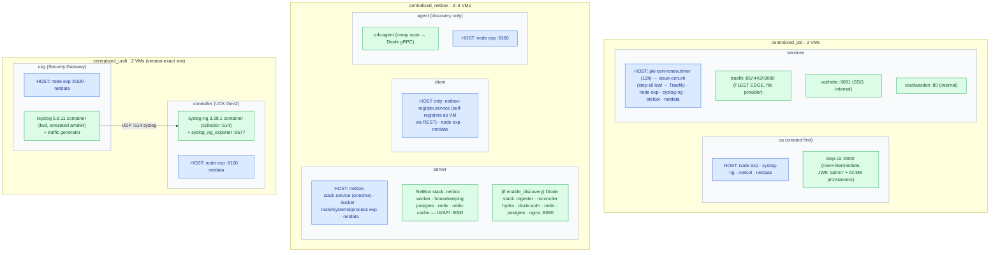
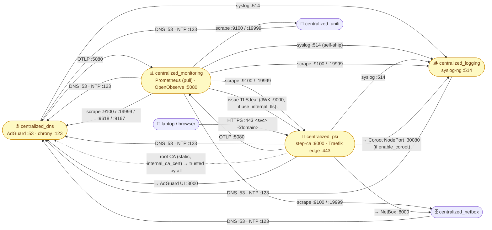
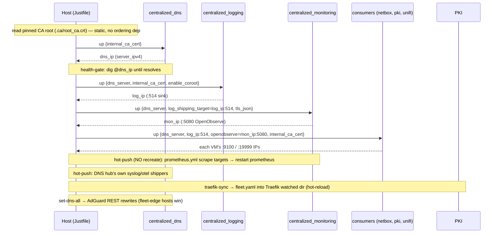

# Fleet Architecture

Runtime map of every cluster in this lab — **what runs on the host, in Docker, and in k0s** — and
**how the clusters talk to each other**. Generated from the OpenTofu roots (`main.tf`), cloud-init
templates (`*.tftpl`), compose files, `scripts/traefik_cli.py`, and the `specs/`.

Subnet: `192.168.252.0/24`. Every collector/exporter binds `0.0.0.0`, so the design is about opt-in
cloud-init wiring + runtime IP discovery, not network reachability.

## Runtime-tier legend

| Tier | Meaning |
|------|---------|
| 🟦 **host** | Runs directly on the Ubuntu 24.04 VM under systemd |
| 🟩 **docker** | Runs as a Docker Compose container inside the VM |
| 🟧 **k0s** | Runs as a Kubernetes workload (pod / DaemonSet / Helm chart) on the k0s node |

The mermaid diagrams below use the same colors (blue = host, green = docker, orange = k0s).

---

## Cluster summary

| Cluster | VMs | Runs k0s? | Core function | Key ports |
|---------|-----|-----------|---------------|-----------|
| `centralized_dns` | 1 | no | AdGuard Home over Unbound — network DNS + NTP hub | DNS `:53`, UI `:3000`, NTP `:123` |
| `centralized_logging` | 3 | **yes** (Coroot eBPF) | syslog-ng central sink + Grafana/Prom stack + Coroot | syslog `:514`, Grafana `:3000`, Coroot `:30080` |
| `centralized_monitoring` | 2 | yes (scrape target only) | Prometheus + Grafana + OpenObserve observability hub | Prom `:9090`, OpenObserve `:5080`, OTLP `:4318` |
| `centralized_pki` | 2 | no | step-ca internal CA + **fleet-edge Traefik** + SSO/vault | step-ca `:9000`, Traefik `:443` |
| `centralized_netbox` | 2–3 | no | NetBox DCIM/IPAM + self-registration + opt-in discovery | NetBox `:8000`, Diode `:8080` |
| `centralized_unifi` | 2 | no | Version-exact UniFi syslog simulation | syslog `:514`, exporter `:9577` |

**Fleet-wide baseline (every VM):** `node_exporter :9100`, Netdata `:19999` (default ON),
`systemd-timesyncd` → NTP hub, `systemd-resolved` → AdGuard DNS hub, internal-CA root trust.

---

## Diagram 1 — Runtime placement (what runs on host / Docker / k0s)

Split into two boards so each stays legible.

### 1a. Observability plane — `centralized_dns`, `centralized_logging`, `centralized_monitoring`

```mermaid
flowchart TB
  classDef host fill:#dbeafe,stroke:#2563eb,color:#1e3a8a;
  classDef dock fill:#dcfce7,stroke:#16a34a,color:#14532d;
  classDef k0s  fill:#ffedd5,stroke:#ea580c,color:#7c2d12;
  classDef vm   fill:#f8fafc,stroke:#94a3b8,color:#334155;

  subgraph DNS["centralized_dns · 1 VM"]
    subgraph dnsvm["dns-server (.166)"]
      ag["AdGuard Home — DNS :53 · UI/API :3000"]:::host
      ub["Unbound — recursive :5335 (localhost)"]:::host
      ch["chrony — NTP :123 (fleet NTP hub)"]:::host
      dex["exporters: node :9100 · adguard :9618 · unbound :9167<br/>process :9256 · systemd :9558 · netdata :19999"]:::host
    end
  end
  class dnsvm vm

  subgraph LOG["centralized_logging · 3 VMs"]
    subgraph lcen["central (.163)"]
      sng["syslog-ng SERVER :514 → /var/log/remote"]:::host
      lcx["exporters: node :9100 · systemd :9558 · process :9256<br/>filestat :9943 · netdata :19999"]:::host
    end
    subgraph lk0s["k0s (.164) — 4CPU/8G (coroot bump)"]
      lk0host["HOST: k0s controller+worker · syslog-ng client → .163<br/>node/systemd/process exp · cadvisor :8089 · netdata :19999"]:::host
      lksm["kube-state-metrics :8081 (hostNetwork)"]:::k0s
      ling["ingress-nginx :80/:443 (hostNetwork)"]:::k0s
      lstore["OpenEBS StorageClass"]:::k0s
      lcoro["Coroot-ce: server · eBPF node-agent (DaemonSet)<br/>cluster-agent · bundled Prometheus · ClickHouse<br/>UI NodePort :30080"]:::k0s
    end
    subgraph ldoc["docker (.165)"]
      ldh["HOST: syslog-ng client → .163 · node/systemd/process exp · netdata"]:::host
      ltra["traefik :80/:8080"]:::dock
      lhei["heimdall"]:::dock
      lpro["prometheus :9090"]:::dock
      lalt["alertmanager :9093"]:::dock
      lgra["grafana :3000"]:::dock
    end
  end
  class lcen,lk0s,ldoc vm

  subgraph MON["centralized_monitoring · 2 VMs"]
    subgraph mk0s["k0s (scrape target)"]
      mk0host["HOST: k0s single-node · otelcol-contrib agent → OpenObserve<br/>node/systemd/process exp · cadvisor :8089 · filestat · netdata"]:::host
      mksm["kube-state-metrics :8081 (hostNetwork)"]:::k0s
    end
    subgraph msrv["server — 4CPU/8G"]
      msh["HOST: netdata :19999 · syslog-ng client → .163<br/>cert-renew.timer (only if use_internal_tls)"]:::host
      mpro["prometheus :9090"]:::dock
      moo["OpenObserve :5080 (OTLP store)"]:::dock
      motel["otel-collector :4317/:4318"]:::dock
      mgra["grafana :3000"]:::dock
      malt["alertmanager :9093"]:::dock
      mnode["node-exporter :9100 (container!)"]:::dock
      mcad["cadvisor :8080 (container!)"]:::dock
      mtra["traefik :80/:443/:8082"]:::dock
      mextra["blackbox :9115 · statsd :9102+:8125udp<br/>ssh_exporter :9312 · uptime-kuma :3001 · heimdall"]:::dock
    end
  end
  class mk0s,msrv vm
```

### 1b. Platform plane — `centralized_pki`, `centralized_netbox`, `centralized_unifi`

---

## Diagram 2 — How the clusters talk to each other

**Edge legend:** solid `-->` = live network flow; dotted `-.->` = static/offline trust anchor.
`centralized_monitoring` is excluded from the fleet edge (fronts its own `:443` via Phase-2 TLS);
`centralized_unifi` is excluded (no real UI). AdGuard DNS rewrites make `<svc>.<domain>` resolve to
the **PKI edge IP**, not the service's own IP (`traefik_cli.py dns-rewrites` layered by `set-dns-all`).

### Cross-cluster edge list

| Plane | Source → | Protocol/Port | → Dest | Mechanism |
|-------|----------|---------------|--------|-----------|
| DNS | all clusters | UDP/TCP `:53` | `centralized_dns` (AdGuard) | `use-dns.conf` resolved drop-in |
| NTP | all clusters | UDP `:123` | `centralized_dns` (chrony) | timesyncd drop-in |
| Logs | dns, monitoring, pki | TCP `:514` | `centralized_logging` (syslog-ng) | `syslog-client.conf` shipper |
| Logs/traces | dns, pki | HTTP `:5080` OTLP | `centralized_monitoring` (OpenObserve) | otelcol-contrib agent |
| Metrics | `centralized_monitoring` | HTTP `:9100`/`:19999`/`:9618`/`:9167` (PULL) | every VM | Prometheus scrape (hot-pushed targets) |
| CA trust | `centralized_pki` root | static PEM (offline) | all clusters | `internal_ca_cert` → `update-ca-certificates` |
| TLS issue | monitoring, pki | HTTPS `:9000` JWK | `centralized_pki` step-ca | `issue-cert.sh` leaf (12h renew) |
| Reverse proxy | browser | HTTPS `:443` `Host` | `centralized_pki` Traefik → netbox/adguard/coroot | `fleet.yaml` hot-push |

---

## Diagram 3 — `just up-connected` boot order & runtime IP injection

The clusters can't see each other's OpenTofu state, so hubs come up first and their DHCP IPs are
read from `tofu output` and injected into the next cluster's cloud-init.

**Baked into first-boot cloud-init:** `dns_server`, `log_shipping_target`, `openobserve_endpoint`,
`internal_ca_cert`, `use_internal_tls` leaf. **Hot-pushed after boot (no VM recreate):** Prometheus
scrape targets, DNS-hub's own shippers, Traefik `fleet.yaml`, AdGuard DNS rewrites.

---

## Notes & gotchas the diagrams encode

- **Only `centralized_logging` runs Kubernetes workloads locally** (Coroot eBPF stack + ingress-nginx
  + kube-state-metrics on k0s). `centralized_monitoring` also has a k0s VM, but it's purely a
  **scrape target** (kube-state-metrics + otelcol agent) — no app workloads. Every other cluster is
  host systemd + Docker Compose only.
- **Same exporter, different tier:** on the monitoring **server**, `node-exporter` and `cadvisor` run
  as **Docker containers**; on every **k0s** VM the same tools run as **host systemd binaries**
  (cadvisor on `:8089` to dodge kube-router's `:8080`).
- **UniFi is a version-exact simulation:** the appliance daemons (syslog-ng 3.28.1 / rsyslog 5.8.11)
  run as **period-Debian containers** inside Ubuntu VMs, not host packages. The `usg` container is
  emulated amd64 (slow first boot).
- **4 hubs:** DNS (resolver + NTP, up FIRST), logging (`:514` sink), monitoring (scrape + OTLP store),
  PKI (CA + fleet reverse-proxy edge). Netdata `:19999` is fleet-wide (default ON).
- **Opt-in flags that change the picture:** `enable_coroot`/`enable_ingress` (logging k0s workloads),
  `use_internal_tls` (monitoring `:443` TLS), `enable_discovery` (netbox agent VM + Diode stack),
  `version_mode` (unifi exact-vs-modern). Empty cross-cluster vars keep a plain `just up <cluster>`
  turnkey and isolated.

## Sources

Regenerate/verify against: each `clusters/<name>/main.tf` + `cloud-init/**/*.tftpl` + `outputs.tf`;
`clusters/_shared/cloud-init/`; `clusters/centralized_pki/scripts/traefik_cli.py`; the root `Justfile`
(`up-connected`, `refresh-cross-cluster`, `set-dns-all`, `traefik-sync`); and `specs/cross-cluster.md`,
`specs/pki-and-dns.md`, `specs/dynamic-traefik.md`, `specs/centralized_dns.md`, `specs/coroot.md`.
