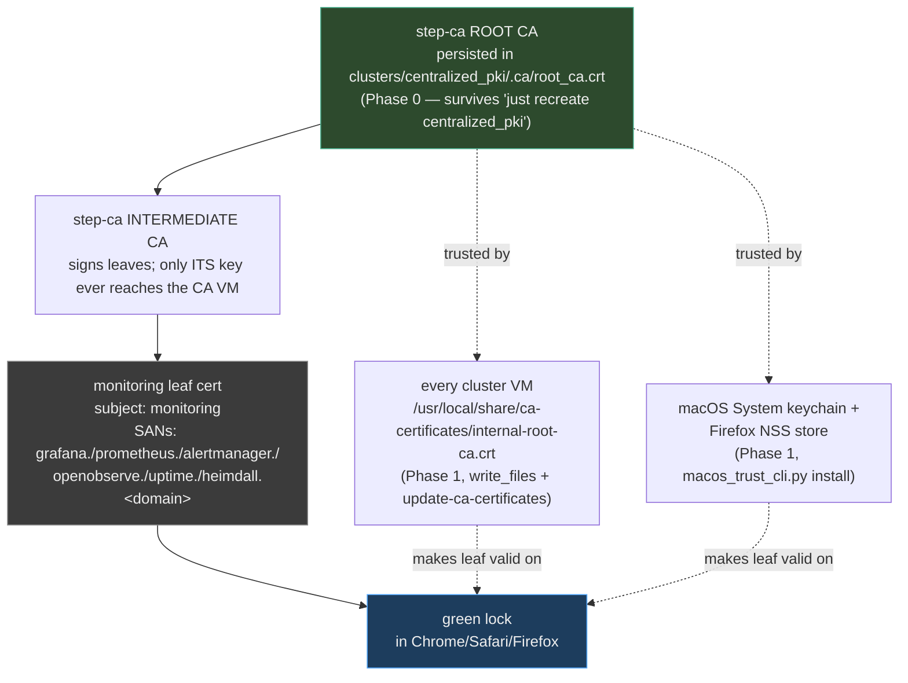
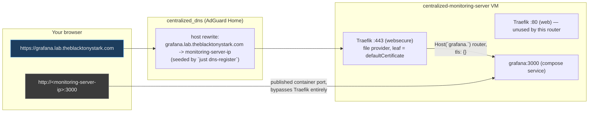
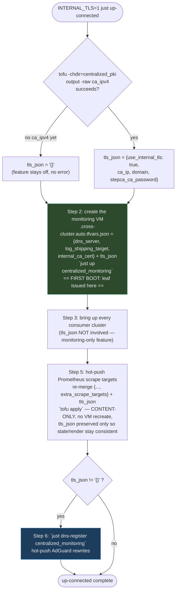

# Phase 2 tutorial: internal-CA TLS for `centralized_monitoring`

> **⚠️ DNS-registration mechanism changed (superseded by `specs/pki-and-dns.md`).** This tutorial
> was written when TLS hostnames were resolved by a `dns_rewrites` var baked into `AdGuardHome.yaml`
> plus a `just dns-register` recipe (scp the rendered config + restart AdGuard). That mechanism has
> been **retired**. Service hostnames are now registered at runtime over the AdGuard REST API by
> **`just set-dns <cluster>` / `just set-dns-all`** (each cluster exposes a `dns_records` output;
> `adguard_cli rewrite-sync` pushes them idempotently — no recreate, no restart). `up-connected`
> runs `set-dns-all` as its final step. Wherever this doc says `just dns-register centralized_monitoring`,
> run **`just set-dns centralized_monitoring`** instead; the `dns_rewrites` var / `AdGuardHome.yaml`
> templating / `dns_rewrites_*` tofu tests no longer exist. See `specs/pki-and-dns.md` for the
> current design. The TLS-issuance half of this tutorial (Parts A–C) is unchanged and still accurate.

This is a runbook and mental-model walkthrough for **Phase 2** of `specs/internal-ca.md`: the
first cluster in the lab to actually *serve* HTTPS with a leaf issued by the internal step-ca,
instead of merely trusting its root. It builds directly on `docs/internal-ca-tutorial.md`
(Phase 0/1 — persisting the root, distributing trust fleet-wide + to macOS). If you haven't
worked through that tutorial yet, do it first: everything here assumes the root already exists
and every VM/host already trusts it.

Source of truth: `specs/internal-ca.md` §Phase 2. This tutorial exists to confirm your mental
model against the real, merged implementation, and to give you copy-pasteable commands.

## What you'll learn

By the end of this tutorial you will be able to:

- Explain why `centralized_monitoring` issues its TLS leaf via a JWK **admin** provisioner
  (password auth) instead of ACME, and why that's a deliberate consequence of this being a
  DNS-less lab.
- Trace the exact boot-time sequence that gets a working leaf onto disk *before* Traefik starts,
  including the retry loops and the 12-hour renewal timer.
- Read `clusters/_shared/cloud-init/issue-cert.sh.tftpl` and correctly distinguish which `$...`
  tokens are shell variables and which `${...}` tokens are OpenTofu interpolations — a distinction
  that actually broke the implementation once (a dollar-brace *in a comment*).
- Trace how `INTERNAL_TLS=1 just up-connected` wires `ca_ip`/`stepca_ca_password` into the
  monitoring hub at the exact `just up` step that matters (VM creation, not the later re-apply),
  and how it hot-pushes AdGuard DNS rewrites afterward.
- Explain why this cutover is **additive** (`http://IP:port` never goes away) rather than a
  replacement, and draw both request paths a browser can take to reach Grafana.
- Read the hermetic test assertions that prove this all works, and recognize the specific
  auto-loaded-tfvars gotcha that makes `*_off_by_default` tests fragile if you don't pin vars in
  the file-level `variables {}` block.
- Diagnose the most common Phase 2 failure modes end-to-end.

## Prerequisites

- Phase 0/1 done and verified per `docs/internal-ca-tutorial.md`: `clusters/centralized_pki/.ca/`
  exists, `ca-material.auto.tfvars` is in place, and `just check centralized_pki` is green.
- The **CA VM** (`centralized_pki`'s `ca` role) must be reachable — its IP is what
  `use_internal_tls` needs (`var.ca_ip`) to reach step-ca at boot. Note this is a *lighter*
  requirement than "the whole `centralized_pki` cluster is healthy" — see Part D for why only
  the CA VM matters for this feature, and how to recover if the heavier `services` VM's launch
  times out.
- `tofu`, `just`, `uv`, `jq`, `dig`, `ssh`/`scp` on your macOS host — nothing new beyond what
  Phase 0/1 already required.
- Working directory for every command below: the repo root,
  `/Users/malcolm/dev/bossjones/multipass-lab`.

## Time estimate

5-10 minutes if `centralized_pki`'s CA VM and `centralized_monitoring` are already up and you're
just flipping the flag (`just recreate centralized_monitoring` dominates the time — cloud-init
must re-run). Add another 5-10 minutes if you're bringing the whole fleet up from scratch with
`INTERNAL_TLS=1 just up-connected`.

---

## Mental model

Two things changed in this cluster, and it's worth separating them cleanly before touching any
file:

1. **A new leaf gets issued at boot.** The monitoring server VM now runs the same "get a leaf
   from step-ca via a password-authenticated provisioner" recipe that `centralized_pki`'s own
   Traefik has used since that cluster existed (`clusters/centralized_pki/cloud-init/services.yaml.tftpl:102-172`)
   — except it's now a reusable, parameterized shell template any cluster can render its own copy
   of.
2. **Traefik gained a second, TLS-terminating entrypoint.** `:443` (`websecure`) already existed
   in the compose command line before this change but nothing used it — no file-provider config,
   no certs mounted. Phase 2 wires both in, alongside the existing `:80` and every plain
   `host:port` publish, which all stay exactly as they were.

### Trust chain

Phase 1 (persisted root, distributed fleet-wide) is what makes the leaf below trustworthy the
moment it's issued — no separate "the monitoring hub is special" trust step is needed anywhere.



The leaf itself carries no new trust — it's valid *because* every machine already trusts the
root that (transitively, via the intermediate) signed it. Phase 2 is purely "who actually
presents a certificate", not "who trusts what".

### Additive request paths

Nothing that worked before this change stopped working. `use_internal_tls` adds a second way to
reach the same backend containers; it does not remove the first.



The `https://` path only works once **both** halves of this feature are wired: `use_internal_tls`
on the monitoring cluster (issues the leaf, stands up the router) *and* the AdGuard rewrite on
the DNS hub (resolves the hostname at all). Either one missing degrades you back to the plain
`http://IP:port` path — which is exactly why that path is never removed.

---

## Part A — the shared leaf-issuance snippet

`clusters/_shared/cloud-init/issue-cert.sh.tftpl` is new. It's a parameterized lift of the logic
that's lived in `clusters/centralized_pki/cloud-init/services.yaml.tftpl:102-172` since that
cluster was built — the PKI cluster's own Traefik has been issuing its `auth.<domain>` /
`warden.<domain>` leaves this way from day one. Phase 2 promotes that proven recipe to
`clusters/_shared/` so any cluster can render its own copy with its own subject/SANs/paths.

Per-cluster callers pass in ten parameters:

| Param | What it controls |
|---|---|
| `ca_url` | `https://ca.<domain>:9000` — where step-ca lives |
| `ca_ip` | IP to `--add-host ca.<domain>:<ca_ip>` (DNS-less lab, no real resolution needed for issuance) |
| `domain` | DNS suffix, used to build the `--add-host` entry |
| `jwk_provisioner` | which step-ca provisioner authenticates the request (`admin`) |
| `cert_subject` | the certificate's CN / positional subject argument (`monitoring`) |
| `sans` | list of SAN hostnames baked into the leaf |
| `cert_dir` / `cert_file` / `key_file` | where the issued leaf+key land on the VM |
| `secrets_dir` | where the provisioner password file lives |
| `step_img` | pinned `smallstep/step-cli` image tag |
| `reload_cmd` | what to run after a (re)issue so the proxy picks up the new cert |

Read the file end to end — it's short (39 lines):

```sh
#!/usr/bin/env bash
# Managed by OpenTofu — SHARED cross-cluster snippet (clusters/_shared/cloud-init). See specs/internal-ca.md.
# ...
# Rendered by templatefile(), so bare $VAR is literal shell and dollar-brace
# sequences are injected OpenTofu vars — do NOT use dollar-brace shell expansions here (use $VAR).
set -euo pipefail
CERT_DIR=${cert_dir}
SECRETS=${secrets_dir}
STEP_IMG=${step_img}
```
*(`clusters/_shared/cloud-init/issue-cert.sh.tftpl:1-11`)*

> [!IMPORTANT]
> **This comment exists because it actually broke once.** `issue-cert.sh.tftpl` is passed through
> `templatefile()`, OpenTofu's own template engine — completely separate from bash. OpenTofu scans
> the *entire file*, including comments, for `${...}` and `%{...}` sequences and tries to
> interpolate them. During implementation, an earlier draft of this file had a bash-style
> parameter-expansion example (`${VAR:-default}`-shaped text) inside a comment explaining a step —
> and `tofu` choked on it, because from OpenTofu's parser's point of view a dollar-brace is a
> dollar-brace, comment or not. The file was reworded to avoid any `${...}` outside of genuine
> OpenTofu interpolations. **Rule of thumb for any new `.tftpl`:** if you want literal
> `${something}` to survive into the rendered shell script, you cannot write it — not even in a
> comment — because `templatefile()` has no comment-awareness. `$VAR` (no braces) is always safe;
> `${VAR}` is only safe when you *want* OpenTofu to substitute it.

The three functional steps (`clusters/_shared/cloud-init/issue-cert.sh.tftpl:12-39`):

1. **Bootstrap the root** — `curl -fsSk ${ca_url}/roots.pem` in a 60-iteration/2s retry loop.
   This is step-ca's documented TOFU (trust-on-first-use) bootstrap: the payload is
   self-authenticating, so `-k` (skip TLS verify) is safe *for fetching the root itself* — you're
   about to use that exact root as the `--root` argument for the real issuance call, so a
   MITM'd response would simply fail to verify anything issued against it.
2. **Issue the leaf** — a 30-iteration/5s retry loop running:
   ```sh
   docker run --rm --user 0:0 \
     --add-host "ca.${domain}:${ca_ip}" \
     -v "$CERT_DIR:/certs" -v "$SECRETS:/secrets:ro" \
     "$STEP_IMG" \
     step ca certificate ${cert_subject} /certs/${cert_file} /certs/${key_file} \
       --ca-url ${ca_url} --root /certs/root_ca.crt \
       --provisioner ${jwk_provisioner} --provisioner-password-file /secrets/provisioner_password \
       %{ for s in sans ~}--san "${s}" %{ endfor ~}--force
   ```
   `--user 0:0` matters: the `step-cli` image's default user is uid 1000, but the mounted
   provisioner-password file is root-owned `0600` (kept non-world-readable on purpose) — so the
   container has to run as root to read its own secret.
3. **Reload the proxy** — `${reload_cmd} >/dev/null 2>&1 || true` (monitoring's caller sets this
   to `docker restart traefik`). Best-effort: a fresh boot's first issuance runs *before* Traefik
   ever starts, so there's nothing to reload yet — the `|| true` absorbs that no-op cleanly.

**Why a JWK `admin` provisioner (password), not ACME.** `specs/centralized_pki.md:49-55` already
established this for the PKI cluster's own leaf, and the same constraint applies here: ACME
(`tls-alpn-01`/`http-01`) requires step-ca to connect *back* to the hostname being issued for —
`grafana.<domain>` resolves nowhere from step-ca's point of view until *after* the DNS rewrite is
registered, which itself depends on the monitoring VM's IP being known, which depends on the VM
already having booted. That's a circular dependency ACME can't satisfy in a DNS-less lab. The JWK
provisioner sidesteps it entirely: it authenticates with a shared password, not a reachback
challenge, so it works before any DNS record exists.

## Part B — the monitoring cluster wiring

Four things had to change in `clusters/centralized_monitoring` to actually front the stack.

### 1. New variables (`clusters/centralized_monitoring/variables.tf:97-121`)

```hcl
variable "use_internal_tls" {
  # ...
  type    = bool
  default = false
}

variable "domain" {
  type    = string
  default = "lab.theblacktonystark.com"   # must match centralized_pki's domain
}

variable "ca_ip" {
  type    = string
  default = ""    # empty + use_internal_tls off = no TLS
}

variable "stepca_ca_password" {
  type      = string
  default   = "changeit-dev-pki-only"   # MUST match centralized_pki's var.stepca_ca_password
  sensitive = true
}
```

Four independent knobs, all off/empty by default so a plain `just up centralized_monitoring`
stays exactly as turnkey as before. `use_internal_tls` is the master switch; the other three are
only meaningful when it's on.

> [!NOTE]
> `use_internal_tls` is deliberately **not** added to `local.flags` in `main.tf`
> (`clusters/centralized_monitoring/main.tf:42-71`). That map exists specifically to drive
> `enabled_exporters` (`local.enabled_exporters = sort([for k, v in local.flags : k if v])`,
> `main.tf:75`), which `tests/testinfra/conftest.py` uses to decide which exporter checks to run.
> TLS termination isn't an exporter — folding it into that map would silently (and wrongly) make
> `use_internal_tls` show up as a "feature flag" the live test suite tries to probe as if it were
> a `/metrics` endpoint.

### 2. New locals (`clusters/centralized_monitoring/main.tf:147-175`)

```hcl
ca_url = "https://ca.${var.domain}:9000"

tls_sans = concat(
  ["grafana.${var.domain}", "prometheus.${var.domain}", "alertmanager.${var.domain}"],
  var.enable_openobserve ? ["openobserve.${var.domain}"] : [],
  var.enable_uptime_kuma ? ["uptime.${var.domain}"] : [],
  var.enable_heimdall   ? ["heimdall.${var.domain}"]  : [],
)

issue_cert_sh = var.use_internal_tls ? templatefile("${path.module}/../_shared/cloud-init/issue-cert.sh.tftpl", {
  ca_url = local.ca_url, ca_ip = var.ca_ip, domain = var.domain
  jwk_provisioner = "admin", cert_subject = "monitoring", sans = local.tls_sans
  cert_dir = "/opt/stack/traefik/certs", cert_file = "leaf.crt", key_file = "leaf.key"
  secrets_dir = "/opt/stack/secrets", step_img = "smallstep/step-cli:0.28.2"
  reload_cmd = "docker restart traefik"
}) : ""

traefik_dynamic = var.use_internal_tls ? templatefile("${path.module}/cloud-init/traefik/dynamic.yaml.tftpl", merge(local.flags, {
  domain = var.domain
})) : ""
```

`tls_sans` is the always-on spine (`grafana`/`prometheus`/`alertmanager` — none of those three are
behind an `enable_*` flag, they're structurally always composed) plus each optional service *only
if its own enable flag is on*. Disable `enable_uptime_kuma` and the leaf simply never carries an
`uptime.<domain>` SAN — there's no dangling router pointing at a service that was never composed.

`issue_cert_sh` and `traefik_dynamic` both render to the **empty string** when
`use_internal_tls` is `false`. That empty string is what lets the same `%{ if use_internal_tls ~}`
gate in `server.yaml.tftpl` (below) cleanly drop the whole block — an empty rendered string inside
a conditional that's also skipped is simply never referenced.

`compose_conf` (`main.tf:140-145`) also picks up `use_internal_tls` directly, threading it into
`cloud-init/docker/compose.yaml.tftpl`.

### 3. Traefik's compose service gains a TLS branch (`cloud-init/docker/compose.yaml.tftpl:155-189`)

```yaml
%{ if enable_traefik ~}
  traefik:
    image: traefik:v3.1
%{ if use_internal_tls ~}
    # Fixed name so issue-cert.sh's `docker restart traefik` reload hook resolves it.
    container_name: traefik
%{ endif ~}
    command:
      - "--api.dashboard=true"
      - "--providers.docker=true"
%{ if use_internal_tls ~}
      - "--providers.file.filename=/etc/traefik/dynamic.yaml"
      - "--providers.file.watch=true"
%{ endif ~}
      - "--entrypoints.web.address=:80"
      - "--entrypoints.websecure.address=:443"
      # ...
    ports:
      - "80:80"
      - "443:443"
      - "8082:8082"
    volumes:
      - /var/run/docker.sock:/var/run/docker.sock:ro
%{ if use_internal_tls ~}
      - /opt/stack/traefik/dynamic.yaml:/etc/traefik/dynamic.yaml:ro
      - /opt/stack/traefik/certs:/etc/traefik/certs:ro
%{ endif ~}
%{ endif ~}
```

Three sub-points worth calling out:

- **`container_name: traefik`** only gets pinned when TLS is on — without a fixed name Compose
  would name the container something like `stack-traefik-1`, and `issue-cert.sh`'s
  `reload_cmd = "docker restart traefik"` would fail to find it.
- **`:443` was already published** before this change (`"443:443"` isn't new) — it just had
  nothing listening behind it in any useful way. `use_internal_tls` is what actually gives it a
  file-provider config and a cert to present.
- **The docker provider stays on** regardless of `use_internal_tls` — that's what still wires up
  Heimdall's `traefik.enable=true` labels on `:80`. The **file provider** is the new, separate
  thing that owns `:443`.

### 4. The file-provider config itself (`cloud-init/traefik/dynamic.yaml.tftpl`, new file)

One `http.routers.<svc>` + `http.services.<svc>` pair per always-on or enabled service, each on
the `websecure` entrypoint with `tls: {}`, reaching the backend by its **compose service name**
(`http://grafana:3000`, not an IP — Traefik and the app containers share the compose network):

```yaml
http:
  routers:
    grafana:
      rule: "Host(`grafana.${domain}`)"
      entryPoints: [websecure]
      service: grafana
      tls: {}
    # prometheus, alertmanager (always) + openobserve/uptime/heimdall-tls (gated %{ if ~})
  services:
    grafana:
      loadBalancer:
        servers: [{ url: "http://grafana:3000" }]
    # ...
tls:
  stores:
    default:
      defaultCertificate:
        certFile: /etc/traefik/certs/leaf.crt
        keyFile: /etc/traefik/certs/leaf.key
```
*(`clusters/centralized_monitoring/cloud-init/traefik/dynamic.yaml.tftpl:1-89`)*

The `tls.stores.default.defaultCertificate` block is what actually makes `:443` present a
certificate at all — every router's bare `tls: {}` (no per-router cert override) falls back to
this store-wide default.

### 5. `server.yaml.tftpl` — write_files + runcmd, and why order matters

The gated block in `write_files` (`cloud-init/server.yaml.tftpl:150-193`) drops four things when
`use_internal_tls` is on: the `0600` provisioner password file, the `0755` `issue-cert.sh` copy
rendered from the shared snippet, the rendered `dynamic.yaml`, and a
`monitoring-cert-renew.service` + `.timer` pair (`OnBootSec=12h`, `OnUnitActiveSec=12h`).

The `runcmd` gate is where the sequencing actually happens
(`cloud-init/server.yaml.tftpl:208-221`):

```yaml
runcmd:
  # ...
  - mkdir -p /opt/stack
  - curl -fsSL https://get.docker.com | sh
  - usermod -aG docker ubuntu
  - systemctl enable docker
  - systemctl restart docker
%{ if use_internal_tls ~}
  - mkdir -p /opt/stack/traefik/certs /opt/stack/secrets
  - /usr/local/sbin/issue-cert.sh
  - systemctl daemon-reload
  - systemctl enable --now monitoring-cert-renew.timer
%{ endif ~}
  - docker compose -f /opt/stack/compose.yaml up -d
```

`issue-cert.sh` runs **after Docker is installed** (it needs `docker run` for the `step-cli`
image) but **before `docker compose up`** (so the leaf already exists on disk the instant Traefik
container starts and mounts `/opt/stack/traefik/certs`). Get this ordering backwards and Traefik
either crashes on a missing cert file or serves whatever default self-signed cert it falls back
to — either way, the file-provider config claims a `defaultCertificate` that doesn't exist yet.

### First-boot sequence, end to end

```mermaid
sequenceDiagram
    participant CI as cloud-init runcmd
    participant Docker
    participant IssueSh as /usr/local/sbin/issue-cert.sh
    participant StepCA as step-ca (centralized_pki CA VM)
    participant Disk as /opt/stack/traefik/certs
    participant Traefik as traefik container

    Note over CI: write_files already dropped provisioner_password,<br/>issue-cert.sh, dynamic.yaml, the renew .service/.timer
    CI->>Docker: curl get.docker.com | sh; enable + restart docker
    CI->>IssueSh: mkdir traefik/certs,secrets; run issue-cert.sh

    loop up to 60x, 2s apart
        IssueSh->>StepCA: curl -fsSk https://ca.<domain>:9000/roots.pem
    end
    StepCA-->>IssueSh: root_ca.crt (TOFU bootstrap)
    IssueSh->>Disk: write root_ca.crt

    loop up to 30x, 5s apart
        IssueSh->>Docker: docker run smallstep/step-cli step ca certificate monitoring ...<br/>--provisioner admin --provisioner-password-file ... --san grafana.<domain> --san ...
        Docker->>StepCA: authenticate via JWK admin provisioner (password, no ACME reachback)
        StepCA-->>Docker: signed leaf.crt + leaf.key
    end
    Docker->>Disk: write leaf.crt (0644) + leaf.key (0600)
    IssueSh->>Traefik: docker restart traefik (no-op — not started yet)

    CI->>Docker: systemctl daemon-reload; enable --now monitoring-cert-renew.timer
    CI->>Docker: docker compose -f /opt/stack/compose.yaml up -d
    Docker->>Traefik: start, mount dynamic.yaml + certs/, load file provider
    Traefik-->>CI: :443 now serves the leaf as defaultCertificate

    Note over IssueSh,Traefik: 12h later — monitoring-cert-renew.timer fires<br/>-> issue-cert.sh reruns -> Traefik file-watch reloads the rotated leaf
```

### 6. `outputs.tf` flips `web_urls`

`web_urls_core` (`clusters/centralized_monitoring/outputs.tf:64-78`) is a ternary keyed on
`var.use_internal_tls`: off, it's the pre-existing list of `http://<server_ip>:<port>` URLs
(unchanged); on, it's `https://<svc>.<domain>` for each always-on/enabled service. A new
`domain` output (`outputs.tf:6-11`) exposes `var.domain` so `just dns-register` and
`just tls-check-monitoring` can read it without hardcoding the default.

## Part C — the DNS piece

TLS-by-hostname is useless if `grafana.<domain>` doesn't resolve anywhere. `centralized_dns`
(AdGuard Home) gained one new mechanism: host rewrites.

- **New variable** (`clusters/centralized_dns/variables.tf:82-89`):
  ```hcl
  variable "dns_rewrites" {
    type = list(object({ domain = string, answer = string }))
    default = []
  }
  ```
- **Threaded into the AdGuard config** (`clusters/centralized_dns/main.tf:28-35`):
  ```hcl
  adguard_conf = templatefile("${path.module}/cloud-init/adguard/AdGuardHome.yaml.tftpl", {
    # ...
    dns_rewrites = var.dns_rewrites
  })
  ```
- **A new standalone `local_file`** (`clusters/centralized_dns/main.tf:119-124`) writes the
  rendered config to `.rendered/AdGuardHome.yaml` on its own (not just embedded in `server.yaml`'s
  `write_files`) — that's the file `just dns-register` later `scp`s onto the running VM.
- **The template itself** (`cloud-init/adguard/AdGuardHome.yaml.tftpl:46-57`):
  ```yaml
  filtering:
    # ...
  %{ if length(dns_rewrites) > 0 ~}
    rewrites:
  %{ for r in dns_rewrites ~}
      - domain: ${r.domain}
        answer: ${r.answer}
  %{ endfor ~}
  %{ else ~}
    rewrites: []
  %{ endif ~}
  ```
  Note the explicit `%{ else ~} rewrites: []`: an omitted YAML key and an empty list are not the
  same thing to AdGuard's config loader, so the template always emits *a* valid `rewrites:` key —
  this is also exactly what the hermetic test below asserts.

AdGuard runs **host-level under systemd** (`systemctl restart AdGuardHome`), not in Docker — so
the hot-push in `just dns-register` (Part D) is a file copy + service restart, not a container
operation.

## Part D — run it end to end

### D.1 — Bring up (or confirm) the CA VM

Phase 2 only needs `centralized_pki`'s **CA** VM to be reachable — not the heavier `services` VM
(Authelia, Vaultwarden, its own Traefik). That distinction matters because
`specs/centralized_pki.md:148-149,156-157` documents a known failure mode: a full apt
dist-upgrade on the `services` VM can push it past Multipass's launch timeout under a slow image
pull, leaving an orphaned VM that `tofu destroy` can't see. If that happens while you only care
about issuing a monitoring leaf, you don't need to chase the `services` VM at all:

```sh
just up centralized_pki          # single apply creates ca THEN services (ca first: main.tf's
                                  # dependency edge is services_ci -> multipass_instance.ca.ipv4)
```

If this times out on the `services` VM, recover and confirm the `ca` VM survived:

```sh
just prune centralized_pki       # deletes any orphaned VM tofu's state doesn't track
just status                      # multipass list — confirm centralized-pki-ca is Running
tofu -chdir=clusters/centralized_pki output -raw ca_ipv4   # should still succeed —
                                  # the ca resource applied successfully before services failed
```

Because `ca` is created *before* `services` in the same `tofu apply`, a failure on `services`
does not roll back `ca` — it's already in state. `ca_ipv4` is all Phase 2 needs.

### D.2 — Bring up the fleet with TLS wired in

```sh
INTERNAL_TLS=1 just up-connected
```

`up-connected` (`Justfile:119-259`) needed one addition for this feature: a `tls_json` fragment
that's `{}` when `INTERNAL_TLS` is unset, and otherwise built from `centralized_pki`'s live
`ca_ipv4`:



The critical detail baked into that diagram: **`tls_json` must be merged in at Step 2**
(`Justfile:181-184`), the very `just up` that *creates* the monitoring VM, because
`use_internal_tls` gates rendered cloud-init — and a `multipass_instance` is never recreated just
because its cloud-init content changed (per `CLAUDE.md`'s "Editing cloud-init requires `just
recreate`, not `just up`" rule). Step 5's re-apply (`Justfile:238-251`) is content-only (it
re-renders `prometheus.yml` to add scrape targets) and explicitly re-includes `tls_json` in its
merged object purely so OpenTofu's plan/state stay consistent with what's already running — **it
does not, and cannot, cause the leaf to be (re-)issued**. That already happened at Step 2.

Finally, Step 6 (`Justfile:253-258`) only fires `just dns-register centralized_monitoring` when
`tls_json` isn't the empty-object sentinel — i.e., only when TLS was actually turned on and
successfully wired.

### D.3 — Or: flip it on an already-running cluster

If `centralized_monitoring` is already up without TLS and you don't want to re-run the whole
fleet orchestration:

```sh
mon_ip=$(tofu -chdir=clusters/centralized_pki output -raw ca_ipv4)
cat > clusters/centralized_monitoring/tls.auto.tfvars <<EOF
use_internal_tls = true
ca_ip             = "$mon_ip"
domain            = "lab.theblacktonystark.com"
EOF
just check centralized_monitoring     # hermetic sanity check first
just recreate centralized_monitoring  # MUST be recreate — cloud-init changed
just set-dns centralized_monitoring    # register grafana.<domain> etc. into AdGuard (REST, no recreate)
```

Remember to remove `tls.auto.tfvars` afterward if you don't want it silently affecting future
`just check`/`tofu test` runs on this cluster (see the troubleshooting entry on auto-loaded
tfvars).

### D.4 — Verify the chain manually

```sh
uv run clusters/centralized_pki/scripts/tls_cli.py --cluster centralized_pki check \
  "$(tofu -chdir=clusters/centralized_monitoring output -raw server_ipv4)" \
  --sni "grafana.$(tofu -chdir=clusters/centralized_monitoring output -raw domain)"

open https://grafana.lab.theblacktonystark.com   # green lock, no warning, in Chrome/Firefox
open http://$(tofu -chdir=clusters/centralized_monitoring output -raw server_ipv4):3000  # still works
```

## Part E — verify (the test-suite tour)

### Hermetic: `clusters/centralized_monitoring/tests/tofu/cross_cluster.tftest.hcl`

Run via `just check centralized_monitoring` (`tofu test -test-directory=tests/tofu`,
`Justfile:283-286`). `mock_provider "multipass" {}` + `command = plan` — **no VM ever launches**.

| `run` block | What it proves |
|---|---|
| `internal_tls_off_by_default` (`:191-210`) | With `use_internal_tls` unset, server cloud-init contains **no** `issue-cert.sh`, **no** `monitoring-cert-renew`, **no** `/etc/traefik/dynamic.yaml` mount, and every `web_urls.core` entry still starts with `http://`. |
| `internal_tls_on_renders_leaf_and_proxy` (`:213-265+`) | With `use_internal_tls = true`, `ca_ip = "10.99.99.5"`, asserts: `issue-cert.sh` is dropped; `--provisioner admin`; the leaf carries `--san "grafana.lab.theblacktonystark.com"` and `--san "prometheus.lab.theblacktonystark.com"`; `ca.lab.theblacktonystark.com:10.99.99.5` appears (the `--add-host` reachback); the provisioner password file is written; Traefik's dynamic config sets `defaultCertificate` and loads `--providers.file.filename=/etc/traefik/dynamic.yaml`; the 12h `monitoring-cert-renew.timer` is armed; `web_urls.core` now contains `https://grafana.lab.theblacktonystark.com`. |

The equivalent pair lives in `clusters/centralized_dns/tests/tofu/cross_cluster.tftest.hcl`:
`dns_rewrites_off_by_default` (`:149-156`, asserts `rewrites: []` renders when the list is empty)
and `dns_rewrites_render_records` (`:158-182`, asserts each `{domain, answer}` pair appears both
in the standalone `local_file.adguard_conf` **and** the embedded copy inside `server_ci` — i.e.
the write_files-embedded seed and the hot-pushable rendered file never drift apart).

### The auto-loaded-tfvars gotcha, concretely

Both files' file-level `variables {}` blocks (`cross_cluster.tftest.hcl:14-29` for monitoring,
similarly for DNS) pin the opt-in vars OFF explicitly:

```hcl
variables {
  # ...
  use_internal_tls   = false
  ca_ip              = ""
  stepca_ca_password = ""
}
```

This exists because `tofu test` — like `tofu plan`/`apply` — auto-loads any `*.auto.tfvars(.json)`
sitting in the cluster directory. If you'd just run `INTERNAL_TLS=1 just up-connected` (Part D.2)
and left the resulting `.cross-cluster.auto.tfvars.json` on disk with `use_internal_tls: true`
still in it, a plain `tofu test` would auto-load that file and the `internal_tls_off_by_default`
run's premise — "with `use_internal_tls` unset, nothing TLS-related renders" — would be false, and
the test would fail for a reason that has nothing to do with a real regression. Pinning the value
in the file-level `variables {}` block **outranks** the auto-loaded tfvars (only the *on*-runs
explicitly override it back at the `run` level), so `just check` stays green regardless of what
`*.auto.tfvars` files happen to be sitting around from a previous live session.

```mermaid
flowchart TB
    subgraph Hermetic["Hermetic layer — `just check`"]
        direction TB
        h1["mock_provider \"multipass\" {}<br/>command = plan"]
        h2["NO VM ever launches"]
        h3["file-level variables{} pins<br/>use_internal_tls=false, ca_ip=\"\", stepca_ca_password=\"\"<br/>-> outranks any leftover *.auto.tfvars"]
        h4["run \"..._on_...\" blocks override<br/>AT THE RUN LEVEL to test the on-path"]
        h1 --> h2
        h3 -.protects.-> h1
        h4 -.overrides only within its own run.-> h3
    end

    subgraph Live["Live layer — `just verify` / `just verify-api` / `just tls-check-monitoring`"]
        direction TB
        l1["real VMs, real SSH/HTTPS"]
        l2["`just verify-api centralized_monitoring`<br/>grafana/prometheus/openobserve CLIs over http, still green"]
        l3["`just tls-check-monitoring`<br/>tls_cli.py check <mon_ip> --sni grafana.<domain><br/>asserts the served leaf chains to the internal root"]
        l1 --> l2
        l1 --> l3
    end

    disk[("clusters/centralized_monitoring/<br/>*.auto.tfvars / .cross-cluster.auto.tfvars.json<br/>(gitignored, persists across `just up-connected` runs)")]
    disk -.auto-loaded by tofu test/plan/apply.-> Hermetic
    disk -.consumed as real input.-> Live

    style h3 fill:#2d4a2d,stroke:#4a8,color:#eee
    style l3 fill:#1d3d5d,stroke:#5af,color:#eee
```

### Live checks

```sh
just verify-api centralized_monitoring   # still green over http://<ip>:<port> by IP — unaffected by TLS
just tls-check-monitoring                # tls_cli.py: does the served leaf chain to the internal root?
```

`just tls-check-monitoring` (`Justfile:541-547`) resolves `server_ipv4` and `domain` from
`centralized_monitoring`'s own outputs, then delegates to `centralized_pki`'s
`scripts/tls_cli.py check <mon_ip> --sni grafana.<domain>` — the same CLI that already verifies
the PKI cluster's own `auth.<domain>`/`warden.<domain>` leaves, now pointed at a different VM.

Both `just check centralized_monitoring` (28 passed) and `just check centralized_dns` (14 passed)
are green as of this feature landing.

---

## Confirm your understanding

Work through these without looking back at the source, then check yourself:

1. **Why doesn't `use_internal_tls` need to be in `local.flags`?**
   <details><summary>Answer</summary>
   <code>local.flags</code> exists to drive <code>enabled_exporters</code>, which the live test
   suite uses to decide which <code>/metrics</code> endpoints to probe. TLS termination isn't an
   exporter — it would be a category error to fold it in, and it would falsely tell the test
   harness to expect a metrics endpoint that doesn't exist.
   </details>

2. **You flip `use_internal_tls = true` in a `.auto.tfvars` and run a plain `just up
   centralized_monitoring` against an already-running cluster. Does the leaf get issued?**
   <details><summary>Answer</summary>
   No. <code>multipass_instance</code> is never recreated just because rendered cloud-init content
   changed — the VM keeps running its old cloud-init, which never had the
   <code>issue-cert.sh</code> runcmd step. You need <code>just recreate</code>.
   </details>

3. **Why is the leaf issued with a JWK provisioner instead of ACME, specifically in this lab?**
   <details><summary>Answer</summary>
   ACME's challenge types need step-ca to reach back to the hostname being issued for
   (<code>tls-alpn-01</code>/<code>http-01</code>), but <code>grafana.&lt;domain&gt;</code>
   doesn't resolve until the AdGuard rewrite exists — which itself needs the monitoring VM's IP,
   which needs the VM to already be booted. The JWK provisioner authenticates with a password
   instead, so it has no such reachback dependency.
   </details>

4. **What breaks if `issue-cert.sh` runs *after* `docker compose up` instead of before?**
   <details><summary>Answer</summary>
   Traefik starts and mounts <code>/opt/stack/traefik/certs</code> before <code>leaf.crt</code>/
   <code>leaf.key</code> exist there. The file-provider's <code>defaultCertificate</code> points at
   files that aren't there yet, so Traefik fails to load the dynamic config (or serves whatever
   fallback cert it has) until the next file-watch trigger — which, on first boot, may never come
   without a restart, since nothing else touches those files.
   </details>

5. **A leftover `.cross-cluster.auto.tfvars.json` from a prior `INTERNAL_TLS=1 just up-connected`
   sets `use_internal_tls: true`. Does `just check centralized_monitoring` still pass?**
   <details><summary>Answer</summary>
   Yes — the <code>internal_tls_off_by_default</code> run's file-level <code>variables {}</code>
   block pins <code>use_internal_tls = false</code> explicitly, and that pin outranks any
   auto-loaded <code>*.auto.tfvars(.json)</code>. Only a <code>run</code> block that itself
   overrides the variable (the <code>_on_</code> run) sees it as true.
   </details>

6. **Why does `http://<server_ip>:3000` keep working after this feature ships?**
   <details><summary>Answer</summary>
   The cutover is additive by design: the plain container port publishes were never removed from
   compose, and Traefik's docker provider (which fronts <code>:80</code>) stays on regardless of
   <code>use_internal_tls</code>. The file provider on <code>:443</code> is a second, independent
   ingress path layered on top, not a replacement.
   </details>

---

## Troubleshooting

| Symptom | Likely cause | Fix |
|---|---|---|
| Leaf never gets issued (Traefik has no working cert, or `issue-cert.sh` seems to have not run) | `centralized_pki`'s CA VM was unreachable at the monitoring VM's first boot — `ca_ip` was wrong/stale, or the CA VM wasn't up yet when you ran `just up centralized_monitoring`. The 60x/2s + 30x/5s retry loops in `issue-cert.sh` cap out after ~7-8 minutes total. | SSH in and check: `journalctl -u cloud-init` for the issuance attempt, or just re-run it live: `sudo /usr/local/sbin/issue-cert.sh`. Confirm `ca_ip` is actually reachable first: `curl -k https://<ca_ip>:9000/roots.pem`. The 12h `monitoring-cert-renew.timer` will also retry on its own schedule, but don't wait 12 hours in a debugging session — re-run manually. |
| `centralized_pki`'s `services` VM launch times out during `just up centralized_pki` | Slow image pull pushing the heavier VM past Multipass's launch window (`specs/centralized_pki.md:148-149,156-157`) — unrelated to Phase 2, since only `ca_ipv4` is needed. | `just prune centralized_pki` to clean the orphan, `just status` to confirm `centralized-pki-ca` is `Running`, then `tofu -chdir=clusters/centralized_pki output -raw ca_ipv4` — it should already work since `ca` was created (and applied successfully) before `services` failed. |
| Browser still shows "not secure" / cert warning for `grafana.<domain>` even though `use_internal_tls` is on | Either the AdGuard rewrite was never registered (`just dns-register centralized_monitoring` wasn't run, or `INTERNAL_TLS` wasn't set during `up-connected`), so the hostname doesn't resolve to the monitoring VM at all — or it resolves fine but your Mac never ran Phase 1's macOS trust step. | Confirm resolution first: `dig @<dns_ip> grafana.<domain>` should return the monitoring server's IP. If not, run `just dns-register centralized_monitoring`. If it resolves correctly but the browser still warns, confirm macOS trust: `uv run clusters/centralized_pki/scripts/macos_trust_cli.py check grafana.<domain>`, and if that fails, `just trust-ca-macos`. |
| `just check centralized_monitoring` fails an `internal_tls_off_by_default` assertion | A leftover `.cross-cluster.auto.tfvars.json` or hand-created `*.auto.tfvars` in the cluster dir is setting `use_internal_tls`/`ca_ip`/`stepca_ca_password` to non-empty values, and `tofu test` auto-loads it. | This should already be handled: confirm `tests/tofu/cross_cluster.tftest.hcl`'s file-level `variables {}` block (`:14-29`) still pins all three to their OFF values. If you added a *new* opt-in var and forgot to pin it there, that's the bug — add it. |
| `dns-register` reports "no https hostnames — nothing to do" | `use_internal_tls` was never turned on for `centralized_monitoring` (its `web_urls.core` output has no `https://` entries to derive rewrites from), or you ran it against the wrong cluster name. | Confirm with `tofu -chdir=clusters/centralized_monitoring output -json web_urls` — `core` should contain `https://...` entries. If they're all `http://`, turn `use_internal_tls` on and `just recreate` first. |
| Traefik `docker restart traefik` (the renew reload) fails to find the container | `container_name: traefik` is only pinned when `use_internal_tls` is true (`compose.yaml.tftpl:159-161`) — if the cluster was ever brought up with TLS off and then flipped on via a plain re-apply (not `just recreate`), the running container may still have Compose's auto-generated name. | This is another instance of the "cloud-init change needs `just recreate`" rule — `just recreate centralized_monitoring` after any `use_internal_tls` flip, not a plain `just up`. |

---

## Extending this to the next cluster

`specs/internal-ca.md` §Phase 2 lists the priority order for the remaining clusters, in each case
because they already run (or are cheapest to add) a reverse proxy:

1. **`centralized_logging`** — already runs Traefik `:80`; needs a `:443` + leaf for
   Heimdall/Grafana, same shape as this tutorial.
2. **`centralized_netbox`** — NetBox's UI/API plus the Diode gRPC ingress (which benefits
   specifically from TLS).
3. **`centralized_dns`** — the AdGuard Home UI itself (lower priority: single service).
4. **`centralized_unifi`** — ships its own self-signed cert already; lowest priority.

The reuse point for every one of them is the same: `clusters/_shared/cloud-init/issue-cert.sh.tftpl`.
The pattern this tutorial documented generalizes directly:

1. Add `use_internal_tls` / `domain` / `ca_ip` / `stepca_ca_password` variables (copy
   `clusters/centralized_monitoring/variables.tf:97-121` verbatim, adjusting only the description
   text).
2. Build a `tls_sans` local scoped to *that* cluster's own hostnames and enable flags.
3. Render `issue_cert_sh` from the shared snippet with that cluster's own `cert_subject`,
   `cert_dir`/`cert_file`/`key_file`, and `reload_cmd` (whatever restarts *that* cluster's proxy).
4. Add a `dynamic.yaml.tftpl` (or equivalent, if the proxy isn't Traefik) with routers/services
   for that cluster's containers plus the `defaultCertificate` block.
5. Gate the `write_files`/`runcmd` additions in that cluster's own `server.yaml.tftpl`-equivalent,
   preserving the "issue before the proxy starts" ordering.
6. Flip `web_urls_core` to `https://` conditionally, exactly like
   `clusters/centralized_monitoring/outputs.tf:64-78`.
7. Add the cluster's `use_internal_tls` opt-in vars to its `tests/tofu/*.tftest.hcl` file-level
   `variables {}` OFF-pin, and write the `_off_by_default`/`_on_renders_...` pair.
8. Wire it into `up-connected`'s `tls_json` merge (or a per-cluster equivalent env var if you don't
   want one global `INTERNAL_TLS` switch to affect every Phase-2 cluster at once) and call
   `just dns-register <cluster>` at the end.

Nothing about `issue-cert.sh.tftpl` itself needs to change for any of this — it was written
parameterized from the start specifically so `centralized_monitoring` would not be a one-off.

## Command reference

| Command | What it does |
|---|---|
| `just up centralized_pki` | Bring up the PKI cluster (`ca` then `services` in one apply). Only `ca_ipv4` is required for Phase 2. |
| `just prune centralized_pki` | Clean up an orphaned VM left by a `services`-VM launch timeout, without touching the already-applied `ca` VM. |
| `INTERNAL_TLS=1 just up-connected` | Bring up the whole fleet, wiring `ca_ip`/`domain`/`stepca_ca_password` into the monitoring hub's first boot and hot-pushing AdGuard rewrites at the end. |
| `just recreate centralized_monitoring` | Required (not `just up`) after flipping `use_internal_tls` on an existing cluster — cloud-init content changes never recreate a `multipass_instance`. |
| `just dns-register centralized_monitoring` | Hot-push AdGuard host rewrites for every `https://` hostname in the cluster's `web_urls.core`, no recreate. |
| `just tls-check-monitoring` | Assert the served monitoring leaf chains to the internal root (`tls_cli.py check <mon_ip> --sni grafana.<domain>`). |
| `just verify-api centralized_monitoring` | Live Grafana/Prometheus/OpenObserve API checks — still green over plain HTTP by IP, unaffected by TLS. |
| `just check centralized_monitoring` | Hermetic: `tofu fmt`/`validate`/`test`, including `internal_tls_off_by_default` / `internal_tls_on_renders_leaf_and_proxy`. |
| `just check centralized_dns` | Hermetic: includes `dns_rewrites_off_by_default` / `dns_rewrites_render_records`. |
| `tofu -chdir=clusters/centralized_monitoring output -json web_urls` | See the current `core`/`all` URL lists — `core` flips to `https://` when TLS is on. |
| `tofu -chdir=clusters/centralized_monitoring output -raw domain` | The DNS suffix in effect (`var.domain`). |
| `uv run clusters/centralized_pki/scripts/tls_cli.py --cluster centralized_pki check <ip> --sni <host>` | Generic leaf-chain check against any host:port, not just monitoring. |
