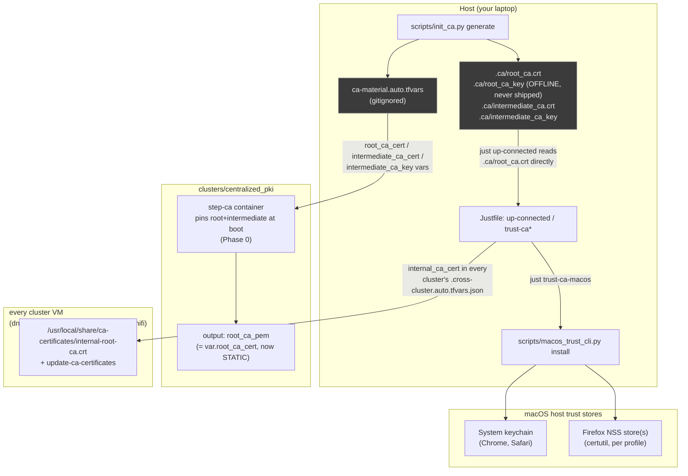
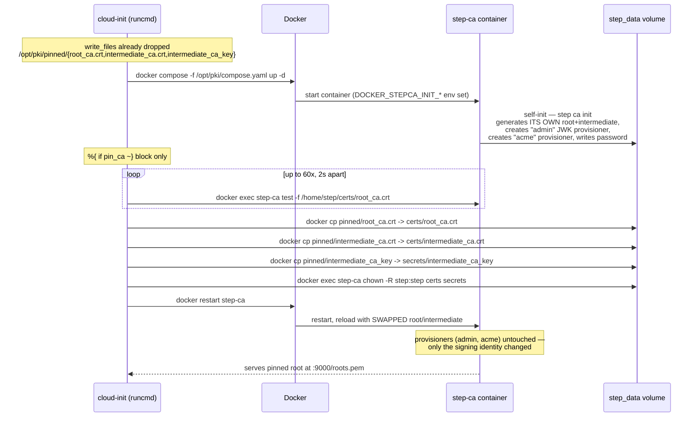
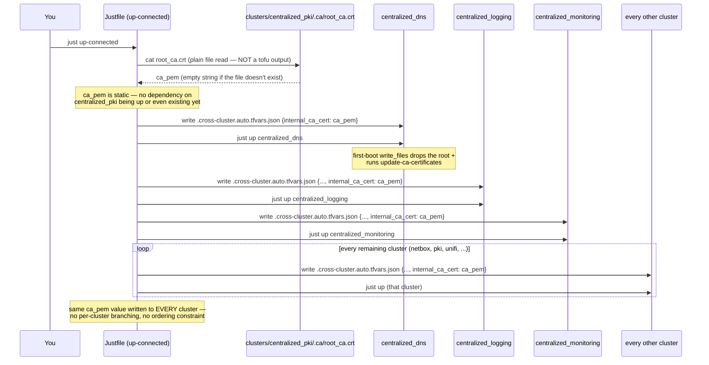
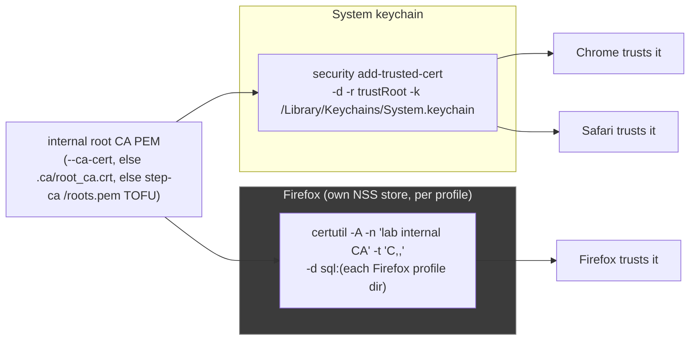

# Tutorial: Fleet-Wide Trust with the Internal CA (`centralized_pki`)

This is a runbook and mental-model walkthrough for the internal-CA trust-distribution feature
built on top of `clusters/centralized_pki`'s step-ca. It covers **Phase 0** (persisting the
step-ca root so it survives rebuilds) and **Phase 1** (distributing trust in that root to every
cluster VM and to your macOS host). It does **not** cover Phase 2 (services actually serving
HTTPS with internal-CA leaves) — that's future work, called out at the end.

Source of truth for the design: `specs/internal-ca.md`. This tutorial exists to confirm your
mental model against the real, already-merged implementation and to give you copy-pasteable
commands for operating it.

## What you'll learn

By the end of this tutorial you will be able to:

- Explain the two separate problems this feature solves — trust distribution vs. root
  stability — and why solving root stability *first* is what makes distribution trivial.
- Trace exactly how step-ca's root gets pinned at boot ("swap-after-init") instead of
  self-generating a fresh one on every `just recreate`.
- Trace how `just up-connected` gets that pinned root onto every VM in the fleet with no
  ordering dependency on `centralized_pki` being up first.
- Run the full operational loop: generate the root once, bring the PKI cluster up so it pins
  it, distribute it fleet-wide, hot-patch a single VM without a recreate, and trust it on your
  Mac (Chrome/Safari *and* Firefox).
- Read the hermetic test assertions that prove this all works, and diagnose the most common
  failure modes.

## Prerequisites

- You've already worked through `docs/TUTORIAL.md` or are otherwise comfortable with the
  `just check` / `just up` / `just verify` / `just recreate` loop and the
  `.cross-cluster.auto.tfvars.json` mechanism described in `specs/cross-cluster.md`.
- `docker`, `tofu`, `just`, `uv` on your macOS host. `docker` is required by
  `scripts/init_ca.py` (it shells out to the `smallstep/step-cli` image — no local `step` CLI
  install needed).
- For the macOS trust step: `brew install nss` if you want Firefox trust too (Chrome/Safari
  read the system keychain and need nothing extra).
- Working directory for every command below: the repo root,
  `/Users/malcolm/dev/bossjones/multipass-lab`.

## Time estimate

15-20 minutes if `centralized_pki` isn't up yet (most of it is `just up-connected` launching
VMs); under 5 minutes to re-run trust distribution against an already-running fleet.

---

## Plain-English overview

Today, only one cluster in this lab does TLS at all: `centralized_pki` runs
[step-ca](https://smallstep.com/docs/step-ca/) and issues leaf certs for
`auth.<domain>` / `warden.<domain>`. Nothing else in the lab — not the other five VMs, not your
Mac's browsers — trusts that CA. Two separate things stood in the way of fixing that:

1. **Nobody trusts the root.** Only the PKI *services* VM installs step-ca's root into its own
   OS trust store. Every other VM, and your Mac (Chrome/Safari/Firefox), sees "certificate not
   trusted" for anything step-ca issues.
2. **The root is ephemeral.** step-ca generates its root + intermediate CA *the first time it
   boots*, inside a Docker volume. That means the root isn't known until the container has
   already started, it can't be a `tofu output`, and — worse — it **regenerates from scratch**
   every time you `just recreate centralized_pki`. Even if you'd solved problem 1, the next
   rebuild would silently invalidate every certificate you'd distributed trust for.

The fix ships in two phases:

- **Phase 0 (root stability):** generate the root + intermediate *once*, offline, on your host,
  and have step-ca adopt that fixed pair instead of inventing its own at boot. Once that's true,
  the root PEM is a static string your OpenTofu config already knows *before* any VM launches.
- **Phase 1 (trust distribution):** because the root is now a static, apply-time-known value,
  trusting it on any machine is just "write this file, run `update-ca-certificates`" — no
  waiting for the PKI cluster to be up, no runtime fetch, no ordering constraints at all. This is
  a deliberately *simpler* pattern than `dns_server` (which needs a real IP discovered at
  runtime, because AdGuard's IP isn't known until Multipass hands out a DHCP lease).

> [!TIP]
> If you've internalized `specs/cross-cluster.md`'s `dns_server` pattern, this feature is the
> "easy version" of the same idea: a value gets threaded into every cluster's `.tftpl` via a
> gated `write_files` block. The only reason `internal_ca_cert` is *easier* than `dns_server` is
> that Phase 0 turns a runtime-only value (the CA's self-generated root) into a static one.

---

## The architecture, end to end



Two things worth noticing immediately:

- `just up-connected` never talks to the PKI cluster's `tofu output` to get the root PEM — it
  reads `.ca/root_ca.crt` straight off disk (see the Justfile walkthrough below). That's the
  "no ordering dependency" claim made concrete: the DNS hub can trust the CA before
  `centralized_pki` is even up.
- The offline root **key** (`root_ca_key`) never leaves `.ca/` on your laptop. Only the
  **intermediate** key (encrypted with `stepca_ca_password`) is shipped to the CA VM, because
  that's the key step-ca actually needs at runtime to sign leaves.

### Sequence 1 — Phase 0: pinning the root at boot time

This is what happens inside the `ca` VM's cloud-init every time it boots, when pinned material
is configured (`clusters/centralized_pki/cloud-init/ca.yaml.tftpl`):



This is the "swap-after-init" trick called out in the spec. step-ca's Docker entrypoint
*insists* on initializing itself (creating provisioners, writing the password file into the
volume) — there's no supported way to hand it a pre-built config and skip that. So the runcmd
lets it self-init as normal, waits for the resulting `root_ca.crt` to exist, then overwrites
just the signing material (`root_ca.crt`, `intermediate_ca.crt`, `intermediate_ca_key`) and
restarts. The `admin` JWK provisioner and `acme` provisioner step-ca created during self-init are
left alone — only *which CA identity signs things* changes. It's idempotent: re-running copies
the same bytes, so `just recreate centralized_pki` with the same `ca-material.auto.tfvars`
produces the exact same root every time.

### Sequence 2 — Phase 1: `just up-connected` distributing trust fleet-wide



Contrast this with `dns_server`: that value literally cannot exist until the DNS hub's VM has
booted and Multipass has handed it a DHCP lease, so `up-connected` must bring the DNS hub up
*first* and read its IP before wiring any consumer. `internal_ca_cert` has no such constraint —
it's read from a file on your laptop that existed before `up-connected` even started, so it's
written into the DNS hub's own first-boot tfvars in the very same step that hub is created.

### macOS trust path



The reason this needs two separate mechanisms: Chrome and Safari on macOS defer to the **system
keychain** for certificate trust, but Firefox ships its own independent trust store (NSS,
`cert9.db`) *per profile* and ignores the keychain entirely. Trusting the root in Keychain Access
alone gets you Chrome + Safari with a green lock, but Firefox will still show a warning — you
need `certutil` (from the `nss` Homebrew package) to add the same root into each Firefox
profile's NSS database.

---

## The runbook

### Step 1 — Generate the persistent root (once, offline)

Before anything else, ground yourself: has this lab already generated a pinned root?

```sh
ls clusters/centralized_pki/.ca/ 2>/dev/null
ls clusters/centralized_pki/ca-material.auto.tfvars 2>/dev/null
```

If both are absent, generate the root + intermediate now:

```sh
uv run clusters/centralized_pki/scripts/init_ca.py generate
```

What this does (`clusters/centralized_pki/scripts/init_ca.py`):

- Runs `step certificate create` **twice** inside the `smallstep/step-cli:0.28.2` Docker image
  (no local `step` binary needed): once for a self-signed root (`--profile root-ca`,
  `--not-after 87600h` — 10 years), once for an intermediate signed by that root
  (`--profile intermediate-ca`, `--not-after 43800h` — 5 years).
- Both keys are encrypted with a password — by default the same dev password that's already
  `var.stepca_ca_password`'s default (`changeit-dev-pki-only`), so a plain `just up` stays
  turnkey.
- Writes the raw material to `clusters/centralized_pki/.ca/{root_ca.crt, root_ca_key,
  intermediate_ca.crt, intermediate_ca_key}`.
- Writes `clusters/centralized_pki/ca-material.auto.tfvars` (gitignored — OpenTofu auto-loads
  any `*.auto.tfvars` in the cluster dir) with `root_ca_cert`, `intermediate_ca_cert`, and
  `intermediate_ca_key` as heredocs.

> [!IMPORTANT]
> `root_ca_key` is deliberately **not** part of the emitted tfvars and never gets copied to any
> VM. step-ca only ever needs the *intermediate* key to sign leaves at runtime; the offline root
> key stays on your laptop in `.ca/`, which is exactly what you want for a real CA hierarchy
> (compromise of a VM should never expose the root key). Keep `.ca/` backed up somewhere if you
> care about this root's identity surviving a wiped laptop — regenerating with `--force` rotates
> the root and invalidates everyone's trust.

> [!TIP]
> If you ever need to rotate the root on purpose, rerun with `--force`:
> `uv run clusters/centralized_pki/scripts/init_ca.py generate --force`. Understand this
> **breaks trust everywhere** until you redo steps 2 and 3 below.

### Step 2 — Bring the PKI cluster up so it pins the root

With `ca-material.auto.tfvars` in place, `centralized_pki`'s three pinning vars
(`root_ca_cert`, `intermediate_ca_cert`, `intermediate_ca_key` — see
`clusters/centralized_pki/variables.tf`) are all non-empty, which flips
`local.pin_ca = true` in `clusters/centralized_pki/main.tf`. That gates the extra `write_files` +
runcmd block in `cloud-init/ca.yaml.tftpl` covered in Sequence 1 above.

Because this changes the *rendered cloud-init*, not just an input variable OpenTofu re-applies
in place, you must recreate the VM — a plain `just up` will **not** pick this up if the CA VM is
already running with the old (self-inited or previously-pinned) material:

```sh
just check centralized_pki      # hermetic: confirm pin_ca_on_renders would pass first
just recreate centralized_pki
```

`just recreate` is `destroy` (incl. orphan cleanup) then `up` — see the `recreate CLUSTER:
(destroy CLUSTER) (up CLUSTER)` recipe in the Justfile. `up` itself blocks until
`cloud-init status --wait` returns on both VMs, so by the time the command returns the pinning
runcmd has already run.

Verify the pin took effect — the served root should be byte-identical to what's in `.ca/`:

```sh
ca_ip=$(tofu -chdir=clusters/centralized_pki output -raw ca_ipv4)
diff <(curl -sk "https://$ca_ip:9000/roots.pem") clusters/centralized_pki/.ca/root_ca.crt \
  && echo "MATCH: served root == pinned root"

# and it matches the tofu output too (now a static value, per specs/internal-ca.md):
diff <(tofu -chdir=clusters/centralized_pki output -raw root_ca_pem) \
     clusters/centralized_pki/.ca/root_ca.crt && echo "MATCH: root_ca_pem output == pinned root"
```

> [!TIP]
> **Prove persistence to yourself.** Run `just recreate centralized_pki` a second time and rerun
> the `diff` above — the root should still match. Before Phase 0 existed, a second `recreate`
> would have produced a *different* self-generated root and broken this diff. That's the whole
> point of Phase 0.

### Step 3 — Distribute trust fleet-wide

Now get every other VM (and the hubs) to trust that root. The turnkey path is
`just up-connected`, which does this as one step among its other cross-cluster wiring
(`specs/cross-cluster.md`):

```sh
just up-connected
```

Relevant excerpt of what it does (`Justfile`, `up-connected` recipe):

```sh
ca_crt="clusters/centralized_pki/.ca/root_ca.crt"
ca_pem=""
if [ -f "$ca_crt" ]; then ca_pem="$(cat "$ca_crt")"; fi
# ... for the dns hub:
jq -n --arg ca "$ca_pem" '{internal_ca_cert: $ca}' \
  > clusters/centralized_dns/.cross-cluster.auto.tfvars.json
just up centralized_dns
```

...and the same `--arg ca "$ca_pem"` gets folded into the `jq -n` object for the logging hub,
the monitoring hub, and every consumer cluster in the loop. If `.ca/root_ca.crt` doesn't exist
yet, `ca_pem` stays empty and every cluster just gets `internal_ca_cert: ""` — the feature is a
no-op, not an error, so `up-connected` still works fine on a fleet that hasn't opted into
Phase 0 at all.

If you only care about this one feature and don't want to bring up the whole fleet again, you
can instead bring up (or recreate, if a cluster is already up and you only just now generated
the root) individual clusters — but note that a plain `just up <cluster>` on a fresh cluster
*already* picks up `internal_ca_cert` if you set it via a `*.auto.tfvars` yourself, since the
var default is `""` and this is a normal (not cross-cluster-orchestrated) variable. In practice
you'll almost always drive this through `up-connected` or `trust-ca` (next section).

### Step 4 — Repair a single running VM without recreating it

`just up-connected` bakes trust in at first boot. But two situations need a **hot-push** instead
of a rebuild:

- You brought a cluster up with a plain `just up <cluster>` (no `internal_ca_cert` wired), and
  now want it to trust the CA without a full recreate.
- You rotated the root (`init_ca.py generate --force`) and need to refresh trust on VMs that are
  already running with the old root.

```sh
just trust-ca centralized_netbox      # one cluster, every VM in it
just trust-ca-all                     # every cluster, glob-discovered
```

What `trust-ca` actually does (`Justfile`):

1. Prefers the pinned file `clusters/centralized_pki/.ca/root_ca.crt`. If that's absent, it
   falls back to fetching the CA's live root over TOFU: `curl -fsSk
   https://<ca_ip>:9000/roots.pem` (i.e. it trusts-on-first-use whatever step-ca is currently
   serving — fine for a lab, not something you'd do against an untrusted network).
2. For every VM in the target cluster's `hosts` output, `scp`s that PEM to
   `/tmp/internal-root-ca.crt` and then over SSH: `sudo cp /tmp/internal-root-ca.crt
   /usr/local/share/ca-certificates/internal-root-ca.crt && sudo update-ca-certificates`.

This is exactly the same two-line idiom baked into every cluster's cloud-init `write_files` +
`runcmd` — `trust-ca` just performs it live over SSH instead of at boot.

### Step 5 — Trust your macOS host (Chrome/Safari + Firefox)

```sh
just trust-ca-macos --dry-run     # see exactly what will run, change nothing
just trust-ca-macos               # prompts, then installs into keychain + every Firefox profile
```

`trust-ca-macos` is a thin wrapper: `uv run
clusters/centralized_pki/scripts/macos_trust_cli.py {{ARGS}} install`. Because it mutates your
Mac's trust stores, it is **not** part of `up-connected` — you run it explicitly, and by default
it prints every command it's about to run and asks for confirmation before doing anything
(`--yes` skips the prompt; `--dry-run` never executes anything, `install`/`remove` included).

Root resolution order inside the CLI (`_resolve_root_pem` in `macos_trust_cli.py`): an explicit
`--ca-cert PATH` wins, then the pinned `clusters/centralized_pki/.ca/root_ca.crt`, then (last
resort) fetching `https://<ca_ip>:9000/roots.pem` over TOFU. In the common case where you've
already run Step 1, it just uses the pinned file — no network round-trip, no dependency on the
PKI cluster being reachable.

What actually runs (you'll see the literal commands printed):

```sh
sudo security add-trusted-cert -d -r trustRoot -k /Library/Keychains/System.keychain <tmp.pem>
# once per Firefox profile found under ~/Library/Application Support/Firefox/Profiles/:
certutil -A -n "lab internal CA" -t "C,," -d sql:<profile-dir> -i <tmp.pem>
```

> [!WARNING]
> If `certutil` isn't found (the `nss` package isn't installed), the CLI still runs the keychain
> step and prints a warning that Firefox profiles were skipped, rather than failing outright —
> Chrome/Safari trust is unaffected, only Firefox needs the extra step.
> `brew install nss` fixes it; rerun `just trust-ca-macos` afterward.

To reverse this later: `uv run clusters/centralized_pki/scripts/macos_trust_cli.py remove`
(also prompts unless `--yes`).

### Step 6 — Verify end to end

Layer the checks from cheap/hermetic to expensive/live:

```sh
# 1. Hermetic — no VMs touched, seconds
just check centralized_pki
just check centralized_dns   # or any other cluster; same internal_ca_* assertions apply

# 2. Live — the CA VM is serving the pinned root
ca_ip=$(tofu -chdir=clusters/centralized_pki output -raw ca_ipv4)
curl -k "https://$ca_ip:9000/roots.pem"
tofu -chdir=clusters/centralized_pki output -raw root_ca_pem
# (these two should be byte-identical)

# 3. Live — a fleet VM actually trusts it (SSH in, or use `just ssh <cluster> <role>`)
just ssh centralized_dns server
#   then, on the VM:
#   ls -l /usr/local/share/ca-certificates/internal-root-ca.crt
#   openssl verify -CAfile /etc/ssl/certs/ca-certificates.crt \
#     <(openssl s_client -connect <ca_ip>:9000 -servername ca.<domain> </dev/null 2>/dev/null)

# 4. Live — macOS trusts it
uv run clusters/centralized_pki/scripts/macos_trust_cli.py check auth.<domain>
open https://auth.<domain>   # or https://warden.<domain> — should show a green lock, no warning,
                              # in BOTH Chrome and Firefox
```

`macos_trust_cli.py check <host>` opens a real TLS socket to `host:443` using
`ssl.create_default_context()` (i.e. the actual macOS system trust roots) and exits nonzero if
verification fails — this is the automatable equivalent of eyeballing the padlock icon.

---

## How do I know it's working? (test-suite tour)

### Hermetic: `clusters/centralized_pki/tests/tofu/cross_cluster.tftest.hcl`

Run with `just check centralized_pki` (`tofu test -test-directory=tests/tofu` under the hood).
`mock_provider "multipass" {}` + `command = plan` means **no VM is ever launched** — these
assertions are purely about what cloud-init *would* render.

| `run` block | What it proves |
|---|---|
| `internal_ca_off_by_default` | With `internal_ca_cert` unset, neither `ca.yaml` nor `services.yaml` contains `internal-root-ca.crt` at all — a plain `just up centralized_pki` renders nothing extra. |
| `internal_ca_on_renders_trust` | With `internal_ca_cert` set to a test PEM, **both** VMs' cloud-init drop the file at `/usr/local/share/ca-certificates/internal-root-ca.crt`, the `ca` VM's runcmd contains `update-ca-certificates`, and the injected PEM content (`MIITESTROOTCA`) actually appears in the rendered `services.yaml`. |
| `pin_ca_off_by_default` | With none of `root_ca_cert`/`intermediate_ca_cert`/`intermediate_ca_key` set, `ca.yaml` contains **no** `/opt/pki/pinned/root_ca.crt` — confirms the self-init (ephemeral) path is still the default and nothing pin-related leaks in unconditionally. |
| `pin_ca_on_renders` | With all three pinning vars set, `ca.yaml` drops `/opt/pki/pinned/root_ca.crt`, contains the `docker cp ... intermediate_ca_key step-ca:/home/step/secrets/intermediate_ca_key` swap line, and the injected root PEM (`MIIPINNEDROOT`) shows up in the rendered file. |

Every other cluster (`centralized_{dns,logging,monitoring,netbox,unifi}`) has the equivalent
`internal_ca_off_by_default` / `internal_ca_on_renders_trust`-shaped pair in its own
`tests/tofu/cross_cluster.tftest.hcl`, since all six got byte-identical `write_files`/`runcmd`
treatment (`specs/internal-ca.md` §1a).

### Hermetic CLI: `clusters/centralized_pki/tests/macos_trust/test_macos_trust_cli.py`

Run via `cd clusters/centralized_pki/tests/macos_trust && uv run pytest -v`. Uses Typer's
`CliRunner` plus fake `security`/`certutil` binaries on `PATH` (fixtures in `conftest.py`) so
**no real keychain or NSS database is ever touched**. Notable cases:

- `test_install_dry_run_plans_keychain_and_every_firefox_profile` — with two fake Firefox
  profile dirs, `--dry-run install` prints exactly one `security add-trusted-cert` and two
  `certutil -A` invocations (one per profile), and executes nothing.
- `test_install_dry_run_without_firefox_does_keychain_only` — no Firefox profiles found ->
  keychain-only plan + the "no Firefox profiles found" note, no `certutil` line at all.
- `test_install_reports_failure_when_keychain_command_fails` — stub `security` exits 1 ->
  the CLI's overall exit code is `pc.CHECK_FAIL_EXIT`, proving failures propagate instead of
  being swallowed.
- `test_missing_root_source_exits_nonzero` — no `--ca-cert`, no pinned root file, and TOFU
  resolution against a (nonexistent, in tests) CA fails -> nonzero exit, not a silent no-op.

### Live checks

Covered in Step 6 above: `curl -k https://<ca_ip>:9000/roots.pem`, SSH + `openssl verify`, and
`macos_trust_cli.py check <host>`.

---

## Troubleshooting

| Symptom | Likely cause | Fix |
|---|---|---|
| Root changed after `just recreate centralized_pki` | `ca-material.auto.tfvars` is missing, or `clusters/centralized_pki/.ca/` was deleted, so `root_ca_cert`/`intermediate_ca_cert`/`intermediate_ca_key` are empty and `local.pin_ca` is `false` — step-ca fell back to self-init. | Confirm the three vars are non-empty: `grep -c BEGIN clusters/centralized_pki/ca-material.auto.tfvars` should print `3`. If the file is gone, you've lost the pinned identity — regenerate (`init_ca.py generate --force`) and redistribute (you cannot recover the old root without a backup of `.ca/`). |
| A VM doesn't trust the CA (browser/`curl` shows untrusted) | Either it was brought up with plain `just up <cluster>` before `internal_ca_cert` existed (so cloud-init never rendered the trust block — no amount of hot-pushing config *files* fixes a template that was never rendered with the var in the first place, but `trust-ca` sidesteps that by writing the cert directly), or `internal_ca_cert` was empty at the time it booted. | Run `just trust-ca <cluster>` to hot-push the cert onto the running VM (no recreate needed) — this is exactly what that recipe is for. To make it permanent-through-recreate, edit cloud-init to include the var (already done for all 6 clusters) and use `just recreate <cluster>` or `just up-connected` next time. |
| `just check <cluster>` fails on a `*_off_by_default` assertion | An auto-loaded `*.auto.tfvars` in the cluster dir is setting an opt-in var to a non-empty value: your persistent `ca-material.auto.tfvars` (pins `root_ca_cert`/etc.) or a leftover `.cross-cluster.auto.tfvars.json` from a prior `just up-connected` (`dns_server`/`log_shipping_target`/`internal_ca_cert`/…). OpenTofu auto-loads any `*.auto.tfvars(.json)` during `tofu test`, so the "off by default" run's assumption that the var is unset gets violated. | **This is now handled**: each cluster's `tests/tofu/*.tftest.hcl` pins the opt-in vars to their OFF value in the file-level `variables {}` block, which outranks auto-loaded tfvars (the on-runs override at the run level). `just check` is therefore green regardless of which `*.auto.tfvars` files are present. If you ever re-hit this, confirm the off var is listed in that file-level `variables {}` block. |
| Firefox still shows "Warning: Potential Security Risk" after `just trust-ca-macos` | `certutil` isn't on `PATH` (the `nss` Homebrew formula isn't installed), so the CLI silently skipped every Firefox profile (Chrome/Safari still got the keychain install). | `brew install nss`, then rerun `just trust-ca-macos`. Confirm Firefox picked it up by fully quitting and relaunching Firefox (it caches its NSS DB in-process). |
| `init_ca.py generate` errors immediately | `docker` isn't running or isn't installed — the script shells out to `docker run smallstep/step-cli` rather than requiring a local `step` binary. | Start Docker Desktop (or your Docker runtime), then rerun. |
| `init_ca.py generate` refuses to run a second time | `ca-material.auto.tfvars` already exists — regenerating rotates the root, which the script treats as dangerous enough to require an explicit flag. | Only pass `--force` if you actually intend to rotate the root and are prepared to redistribute trust everywhere afterward. |

---

## What's next: Phase 2

Everything in this tutorial is **Phase 1** — every machine in the lab now trusts the internal
root, but almost nothing actually *serves* HTTPS signed by it yet. Today, `centralized_pki`'s own
Traefik is the only thing presenting an internal-CA leaf (to `auth.<domain>` /
`warden.<domain>`); every other cluster's services are still plain HTTP.

Per `specs/internal-ca.md` §Phase 2, the plan is to promote the PKI cluster's existing
"get-a-leaf" recipe (`issue-cert.sh` + the JWK `admin` provisioner + a renew timer, currently
living in `services.yaml.tftpl`) into a shared, parameterized building block at
`clusters/_shared/cloud-init/issue-cert.sh.tftpl`, then front each cluster's plain-HTTP services
with a TLS-terminating reverse proxy issued a leaf from that block — in priority order
`centralized_monitoring` (already has `enable_traefik`) -> `centralized_logging` ->
`centralized_netbox` -> `centralized_dns` -> `centralized_unifi`. Each gets its own
`use_internal_tls` opt-in flag (default off), and DNS records for `*.<domain>` need to be wired
into the AdGuard config so hostname-based HTTPS actually resolves. None of that exists yet —
today this feature is trust distribution only.

---

## Command reference

| Command | What it does |
|---|---|
| `uv run clusters/centralized_pki/scripts/init_ca.py generate` | Generate the persistent root + intermediate once (offline, via `smallstep/step-cli` in Docker); writes `.ca/` + `ca-material.auto.tfvars`. Add `--force` to rotate an existing root. |
| `just check centralized_pki` | Hermetic: `tofu fmt`/`validate`/`test` — includes the `internal_ca_*` and `pin_ca_*` assertions. No VMs. |
| `just recreate centralized_pki` | Destroy + bring the PKI cluster back up so step-ca pins the (freshly generated or existing) root at first boot. Required after editing cloud-init or generating/rotating the root. |
| `just up-connected` | Bring the whole fleet up, wiring DNS/log-shipping/OTLP/`internal_ca_cert` into every cluster's first boot in one pass. Reads `clusters/centralized_pki/.ca/root_ca.crt` directly (static, no ordering dependency). |
| `just trust-ca <cluster>` | Hot-push the pinned (or TOFU-fetched) root onto every already-running VM in one cluster — no recreate. |
| `just trust-ca-all` | `trust-ca` for every cluster, glob-discovered. |
| `just trust-ca-macos [--dry-run\|--yes]` | Install the root into the macOS System keychain + every Firefox NSS profile. Prompts by default; not part of `up-connected`. |
| `uv run clusters/centralized_pki/scripts/macos_trust_cli.py remove` | Reverse the macOS install (keychain + Firefox). |
| `uv run clusters/centralized_pki/scripts/macos_trust_cli.py check <host> [--port] [--sni]` | Exit 0/nonzero: does the macOS system trust store validate the leaf served at `host:port`? |
| `curl -k https://<ca_ip>:9000/roots.pem` | Fetch step-ca's currently-served root (compare against the pinned file to confirm Phase 0 took effect). |
| `tofu -chdir=clusters/centralized_pki output -raw root_ca_pem` | The pinned root PEM as OpenTofu sees it (empty string if not pinned). |
| `tofu -chdir=clusters/centralized_pki output -raw ca_ipv4` | IP of the step-ca VM. |
| `just ssh <cluster> <role>` | SSH onto a specific VM to poke at `/usr/local/share/ca-certificates/internal-root-ca.crt` directly. |
| `openssl verify -CAfile /etc/ssl/certs/ca-certificates.crt <leaf.pem>` | On a VM: confirm a served leaf chains to the now-trusted root via the OS trust bundle. |
